# 面向异构图社区检测的多层级结构融合方法：通过破坏异质性

戴梦莹 a，李卫民 a,∗，张欣怡 a，刘芳芳 a，辛明军 a，王灿 b

a 上海大学计算机工程与科学学院，中国上海  
b 格里菲斯大学信息与通信技术学院，澳大利亚

# 文章信息

关键词：

多层级结构融合

结构异质性

对比学习

无监督社区检测

异质异构图

# 摘要

现有的异构图社区检测方法主要关注同质性异构图，通常使用GNN和HGNN。在具有异质性的异构图网络中，由元路径连接的两个节点往往具有不同的标签，现有方法会导致来自不同社区的节点表示坍缩。为了解决结构异质性带来的挑战并增强同质性强度，本文提出了一种以同质性为导向的多级结构融合无监督社区检测方法，称为SFCDH。该方法在各种同质性和异质性异构图网络中展现出强大的泛化能力。具体而言，SFCDH包含两个模块：基于同质性比率采样的层次结构融合模块和基于生成式与对比学习的无监督图表示学习模块。第一个模块基于网络同质性构建细粒度的高阶融合图，并通过层次抽象树将社区划分为多粒度结构，以提高模型对不同元路径子图的泛化能力。随后，第二个模块利用基于社区原型的对比损失引导图生成动态掩码，并通过图自编码器增强SFCDH学习属性和复杂语义的能力。最终，将元路径层级和树层级的节点嵌入相结合，实现多级结构融合以进行无监督社区检测。在六个公开数据集上的大量实验表明，SFCDH优于最先进的基线方法。值得注意的是，在异质性异构图IMDB中，SFCDH在准确率上比第二名模型高出$1 1 \%$，进一步验证了其有效性。

# 1. 引言

现实世界中的复杂系统可以被抽象并建模为复杂网络，例如社交网络[1]、生物信息网络[2]和交通网络[3]。复杂网络中的节点代表某一类实体，而连接边则表示两个实体之间的相互关系。社区检测旨在识别复杂网络中的不同社区，其中内部节点连接紧密，而外部节点之间的连接稀疏。

异构图由多种类型的节点和边组成，与同构图相比，具有更丰富的结构和语义信息。例如，在图1(a)中，作者节点A1和A2之间没有直接的边，但通过元路径APA相连，表明他们共同撰写了一篇论文。使用传统的同构图社区检测方法很难将这两个节点划分到同一个社区。因此，异构图对社区检测提出了重大挑战，凸显了针对这些复杂结构定制专门方法的必要性。

现有的大多数异构图社区检测方法涉及提取各种元路径并将其视为同构图。然后使用标准图嵌入技术（如GNN）通过学习节点嵌入来识别图中的社区。据此，Luo等人[4]构建了一个基于上下文路径的GNN来检测异构图，并应用上下文路径捕获节点之间的高阶关系。Zhao等人[5]使用分层注意力机制，通过提出一种具有分层注意力机制的图自编码器来聚合异构图结构信息，应用非负矩阵分解来学习图社区语义信息，并最终以统一方式优化两者。Tian

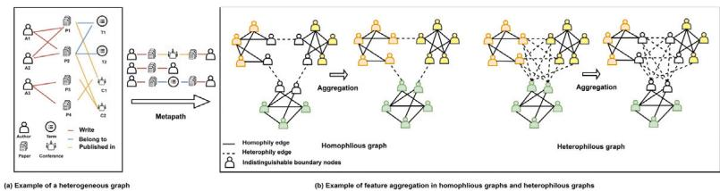  
图1. (a) 包含四种类型节点（作者、论文、会议、术语）和三种类型边（撰写、发表于、属于）的异构图。(b) 同质图和异质图中特征聚合的示例。

等人[6]通过掩码每个同构子图的属性、拓扑和位置信息来计算重构损失并学习节点嵌入。上述方法中使用的GNN、HGNN等基于同质性假设，该假设认为同一社区的节点更有可能相互连接。通常，异构图并不总是满足同质性假设，因为从元路径导出的同构子图也可能包含大量异质边。

在图1(b)中，通过元路径获得的同构子图由作者节点组成，这些节点可以是同质的或异质的。实线表示同质边，表明连接的两个节点属于同一社区，而虚线表示异质边，连接来自不同社区的节点。异质图包含许多异质边，而同质图则很少。异质图中过多的类间边会导致不同社区节点的特征在聚合后混合，使其难以区分[7]。如图1(b)所示，对于难以区分的边界节点，同质结构为其聚合特征提供的信息比原始节点特征更有价值。相反，缺乏同质性（即异质性）是GNN和HGNN在异质图上表现不佳的重要原因。边界节点通常拥有比同质邻居更多的异质邻居。由于异质边连接不同类别的节点，它们可能导致节点嵌入混合且难以区分，模糊社区之间的边界。

因此，上述方法在同质异构图中的效果通常较好，但在异质异构图中的效果较差。

# 1.1. 研究动机

开发一种适用于同质性和异质性异构图的无监督社区检测方法具有挑战性。本文的研究动机如下：

M1：在存在缺失或噪声标签的情况下，处理异构图中的复杂结构和语义信息变得尤为困难。无监督方法对于管理这些图中多种类型的节点至关重要。通过利用可用的丰富语义信息，我们可以提高社区检测的有效性。

M2：避免异质性异构图中来自不同社区的节点出现表示坍缩，对于保持这些多样节点的独特特征和关系至关重要。在处理异构图时，实施能够最小化结构异质性同时增强同质性的策略具有重要意义。

# 1.2. 贡献

本文提出了一种无监督社区检测框架，该框架通过破坏结构异质性并增强同质性强度，生成元路径级节点嵌入和层次树级节点嵌入以实现多级结构融合，并利用生成式学习与对比学习完成无监督表示学习。据我们所知，本文首次提出了针对同质性与异质性异构图的无监督社区检测方法。

本文的主要贡献如下：

（1）提出了一种统一框架，包含基于同质性比率采样的层次结构融合模块（SFR）和用于生成式与对比学习的无监督图表示学习模块（UGC）。该模型在同质性与异质性异构图上均展现出强大的泛化能力；
（2）所提出的SFR模块通过不同元路径实现自适应高阶子图聚合，构建细粒度高阶图。此外，利用结构熵从该高阶图中构建抽象树以学习稳定节点嵌入。该模块在增强同质性边影响力的同时削弱异质性边的影响力；
（3）所提出的UGC模块将对比学习与生成式学习相结合，利用基于社区原型的对比损失与动态图掩码自编码器，计算特征与结构在重构前后的损失。在模型训练过程中，该模块动态增强节点特征与异构图语义的学习；
（4）在包含同质性与异质性异构图的6个公开异构图数据集上的大量实验表明，与11个最先进基线模型相比，SFCDH具有有效性和泛化性。值得注意的是，在异质性异构图数据集IMDB上，SFCDH的准确率比第二名模型高出$1 1 \%$，进一步验证了其有效性。

本文其余部分组织如下：第2节回顾相关研究工作，第3节全面概述预备知识，第4节介绍所提出的模型，第5节报告实验结果与分析，最后在第6节总结本文的结论与未来工作。

# 2. 相关工作

# 2.1. 同质图社区检测

社区检测作为网络研究的热点，近几十年来受到了广泛关注。传统的社区检测方法侧重于根据网络节点的局部拓扑结构将其划分为不同的社区。Shi等人[8]提出了一种改进的成对约束非负对称矩阵分解方法，该方法利用从真实社区信息中生成的成对约束来提高社区检测性能。He等人[9]首次将马尔可夫随机场应用于网络分析，将不规则网络的结构特性编码为能量函数，从而通过最小化能量函数得到最合适的社区结构。Gianluca Bonifazi等人[10]利用传播者中心性来检测社交网络中不同社区间的信息扩散。为了进一步解决动态性问题，他们研究了在非危险和危险挑战期间社区演化模式中的惊喜因素[11]。Kang等人[12]提出了一种基于多邻域的局部搜索策略，该策略具有动态分组机制，并重新定义了个体更新规则。该方法将社区检测技术应用于农业中的机器人任务分配。Kong等人[13]通过对称分解邻接矩阵和属性矩阵，利用丰富的多域信息优化社区隶属矩阵，以检测复杂属性网络中的社区。多数据的联合分解导致了较高的计算复杂度。Li等人[14]利用模体，通过提取每一层的高阶交互，将多路网络聚合为单层多路网络进行社区检测。

随后，许多研究者利用深度学习来解决社区检测问题。Liu[15]等学者提出利用高阶邻近性和重叠社区模函数来学习网络的潜在社区结构。Hao等人[16]通过多个图自编码器将层次属性信息与拓扑关系有机结合，克服了特征不足的问题。然而，上述方法可能导致过度划分或划分不足的问题。Sun等人[17]提出了一种图信息最大化社区模型，该模型利用网络内的社区信息来学习节点嵌入。Li等人[18]将图对比学习与图卷积网络相结合，该模型考虑了社区信息，并以端到端的方式联合分析社区检测和节点嵌入。

然而，上述方法主要关注同构图，无法处理具有多种节点类型和关系的异构图，也未能考虑异质性。

# 2.2. 异构图社区检测

目前，针对异质网络社区检测的研究相对较少，且研究内容碎片化、方法多样，难以形成统一的体系。现有异质网络社区检测方法主要分为两类：传统异质网络社区检测方法和基于深度学习的异质图神经网络聚类方法。总体而言，传统异质网络社区检测方法的泛化能力不强，通常针对特定网络结构设计。Sun等人[19]提出了一种基于概率的二部图算法。Li等人[20]针对特定网络结构提出了基于矩阵分解的方法。基于深度学习的聚类方法根据其处理网络中多样关系的方式，大致可分为两类：元路径方法和自适应方法。前者依赖预定义的元路径来捕获各种语义关系，然后利用神经网络表示节点信息以生成表征，再基于这些表征执行特定的聚类任务。Wang等人[21]提出了HAN模型，该模型结合注意力机制和元路径结构来聚合最终的节点嵌入。Zhang等人[22]提出了HetGNN模型，该模型使用LSTM作为聚合器来生成节点级嵌入，但其捕获长距离关系的能力较弱。Yun等人[23]提出了GTN模型，该模型通过多通道卷积学习不同类型的元路径，并将多个节点嵌入拼接作为最终的节点嵌入，但该方法消耗大量内存。自适应方法则挖掘潜在的高阶结构以捕获关系信息，并引导节点特征的聚合。He等人[24]将异质社区规模与SBM相结合，用于链接社区检测。Zhao等人[25]使用元路径构建多个同质子图，并在每个同质子图上递归地利用社区检测方法构建一个包含节点嵌入的分层图，从而保留社区语义。Wei等人[26]通过随机游走，并联合考虑社区、组织和属性信息，将局部节点特征以及全局社区和组织信息嵌入到节点嵌入中，以同时检测社区和组织结构。

然而，上述方法可能需要高质量的输入数据，尤其是在节点属性缺失或数据存在噪声的情况下，这可能导致结果出现偏差或不准确。这些方法无法处理具有缺失属性或噪声的真实网络节点。因此，我们考虑将图掩码自编码器与对比学习相结合，利用动态掩码策略扰动原始图，以无监督方式提升模型对图的学习能力。此外，上述方法忽略了复杂异质图中相邻节点具有不完全相关的不同特征（即结构异质性）。上述所有方法均基于同质性假设，无法处理具有异质性的异质图。

# 2.3. 异配图表示学习

异质性图在现实生活中也普遍存在，从人际关系到蛋白质基因的科学研究。在异质性图中，关注点在于节点与其邻居之间的对比，突出显示了属于不同类别的节点之间建立连接的倾向。近期多项研究致力于扩展图神经网络（GNN）以有效处理异质性图。Yang等人[27]采用了一种多样化的消息传递框架，为每个属性分配传播权重，并针对异质性图调整了GNN。Li等人[28]通过聚合全局信息学习了节点的潜在同质性信息。Chien等人[29]自适应地学习了同质性和异质性节点权重，并联合学习了节点特征和拓扑结构。Wu等人[30]利用自适应深度图卷积技术实现了局部高阶邻域的自适应聚合。针对药物-疾病网络的异质性，Liu等人[31]提出了一种新颖的结构增强线图卷积网络，用于学习融合结构信息的药物-疾病对综合表示。此外，该方法存在较大的内存和时间开销。

尽管上述方法缓解了异质性同构图的问题，但在一定程度上，它们依赖于先验知识，例如用于训练的标签。因此，它们适用于半监督社区检测，但不适用于无监督社区检测，也无法处理包含多种类型节点和边的异构图。

在解决过平滑问题时，Zheng等人[32]从拓扑空间视角引入了一种图互补卷积方法。他们主张生成互补图以增强原始图数据中缺失的结构细节，无论图结构是同质性还是异质性。Wen等人[33]基于图同质性，通过同时考虑低频和高频信号来增强节点嵌入。他们利用节点特征和邻接关系设计了一种图联合聚合矩阵，使这些信号更具区分性。

上述大多数方法首先从拓扑空间入手，并处理邻域数据的处理方式。它们忽略了高阶连接中嵌入的额外详细信息。然而，在模型训练过程中，没有一种方法充分评估相互连接的节点是否属于同一类别，从而限制了它们动态调节传播数据重要性的能力。这一限制可能阻碍模型的适应性，并损害其整体泛化能力。

表1 符号与说明。

<table><tr><td>Notation</td><td>Explanation</td></tr><tr><td>Gφ</td><td>The homogeneous subgraph according to the metapath φ</td></tr><tr><td>HRφ</td><td>The homophily ratio of the homogeneous subgraph Gφ</td></tr><tr><td>o_v</td><td>The community strength of a leaf node v in T</td></tr><tr><td>odφ</td><td>The aggregation order of Gφ</td></tr><tr><td>Aφ</td><td>The masked adjacency matrix of Gφ</td></tr><tr><td>S</td><td>The constructed high-order fusion graph</td></tr><tr><td>T</td><td>The hierarchical abstraction tree based on S</td></tr><tr><td>R*</td><td>The pseudo label of the heterogeneous graph G</td></tr><tr><td>Z</td><td>The node embeddings generated from the masked autoencoder</td></tr><tr><td>ZTree</td><td>The node embeddings generated from tree T</td></tr></table>

# 3. 预备知识

本节定义了一些与本文相关的重要概念，并指出了本文试图解决的问题。表1给出了一些符号和解释。

定义1（异质信息网络）。异质信息网络（HIN）是一个由多种类型的边和节点组成的图，定义为 $G \ = \ \left( V , A , T _ { V } , T _ { E } , X , \phi \right)$ ，其中 $V$ 和 ?? 分别表示节点集和邻接矩阵。其中 $T _ { V }$ 和 $T _ { E }$ 表示节点和边的类型，并满足 $\left| T _ { V } \right| > 1$ 或 $\left| T _ { E } \right| > 1$ 。?? 表示元路径集。

定义2（元路径）。元路径 $\phi ~ \in ~ \phi$ 是HIN中连接不同类型节点与不同类型边的一种关系，定义为 $V _ { 0 } \xrightarrow { R _ { 0 } } V _ { 1 } \xrightarrow { R _ { 1 } } \cdots \xrightarrow { R _ { n } } V _ { n + 1 }$ ??1←←←←←←←←←→ . ????←←←←←←←←←←←→ ????+1。?? 表示节点之间的关系类型，而 $R _ { i }$ 表示节点 $V _ { i }$ 和 $V _ { i + 1 }$ 之间的关系。

定义3（同质子图）。对于异质图 $G$ ，给定目标节点类型 $\varepsilon \in T _ { V }$ 和元路径 $\phi$ ，存在一个同质子图 $G _ { \phi } = \left( V ^ { \prime } , E ^ { \prime } \right)$ 。对于任意节点 $v \in V ^ { \prime }$ ，该节点属于目标类型 ??。

定义4（元路径子图同质比）。对于异质图 $G$ 的任意元路径 $\phi$ 对应的同质子图 $G _ { \phi } \ : = \ : \left( V ^ { \prime } , E ^ { \prime } \right)$ ，该图的同质比 $H R ^ { \phi }$ 计算如下：

$$
H R ^ {\phi} = \frac {\operatorname {s u m} \left(A ^ {\phi} \odot B B ^ {T} - I\right)}{\operatorname {s u m} \left(A ^ {\phi} - I\right)} \tag {1}
$$

其中 ?????? (⋅) 表示求和操作，$\odot$ 表示哈达玛积。$B \in \{ 0 , 1 \} ^ { n \times c }$ 表示伪标签 $R ^ { * }$ 的独热编码，而 $I$ 表示单位矩阵。

定义5（元路径的高阶组合图）。由于邻接矩阵 ?? 的不同阶次包含不同的结构信息，高阶图结构可以捕获更多关系，将高阶邻域关系定义为：

$$
A _ {k} ^ {\phi} = \frac {1}{k} \sum_ {i = 1} ^ {k} \left(A ^ {\phi}\right) ^ {i} = \frac {1}{k} \left(A ^ {\phi} + \left(A ^ {\phi}\right) ^ {2} + \dots + \left(A ^ {\phi}\right) ^ {k}\right) \tag {2}
$$

其中 $k$ 表示邻域聚合的阶次，元路径 $\phi \in \phi$ ，而 $A ^ { \phi }$ 表示对应于元路径 $\phi$ 的高阶邻域矩阵。

异质网络 $G$ 对应的元路径高阶组合图 $G _ { C }$ 定义为：

$$
G _ {C} = \sum_ {\phi \in \Phi} \theta^ {\phi} A _ {k} ^ {\phi} \tag {3}
$$

其中不同元路径被认为具有不同的重要性。$\theta ^ { \phi }$ 是对应于元路径 $\phi$ 的子图的权重。

定义6（层次抽象树）。与先前的工作[34]不同，本文构建了一个深度为 $K$ 的异质抽象树 $T$ 来表示元路径高阶组合图 $G _ { C }$ 。?? 由图 $G _ { C }$ 的节点集 $V ^ { \prime }$ 、元路径 $\phi \in \Phi$ 和关系 $E ^ { \prime }$ 组成。图2是一个简单示例。

定义7（K维结构熵）。对于深度为 $K$ 的树 $T$ ，本文将树的结构熵 $H$ 定义如下：

$$
H ^ {K} \left(G _ {C}\right) = \min  _ {\forall T: \text {h e i g h t} (T) = K} \left\{H ^ {T} \left(G _ {C}\right) \right\} \tag {4}
$$

$$
H ^ {T} \left(G _ {C}\right) = \sum_ {\alpha \in T, \alpha \neq \text {r o o t}} H ^ {T} \left(G _ {C}; \alpha\right) = - \sum_ {\alpha \in T, \alpha \neq \text {r o o t}} \frac {w (\alpha)}{\mathrm {d} \left(G _ {C}\right)} \log_ {2} \frac {\mathrm {d} \left(T _ {\alpha}\right)}{\mathrm {d} \left(T _ {\alpha} -\right)} \tag {5}
$$

其中 $H ^ { T } \left( G _ { C } \right)$ 是对应于图 $G _ { C }$ 的编码树 $T$ 的结构熵，边集根据非叶节点进行划分。对于非叶节点和非根节点 $\alpha$ ，假设 $\alpha$ 的子节点数为 ?? 。$\begin{array} { r } { T _ { \alpha } = \bigcup _ { i = 1 } ^ { N } T _ { \alpha ^ { ( i ) } } , ( } \end{array}$ ??(??) 是 $\alpha$ 的第 ?? 个子节点。根节点记为 root，$T _ { r o o t } = T$ ，$T _ { \alpha }$ 内部切割边的总权重（度）为 $w ( \alpha )$ （连接 $T _ { \alpha }$ 内部节点与 $T _ { \alpha . }$ 外部节点的边），而 $d \left( G _ { C } \right)$ 是图中所有节点的度之和。$\alpha ^ { - }$ 表示 ?? 的父节点。?? ?? 表示 $T _ { \alpha }$ 内部所有节点的度之和。

问题定义：对于给定的异质图 $G$ 和目标节点类型 ??，我们的目标是学习一个嵌入矩阵 $\boldsymbol { Z } \in \mathbb { R } ^ { n \times d }$ ，其中 $n$ 表示目标节点类型 $\varepsilon$ 的节点数，?? 表示嵌入的维度，以保证目标类型的节点被分组为具有强连通性的社区 $C =$ $\{ 1 , \ldots , C \}$ 。

# 4. 方法

本节提出了一种异构图社区检测方法（SFCDH）。该方法打破了结构异质性，增强了异构图同质性的强度。SFCDH的核心思想是融合具有不同同质性比率的元路径子图，并利用动态掩码自编码器和对比学习进行无监督异构图社区检测。通过融合元路径级节点嵌入和层次树级节点嵌入，SFCDH完成了无监督社区检测。

我们的模型架构如图3所示。SFCDH包含两个主要模块：基于同质性比率采样的层次结构融合模块（SFR）和基于生成式与对比学习的无监督图表示模块（UGC）。SFR由两部分组成：(a) 从异构图中提取同质子图，并计算每个视图的同质性比率以生成高阶融合图。(b) 构建高阶融合图的层次抽象树，并从树的角度学习节点特征。UGC由两部分组成：(c) 应用掩码策略，基于社区原型计算高阶融合图和基于元路径的同质子图的对比损失。(d) 使用异构掩码自编码器计算增强图在特征和结构重构前后的损失。通过整合来自元路径级和层次树级的节点嵌入，SFCDH实现了无监督社区检测。

# 4.1. 基于同质性比率采样的层次结构融合模块

SFR包含两个主要组成部分：基于同质性比率的元路径子图高阶重写以及层次化抽象树的构建。通过构建基于同质性比率的高阶融合图，前者提升了SFCDH对具有不同同质性比率的元路径子图的泛化能力，增强了异质图中同质性边的影响力，并削弱了异质性边的影响力。后者通过构建层次化抽象树，从层次化社区中学习节点嵌入。

4.1.1. 基于同质性比率的元路径子图高阶重写

对于基于元路径的同质子图，本文首先使用metapath2vec [35]作为预训练编码器 $f \left( \cdot \right)$ 来学习节点嵌入 $Z _ { f }$ ，该嵌入包含多个元路径共享的信息。我们对 $Z _ { f }$ 进行聚类以提取社区信息，即 $R ^ { \ast } \in$ 。

$\mathbb { R } ^ { n \times c }$ 被用作模型初始化的伪标签，而 $c$ 是社区的数量。

$$
Z _ {f} = f \left(\sigma (X; W _ {\theta})\right) \tag {6}
$$

其中 $W _ { \theta }$ 是 $f \left( \cdot \right)$ 的可学习参数，$\sigma \left( \cdot \right)$ 是相应的激活函数。由于 $Z _ { f }$ 包含从多个元路径获得的同质子图的共同信息，因此使用 $Z _ { f }$ 来指导精细化图结构学习。

$$
\Omega = Z _ {f} Z _ {f} ^ {T} \tag {7}
$$

其中 $\varOmega$ 可以表示一阶结构相似性。

由于邻接矩阵 ?? 的不同阶次包含不同的结构信息，高阶图结构能够捕获更多的关系。因此，使用公式(2)来计算 $A ^ { \phi }$ 的高阶邻域关系。

由于从不同元路径获得的同质子图具有不同的同质性比率，对高同质性比率的图结构进行高阶聚合将更有助于发现相似节点，而对低同质性比率的图结构进行高阶聚合则会导致不同类别节点嵌入的混淆。因此，我们设计了一种自适应聚合方法：对高同质性比率图采用高阶聚合，对低同质性比率图采用低阶聚合。由于无监督社区检测无法使用节点的真实标签，这里考虑使用伪标签 $R ^ { * }$ 来计算每个图的同质性比率，并通过计算同质性比率来确定每个图进行高阶聚合的最优阶次。

$$
o d ^ {\phi} = \left\{ \begin{array}{c c} 0, & \text {i f} H R ^ {\phi} \leq \delta \\ \left\lfloor \frac {1}{1 - H R ^ {\phi}} \right\rfloor , & \text {i f} H R ^ {\phi} > \delta \end{array} \right. \tag {8}
$$

其中 $\lfloor \cdot \rfloor$ 是向下取整操作，$\delta$ 是用于过滤低同质性图的系数。为低同质性图分配较小的阶次，为高同质性图分配高阶次。在伪标签的引导下，对每个视图进行精细化学习，以获得精细化的图结构。

$$
\hat {A} ^ {\phi} = \alpha \theta^ {\phi} A _ {o d \phi} ^ {\phi} + \Omega \tag {9}
$$

其中 $\theta ^ { \phi } = \iota ( 1 - \iota ) ^ { \operatorname* { m a x } { \ ( o d ) } - o d ^ { \phi } }$ 是衰减因子，确保对高同质性图结构 $\iota \in ( 0 , 1 )$ 给予更多考虑。

最终，将从所有元路径获得的图结构进行融合，生成增强的高阶融合图S，其中 $\alpha$ 和 $\beta$ 是可调参数。

$$
S = \sum_ {\phi \in \Phi} \hat {A} ^ {\phi} = \sum_ {\phi \in \Phi} \alpha \theta^ {\phi} A _ {o d \phi} ^ {\phi} + \beta \Omega \tag {10}
$$

# 4.1.2. 层次化抽象树的构建

编码树[36]将图以多粒度方式划分为层次化的社区和子社区，从而更好地理解图的结构。现有的异构图方法忽略了元路径间树的层次结构。在本节中，为了增强同质性并揭示各种层次结构，将生成的高阶融合图构建为树结构，并通过最小化结构熵来降低图结构的不稳定性。结构熵最小化的树结构定义为：

$$
T ^ {*} = \underset {\forall T: \text {h e i g h t} (T) \leq K} {\arg \min } \left(H ^ {T} (S)\right) \tag {11}
$$

其中高度 $( T )$ ) 表示语义树的高度。

根据算法1，基于融合图 $S$ 构建层次化抽象树。首先，基于融合图 $S$ 构建一棵仅包含叶节点和根节点的树，使用 $S$ 的所有节点构成叶节点。第2-4行表示自底向上构建一棵二叉树。在这棵树中，

即 INSERT(????????(1), ????????(2)) 操作表示在根节点的两个子节点之间插入一个新节点。第5-7行压缩树的高度直至达到 ??。DELETE(??) 操作表示删除 $\alpha$ 节点，并将 $\alpha$ 的子节点添加到 $\alpha$ 父节点的子节点集合中。每次迭代中，每个被删除的节点应确保结构熵最小化。

# 算法1 基于高阶融合图的层次化抽象树构建

输入：树的高度 $k$ ，高阶融合图 $S$ ，节点集合 ?? ；

输出：高度为 $k$ 的层次抽象树；

1：构建包含根节点和叶节点的层次抽象树 $T$ ，节点集合 $V$ 内的所有节点均为叶节点；  
2：当 |????????.??ℎ????????????| $> 2$ 时执行  
3：INSERT(????????(1), ????????(2)) ← arg max(?? ?? (??) − ?? ??INSERT(????????(1),????????(2)) (??)), ????????(1), $r o o t ^ { ( 2 ) } \in$ ????????.??ℎ????????????；

4：结束循环

5：当高度 $( T ) > k$ 时执行  
6：$\mathrm { D E L E T E } ( \alpha ) \gets \arg \operatorname* { m i n } ( H ^ { T _ { \mathrm { D E L E T E } ( \alpha ) } } ( S ) - H ^ { T } ( S ) ) , \alpha \neq r o o t , \ \alpha \notin \ V ;$  
7：结束循环  
8：返回 ?? ；

使用MLP作为抽象树的编码器 $f _ { M } ( \cdot )$ ，叶节点的特征通过树的层次结构进行初始化，非叶节点的特征通过聚合其子节点的特征获得，即每个非叶节点是其子节点的抽象表示。

$$
x _ {v} ^ {i} = f _ {M} ^ {i} \left(\sum_ {u \in v. c h i l d r e n} x _ {u} ^ {(i - 1)}\right) \tag {12}
$$

其中 $\boldsymbol { x } _ { v } ^ { i }$ 表示编码树 $T$ 第 ?? 层节点 $v$ 的特征，$x _ { v } ^ { 0 }$ 是输入叶节点的特征，??.??ℎ???????????? 表示节点 $v$ 的子节点。最终从树的角度获得高阶融合图 $S$ 内所有节点的嵌入表示 $Z ^ { T r e e }$ 。

定义8（社区强度）。给定图 $S$ 的最优层次抽象树 $T$ ，叶节点 $v$ 在 $T$ 中的社区强度定义为：

$$
o _ {v} = \frac {w (v ^ {-})}{d (S)} - \frac {\left(d \left(T _ {v ^ {-}}\right)\right) ^ {2}}{4 (d (S)) ^ {2}} \tag {13}
$$

本文使用社区强度来衡量叶节点相对于树的角度的重要性得分。$v ^ { - }$ 是节点 $v$ 的父节点。它由两部分组成：$T _ { v ^ { - } }$ 内切割边的权重与图 $S$ 中所有节点度数的比值，以及树 $T _ { v ^ { - } }$ 中所有节点度数之和与整棵树度数之和的比值。该值可解释为叶节点所属社区内部的边与该社区与其他社区之间连接边的比例。最终，层次抽象树的角度节点表示为 $Z _ { v } ^ { T r e e } = o _ { v } Z _ { v } ^ { T r e e }$ ，其中 $Z _ { v } ^ { T r e e }$ 表示 $Z ^ { T r e e }$ 的第 ?? 行。

# 4.2. 面向联合生成学习与对比学习的无监督图表示学习模块

UGC模块由两部分组成：增强图的社区原型一致性模块和异构图掩码自编码器。前者采用基于社区原型的对比损失，结合约束动态掩码策略，对同质子图进行增强操作。同时，后者通过重构图结构和特征来学习深层节点嵌入。

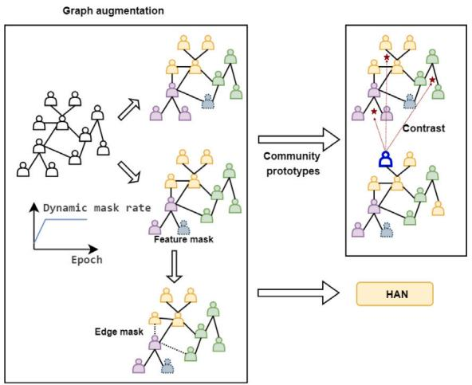  
图4. 社区原型一致性

# 4.2.1. 增强图的社区原型一致性

现有的异构图对比学习方法很少考虑图社区结构。在本节中，我们考虑将动态掩码策略与社区结构相结合，并利用社区级对比损失来引导模型在训练过程中生成更具区分性的掩码，使得同一社区内的节点在不同增强图中具有相似的掩码策略，而不同社区的节点则具有不同的掩码策略，这有助于生成更具区分性的节点嵌入。对于给定的异构图 $G = \left( V , A , T _ { V } , T _ { E } , X , \phi \right) .$，为每条元路径 $\phi \in \Phi$ 构建基于元路径的邻接矩阵 $A ^ { \phi }$。每个 $A ^ { \phi }$ 通过伯努利分布 ??? $M _ { A } ^ { \phi } \sim$ Bernoulli $\left( p _ { e } \right)$ 生成一个用于图增强的二元掩码，其中 $p _ { e } < 1$ 表示掩码概率。然后，我们可以通过掩码 $\tilde { A } ^ { \phi ^ { 1 } } = M _ { A } ^ { \phi ^ { 1 } } \cdot A ^ { \phi } , \tilde { A } ^ { \bar { \phi } ^ { 2 } } = \bar { M _ { A } ^ { \phi ^ { 2 } } } \cdot A ^ { \phi } .$ 获得增强后的两个邻接矩阵。特征采用动态掩码方式，而非使用固定的掩码概率进行属性重构。属性掩码概率 $p _ { a }$ 通过调度函数 $\tau ( m + 1 ) = \tau ( m ) + { \cal { \Delta } }$ 获得，其中 $\tau \left( m \right)$ 表示在第 ?? 个训练周期中被掩码的特征比例。

对于 $\textit { m } \in \{ 0 , 1 , \ldots , M \}$、$\tau ( 0 ) ~ = ~ m i n \left( p _ { a } \right)$ 和 $\tau \left( M \right) \ = \ m a x \left( p _ { a } \right)$。特征的二元掩码通过伯努利分布 $M _ { H } ^ { \phi } \sim$ Bernoulli $\left( p _ { a } \right)$ 生成，以得到扩展后的两个属性矩阵 $\tilde { X } ^ { \phi ^ { 1 } } = M _ { X } ^ { \phi ^ { 1 } } \cdot X ^ { \phi }$ 和 $\tilde { X } ^ { \phi ^ { 2 } } = M _ { X } ^ { \phi ^ { 2 } } \cdot X ^ { \phi }$。通过应用上述图的增强（分别记为 $t ^ { 1 }$ 和 $t ^ { 2 } \sim T$ 表示两次独立的增强），可以为每条元路径 $\phi \in \Phi$ 生成两个视图 $\left\{ \left( \tilde { X } ^ { \phi ^ { 1 } } , \tilde { A } ^ { \phi ^ { 1 } } \right) = t ^ { 1 } \left( X ^ { \phi } , \stackrel { \cdot } { A } { } ^ { \phi } \right) \right.$ 和 $\left( \tilde { X } ^ { \phi ^ { 2 } } , \tilde { A } ^ { \phi ^ { 2 } } \right) = t ^ { 2 } \left( X ^ { \phi } , A ^ { \phi } \right)$。

社区原型矩阵 Υ 在模型初始化时通过随机初始化获得。随后，在后续训练过程中，它由该社区所有节点的嵌入平均得到：

$$
Y _ {k} = \sum_ {k _ {i} = k} \widetilde {x} _ {i} / \sum_ {k _ {i} = k} 1 \tag {14}
$$

其中，$Y _ { k }$ 是 $\Upsilon$ 的第 ?? 行，表示第 ?? 个社区的原型嵌入。$\widetilde { \boldsymbol { x } } _ { i }$ 表示 $\widetilde { X }$ 的第 ?? 行，$k \in [ 1 , c ]$ 表示社区数量。$k _ { i }$ 表示第 ?? 个节点所属的社区。

一种跨视图和跨社区的对比机制将一个视图的节点嵌入与另一个视图的社区原型进行比较。如图 4 所示，社区对比损失为：

$$
l _ {\cos} (\widetilde {X}, Y) = - (1 - \exp \frac {- m}{\epsilon}) \times \log \sum_ {i} \frac {\delta (\widetilde {x} _ {i} , Y _ {k _ {i}})}{\delta (\widetilde {x} _ {i} , Y _ {k _ {i}}) + \sum_ {k _ {i} \neq k} w (i , k) \cdot \delta (\widetilde {x} _ {i} , Y _ {k})}
$$

(15)

其中，$m$ 表示当前训练周期，$\epsilon$ 是超参数，对比损失的权重在模型训练过程中逐渐增加。?? 表示高斯 RBF 相似度。$w \left( i , k \right)$ 是 RBF 权重函数。$w \left( i , k \right) = \exp \left\{ - \gamma \| \widetilde { x } _ { i } - Y _ { k } \| ^ { 2 } \right\}$。这最大化同一社区内节点的相似性，并最小化不同社区间节点的相似性。因此，最终模型的对比损失为：

$$
L _ {\mathrm {C o s}} = \frac {1}{2} \sum_ {\phi \in \phi \cup S} \left[ l _ {\cos} \left(\tilde {X} ^ {\phi^ {1}}, Y ^ {\phi^ {2}}\right) + l _ {\cos} \left(\tilde {X} ^ {\phi^ {2}}, Y ^ {\phi^ {1}}\right) \right] \tag {16}
$$

其中，$\tilde { X } ^ { \phi ^ { 1 } }$ 表示图增强后与元路径 $\phi$ 对应的同质子图第一视图的属性矩阵，$\gamma \bar { \phi } ^ { 2 }$ 表示图增强后第二视图中的社区原型矩阵。

# 4.2.2. 异构图掩码自编码器

为了捕捉异构图中的复杂语义信息，我们对从元路径获得的同质子图 $G _ { \phi } ~ = ~ \left( V ^ { \prime } , E ^ { \prime } \right)$ 和高阶融合图 $S$ 进行掩码处理，这破坏了短程语义连通性，有助于模型探索更深层关系以预测被掩码的信息，并促进更有效地学习语义信息。为了挖掘节点特征中包含的内容信息，对节点特征采用动态掩码策略。这使得模型能够在训练过程中逐步增强对目标类型节点特征的学习。

学习到的节点特征是通过将属性矩阵 $X$ 和掩码后的邻接矩阵 $\widetilde { A } ^ { \phi }$ 输入编码器 $f _ { E } \left( \cdot \right)$ 获得的。

$$
H _ {1} ^ {\phi} = f _ {E} \left(\widetilde {A} ^ {\phi}, X\right) \tag {17}
$$

然后使用解码器 $f _ { D } \left( \cdot \right)$ 生成节点嵌入 $H _ { 2 } ^ { \phi }$ ，利用sigmoid激活函数得到重构的邻接矩阵 $A ^ { \phi ^ { \prime } }$ ，并计算重构邻接矩阵与原始邻接矩阵 $A ^ { \phi }$ 之间的重构损失。

$$
H _ {2} ^ {\phi} = f _ {D} \left(\widetilde {A} ^ {\phi}, H _ {1} ^ {\phi}\right), A ^ {\phi^ {\prime}} = \sigma \left(\left(H _ {2} ^ {\phi}\right) ^ {T} \cdot H _ {2} ^ {\phi}\right) \tag {18}
$$

$$
l ^ {\phi} = \frac {1}{\left| A ^ {\phi} \right|} \sum_ {v \in V} \left(1 - \frac {A _ {v} ^ {\phi} \cdot A _ {v} ^ {\phi^ {\prime}}}{\left\| A _ {v} ^ {\phi} \right\| \times \left\| A _ {v} ^ {\phi^ {\prime}} \right\|}\right) ^ {\gamma_ {1}} \tag {19}
$$

其中 $l ^ { \phi }$ 表示元路径 $\phi$ 的边重构损失，$\gamma _ { 1 }$ 为相应的比例因子。由于每条元路径的重要性不同，此处引入语义级注意力机制来计算不同元路径的重要性分数 $c ^ { \phi }$ 。通过使用softmax函数对 $c ^ { \phi }$ 进行归一化，得到不同的元路径权重。

$$
c ^ {\phi} = q ^ {\mathrm {T}} \cdot \tanh  \left(W \cdot H _ {1} ^ {\phi} + b\right), \alpha^ {\phi} = \frac {\exp \left(c ^ {\phi}\right)}{\sum_ {\phi \in \Phi \cup S} \exp \left(c ^ {\phi}\right)} \tag {20}
$$

其中??表示权重矩阵，$b$ 为偏置向量。所有元路径的最终边重构损失 $L _ { \mathrm { E d g e } }$ 计算如下：

$$
L _ {\text {E d g e}} = \sum_ {\phi \in \Phi \cup S} \alpha^ {\phi} \cdot l ^ {\phi} \tag {21}
$$

∈ ∪ 将掩码后的属性矩阵 $\widetilde { X }$ 和原始邻接矩阵 $A$ 输入编码器，计算学习到的节点属性 $H _ { 3 }$ ：

$$
Z = f _ {E} (A, \widetilde {X}), H _ {3} = f _ {D} (A, Z) \tag {22}
$$

使用解码器获取重构的节点特征 $H _ { 3 }$ 并计算属性重构损失。

$$
L _ {\text {F e a t}} = \frac {1}{| \widetilde {V} |} \sum_ {v \in \widetilde {V}} \left(1 - \frac {\tilde {X} _ {v} \cdot H _ {3 v}}{\| \tilde {X} _ {v} \| \times \| H _ {3 v} \|}\right) ^ {\gamma_ {2}} \tag {23}
$$

其中 $\widetilde { V }$ 表示被掩码的目标节点集合，$\gamma _ { 2 }$ 为相应的比例因子。

# 4.3. 模型优化

最终，目标函数 $L$ 被定义为多视图对比损失 $L _ { \mathrm { C o s } }$、基于元路径的边重构损失 $L _ { \mathrm { E d g e } }$ 和属性重构损失 $L _ { \mathrm { F e a t } }$ 的加权组合。

$$
L = \lambda \cdot L _ {\text {C o s}} + \mu \cdot L _ {\text {E d g e}} + \eta \cdot L _ {\text {F e a t}} \tag {24}
$$

具体的优化算法如算法2所示。

# 算法 2 SFCDH

输入：基于元路径 $G _ { \phi } = \left( V ^ { \prime } , E ^ { \prime } \right)$、$\phi \in \phi$ 的所有同质子图，目标节点属性 $X$，预训练伪标签 $R ^ { 0 }$，伪标签更新间隔 ????????????；

输出：节点的社区分配矩阵 $R ^ { * }$

1: $R = R ^ { 0 }$ ；   
2: 对于 ?????? $\cdot h = 1 , 2 , \ldots$ 执行   
3: 如果 ????????ℎ% ???????????? $= 0$ 则   
4: 更新 $R = R ^ { * }$   
5: 根据 $R$ 和公式(10)更新高阶融合图 $S$；   
6: 根据算法1更新 $S$ 的最新树结构；   
7: 结束条件判断   
8: 对于每个 $G _ { \phi } = \left( V ^ { \prime } , E ^ { \prime } \right)$、$\phi \in \phi \cup S$ 执行   
9: 生成两个增广图 $\left( \tilde { X } ^ { \phi ^ { 1 } } , \tilde { A } ^ { \phi ^ { 1 } } \right)$ 和 $\biggl ( \tilde { X } ^ { \phi ^ { 2 } } , \tilde { A } ^ { \phi ^ { 2 } } \biggr ) ;$；   
10: 根据公式(16)计算对比损失 $L _ { \mathrm { C o s } }$；   
11: 结束循环   
12: 对于每个 $G _ { \phi } = \left( V ^ { \prime } , E ^ { \prime } \right)$、$\phi \in \phi \cup S$ 执行   
13: 根据 $f _ { E } \left( \cdot \right)$ 和公式(22)生成节点嵌入 $Z$；   
14: 根据公式(19)-(23)计算解码特征和边的重构损失 $L _ { \mathrm { F e a t } }$、$L _ { \mathrm { E d g e } }$；   
15: 结束循环   
16: 根据公式(12)生成树的节点嵌入 $Z ^ { T r e e }$；   
17: 拼接 $Z$ 和 $Z ^ { T r e e }$   
18: 使用K-means算法获取社区分配矩阵 $R ^ { * }$   
19: 结束循环   
20: 返回 $R ^ { * }$

从异构图自编码器学习到的节点嵌入 $Z$ 与从层次抽象树视角学习到的节点嵌入 $Z ^ { T r e e }$ 进行拼接，实现了多层级结构融合。基于训练轮次的社区分配矩阵 $R ^ { * }$ 通过K-means算法获得，在模型训练过程中作为生成高阶融合图的伪标签，直至模型达到最优状态。

# 5. 实验评估

# 5.1. 实验设置

# 5.1.1. 数据集

为验证SFCDH的性能，本文使用6个公开可用的异构图数据集进行实验：ACM、DBLP、Freebase、IMDB、AMiner和Texas。表2描述了这6个异构图数据集。边数表示通过相应元路径提取的同质子图对应的边数量，第五列表示通过每条元路径提取的子图内部同质性边的数量，第六列中的????表示同质性比率。

根据同质性比率，ACM、DBLP、Freebase和AMiner是典型的同质性异构图，而IMDB和Texas是典型的异质性异构图。

(1) ACM。一个常见的引文图数据集，包含三种类型的节点：作者、论文和主题。   
(2) DBLP。一个常见的引文图数据集，包含四种类型的节点：作者、论文、术语和会议。   
(3) Freebase。一个常见的大型电影图数据集，包含四种类型的节点：电影、演员、导演和编剧。   
(4) IMDB。一个在线电影图数据集，包含四种类型的节点：电影、演员、导演和关键词。   
(5) AMiner。一个在线引文图数据集，包含三种类型的节点：论文、作者和参考文献。目标节点由基于原始数据集子集划分为四类的论文组成。   
(6) Texas。为测试SFCDH在异质性图上的性能，使用了Texas和IMDB等数据集。Texas是来自WebKB3数据集的网页图，其同质性比率（HR）为0.06。

# 5.1.2. 基线

本研究将提出的SFCDH模型与11个基线模型进行了比较，这些基线模型分为三类：同质网络社区检测方法（DFCN、VGAER、DDGAE）、异质网络社区检测方法（HAN、HeCo、HetGNN-SF、HGMAE、HAESF）以及异嗜网络社区检测方法（HoLe、AHGFC、PLCSR）。以下简要介绍这些对比模型。

HAN [21] 融合了节点级注意力机制，以识别节点及各类邻居的重要性，同时采用语义级注意力机制评估不同元路径的相关性，最终利用节点嵌入进行社区检测。

DFCN [37] 采用动态融合模块，将来自局部和全局视角的嵌入进行合并，并集成三重自监督机制以增强社区检测性能。

HeCo [38] 在网络模式和元路径视图之间执行直接的跨视图对比学习，实现视图间的相互监督，从而学习鲁棒的节点嵌入。

VGAER [39] 采用变分图自编码器进行社区检测，将高阶模块度信息与节点特征相结合。

HetGNN-SF [40] 利用加权融合方法构建语义融合图，从语义强度和特征相似性中推导出最终节点嵌入，并结合对比学习进行优化。

HGMAE [6] 利用动态掩码自编码器，通过编码属性、拓扑和位置信息来学习节点嵌入，从而有效促进社区检测。

HoLe [41] 采用层次相关估计和聚类感知稀疏性模块来增强图同嗜性，有效将社区检测与图结构学习相结合。

DDGAE [42] 利用高阶模块度和属性信息构建视图，采用深度多重注意力机制，通过拓扑和特征重构进行社区检测。

HAESF [5] 采用图自编码器聚合异质图结构信息，并利用非负矩阵分解学习社区语义信息，同时对两个组件进行联合优化。

AHGFC [33] 基于图同嗜性，通过考虑低频和高频信号来增强节点嵌入。利用节点特征和邻接关系设计图联合聚合矩阵，使这些信号更具区分性。

PLCSR [43] 利用基于指数移动平均的自辅助编码器和动态阈值驱动的课程选择机制，提升伪标签的可靠性，从而在基于图的社区检测学习模型中实现精确的节点处理。

表2 数据集统计信息。

<table><tr><td>Dataset</td><td>Node</td><td>Metapath</td><td>Edges</td><td>Homo-Edges</td><td>HR</td></tr><tr><td rowspan="3">ACM</td><td>paper(P):4019</td><td>PAP</td><td>53834</td><td>43526</td><td>0.8085</td></tr><tr><td>author(A):7167</td><td>PSP</td><td>4334194</td><td>2770816</td><td>0.6393</td></tr><tr><td>subject(S):60</td><td></td><td></td><td></td><td></td></tr><tr><td rowspan="4">DBLP</td><td>author(A):4057</td><td>APA</td><td>7056</td><td>5636</td><td>0.7988</td></tr><tr><td>paper(P):14328</td><td>APCPA</td><td>4996438</td><td>3346042</td><td>0.6697</td></tr><tr><td>conference(C):20</td><td>APTPA</td><td>7039514</td><td>2284306</td><td>0.3245</td></tr><tr><td>term(T):7723</td><td></td><td></td><td></td><td></td></tr><tr><td rowspan="4">Freebase</td><td>movie(M):3492</td><td>MDM</td><td>4912</td><td>4078</td><td>0.8302</td></tr><tr><td>actor(A):33401</td><td>MAM</td><td>251210</td><td>173820</td><td>0.6919</td></tr><tr><td>direct(D):2502</td><td>MWM</td><td>7214</td><td>4638</td><td>0.6429</td></tr><tr><td>writer(W):4459</td><td></td><td></td><td></td><td></td></tr><tr><td rowspan="4">IMDB</td><td>movie(M):4275</td><td>MAM</td><td>98010</td><td>49538</td><td>0.5054</td></tr><tr><td>actor(A):5432</td><td>MDM</td><td>21018</td><td>14802</td><td>0.7043</td></tr><tr><td>director(D):2083</td><td>MKM</td><td>813852</td><td>328700</td><td>0.4039</td></tr><tr><td>keyword(K):7313</td><td></td><td></td><td></td><td></td></tr><tr><td rowspan="3">AMiner</td><td>paper(P):6564</td><td>PAP</td><td>15412</td><td>14788</td><td>0.9595</td></tr><tr><td>author(A):13319</td><td>PRP</td><td>123260</td><td>106124</td><td>0.8609</td></tr><tr><td>reference(R):35890</td><td></td><td></td><td></td><td></td></tr><tr><td>Texas</td><td>187</td><td>-</td><td>1703</td><td>104</td><td>0.0611</td></tr></table>

表3 DBLP数据集对比结果。

<table><tr><td></td><td>NMI</td><td>ARI</td><td>ACC</td><td>F1</td><td>Precision</td><td>Recall</td></tr><tr><td>HAN</td><td>0.6115</td><td>0.6209</td><td>0.7894</td><td>0.7343</td><td>0.7707</td><td>0.7454</td></tr><tr><td>DFCN</td><td>0.6471</td><td>0.6867</td><td>0.8553</td><td>0.8436</td><td>0.6867</td><td>0.8436</td></tr><tr><td>HeCo</td><td>0.7113</td><td>0.7675</td><td>0.8989</td><td>0.8896</td><td>0.8950</td><td>0.8866</td></tr><tr><td>VGAER</td><td>0.7149</td><td>0.7392</td><td>0.8699</td><td>0.8291</td><td>0.8638</td><td>0.8444</td></tr><tr><td>HetGNN-SF</td><td>0.6146</td><td>0.6436</td><td>0.8441</td><td>0.8393</td><td>0.8510</td><td>0.8464</td></tr><tr><td>HGMAE</td><td>0.7203</td><td>0.7691</td><td>0.9004</td><td>0.8923</td><td>0.8980</td><td>0.8904</td></tr><tr><td>HoLe</td><td>0.4101</td><td>0.4376</td><td>0.7422</td><td>0.7386</td><td>0.7491</td><td>0.7496</td></tr><tr><td>DDGAE</td><td>0.6333</td><td>0.6579</td><td>0.8338</td><td>0.8155</td><td>0.8270</td><td>0.8155</td></tr><tr><td>HAESF</td><td>0.7244</td><td>0.7679</td><td>0.9014</td><td>0.8919</td><td>0.9105</td><td>0.8840</td></tr><tr><td>AHGFC</td><td>0.5762</td><td>0.5314</td><td>0.7352</td><td>0.6406</td><td>0.7352</td><td>0.7352</td></tr><tr><td>PLCSR</td><td>0.3731</td><td>0.2945</td><td>0.5943</td><td>0.6070</td><td>0.6679</td><td>0.5845</td></tr><tr><td>SFCDH</td><td>0.7613</td><td>0.8133</td><td>0.9216</td><td>0.9157</td><td>0.9195</td><td>0.9134</td></tr></table>

# 5.1.3. 参数设置

本节旨在基于PyTorch实现所提出的SFCDH模型。模型参数通过随机初始化生成，编码器和解码器采用HAN，学习率范围为8e-6至3e-4，并使用Adam优化器进行训练。早停法的耐心值范围为10至50。模型超参数根据在不同数据集上的实验进行调整。所有实验均在RTX 4090 GPU上进行。

对于基线模型，参数默认遵循原始论文的设置。在最终学习到的节点嵌入中，使用K-means算法进行社区检测，并取10次不同随机种子运行结果的平均值。

# 5.2. 性能分析

在进行社区检测之前，我们基于同构图基线方法，利用元路径将异构图数据集转换为同构图。表3至表8展示了社区检测对6个数据集的影响，包括基线方法和所提出模型。表3比较了DBLP数据集上的结果，显示SFCDH的NMI得分分别比HAN、DFCN、HeCo、VGAER、HetGNN-SF、HGMAE、HoLe、DDGAE、HAESF、AHGFC和PLCSR高出$1 4 . 9 8 \%$、$1 1 . 4 2 \%$、$5 \%$、$4 . 6 4 \%$、$1 4 . 6 7 \%$、$4 . 1 \%$、$3 5 . 1 2 \%$、$1 2 . 8 \%$、$3 . 6 9 \%$、$1 8 . 5 1 \%$和$3 9 \%$。这表明所提出的方法显著优于最近的异构图社区检测技术（如HGMAE、HetGNN-SF和HAESF）、同构图检测方法（如DDGAE和DFCN）以及异质图检测方法（包括HoLe、AHGFC和PLCSR）。

表4 ACM数据集比较。

<table><tr><td></td><td>NMI</td><td>ARI</td><td>ACC</td><td>F1</td><td>Precision</td><td>Recall</td></tr><tr><td>HAN</td><td>0.4618</td><td>0.4589</td><td>0.5695</td><td>0.4537</td><td>0.4931</td><td>0.4361</td></tr><tr><td>DFCN</td><td>0.3708</td><td>0.2999</td><td>0.6477</td><td>0.6627</td><td>0.2999</td><td>0.6617</td></tr><tr><td>HeCo</td><td>0.5574</td><td>0.4988</td><td>0.8014</td><td>0.8162</td><td>0.8261</td><td>0.8507</td></tr><tr><td>VGAER</td><td>0.3775</td><td>0.3021</td><td>0.6477</td><td>0.6627</td><td>0.6841</td><td>0.6511</td></tr><tr><td>HetGNN-SF</td><td>0.5091</td><td>0.4403</td><td>0.7024</td><td>0.5948</td><td>0.6287</td><td>0.6389</td></tr><tr><td>HGMAE</td><td>0.5652</td><td>0.5231</td><td>0.7932</td><td>0.7488</td><td>0.8613</td><td>0.7443</td></tr><tr><td>HoLe</td><td>0.5639</td><td>0.5429</td><td>0.8313</td><td>0.8348</td><td>0.8281</td><td>0.8755</td></tr><tr><td>DDGAE</td><td>0.4022</td><td>0.3745</td><td>0.6857</td><td>0.6391</td><td>0.6475</td><td>0.6631</td></tr><tr><td>HAESF</td><td>0.5681</td><td>0.5542</td><td>0.8323</td><td>0.8418</td><td>0.8419</td><td>0.8644</td></tr><tr><td>AHGFC</td><td>0.4208</td><td>0.4078</td><td>0.7282</td><td>0.7333</td><td>0.7466</td><td>0.7286</td></tr><tr><td>PLCSR</td><td>0.4429</td><td>0.3934</td><td>0.6783</td><td>0.5980</td><td>0.6184</td><td>0.6265</td></tr><tr><td>SFCDH</td><td>0.6300</td><td>0.6474</td><td>0.8729</td><td>0.8783</td><td>0.8725</td><td>0.8919</td></tr></table>

表5 Freebase数据集比较。

<table><tr><td></td><td>NMI</td><td>ARI</td><td>ACC</td><td>F1</td><td>Precision</td><td>Recall</td></tr><tr><td>HAN</td><td>0.1211</td><td>0.1386</td><td>0.5286</td><td>0.4794</td><td>0.4808</td><td>0.4802</td></tr><tr><td>DFCN</td><td>0.0803</td><td>0.0387</td><td>0.4505</td><td>0.3958</td><td>0.5278</td><td>0.4191</td></tr><tr><td>HeCo</td><td>0.1748</td><td>0.1986</td><td>0.5646</td><td>0.5068</td><td>0.5059</td><td>0.5108</td></tr><tr><td>VGAER</td><td>0.1647</td><td>0.0793</td><td>0.5493</td><td>0.5493</td><td>0.4671</td><td>0.4296</td></tr><tr><td>HetGNN-SF</td><td>0.1886</td><td>0.2111</td><td>0.5713</td><td>0.5172</td><td>0.5186</td><td>0.5171</td></tr><tr><td>HGMAE</td><td>0.1784</td><td>0.1960</td><td>0.5822</td><td>0.5048</td><td>0.5176</td><td>0.5002</td></tr><tr><td>HoLe</td><td>0.0405</td><td>0.0074</td><td>0.3771</td><td>0.3520</td><td>0.4163</td><td>0.4240</td></tr><tr><td>DDGAE</td><td>0.1643</td><td>0.1621</td><td>0.5404</td><td>0.4557</td><td>0.4840</td><td>0.4565</td></tr><tr><td>HAESF</td><td>0.0791</td><td>0.0990</td><td>0.5000</td><td>0.4578</td><td>0.4679</td><td>0.4703</td></tr><tr><td>AHGFC</td><td>0.1728</td><td>0.1721</td><td>0.5565</td><td>0.5132</td><td>0.5305</td><td>0.5087</td></tr><tr><td>PLCSR</td><td>0.2032</td><td>0.1544</td><td>0.5684</td><td>0.4469</td><td>0.5173</td><td>0.4585</td></tr><tr><td>SFCDH</td><td>0.2100</td><td>0.1923</td><td>0.6412</td><td>0.4716</td><td>0.7918</td><td>0.5133</td></tr></table>

表5比较了Freebase数据集上的结果，显示SFCDH在NMI、ACC和精确度指标上取得了最高得分。虽然在其他指标上排名仅次于HetGNN-SF和VGAER，但SFCDH的性能仍具有高度竞争力。

表6至表8展示了在IMDB和Texas数据集上的实验结果，这些数据集以异构图中的异质性为特征。由于IMDB和Texas缺乏正负样本信息，HeCo无法作为基线方法使用。其余10种基线方法的结果均不理想。IMDB数据集的异质性导致无法有效分析从元路径中提取的同构子图，从而产生次优结果。然而，SFCDH在准确度上比排名第二的模型高出$1 1 \%$。这些结果表明，所提出的模型在异质性和同质性异构图上都表现良好。

表6 IMDB数据集比较。

<table><tr><td></td><td>NMI</td><td>ARI</td><td>ACC</td><td>F1</td><td>Precision</td><td>Recall</td></tr><tr><td>HAN</td><td>0.0166</td><td>0.0172</td><td>0.1806</td><td>0.1010</td><td>0.2910</td><td>0.2290</td></tr><tr><td>DFCN</td><td>0.0233</td><td>-0.002</td><td>0.2805</td><td>0.1628</td><td>0.2947</td><td>0.2549</td></tr><tr><td>VGAER</td><td>0.0168</td><td>0.0053</td><td>0.3673</td><td>0.2061</td><td>0.3853</td><td>0.3475</td></tr><tr><td>HetGNN-SF</td><td>0.0100</td><td>0.0037</td><td>0.3968</td><td>0.2839</td><td>0.3228</td><td>0.3573</td></tr><tr><td>HGMAE</td><td>0.0353</td><td>0.0392</td><td>0.4451</td><td>0.3450</td><td>0.3664</td><td>0.3559</td></tr><tr><td>HoLe</td><td>0.0350</td><td>0.0007</td><td>0.3633</td><td>0.2987</td><td>0.3549</td><td>0.3361</td></tr><tr><td>DDGAE</td><td>0.0847</td><td>0.0884</td><td>0.4769</td><td>0.4413</td><td>0.4752</td><td>0.4892</td></tr><tr><td>HAESF</td><td>0.0152</td><td>0.0115</td><td>0.3818</td><td>0.3810</td><td>0.3947</td><td>0.3989</td></tr><tr><td>AHGFC</td><td>0.0516</td><td>0.0570</td><td>0.4509</td><td>0.4383</td><td>0.4430</td><td>0.4379</td></tr><tr><td>PLCSR</td><td>0.0437</td><td>0.0356</td><td>0.3973</td><td>0.4014</td><td>0.4431</td><td>0.4071</td></tr><tr><td>SFCDH</td><td>0.1641</td><td>0.1953</td><td>0.5869</td><td>0.4671</td><td>0.6033</td><td>0.5433</td></tr></table>

表7 AMiner数据集比较。

<table><tr><td></td><td>NMI</td><td>ARI</td><td>ACC</td><td>F1</td><td>Precision</td><td>Recall</td></tr><tr><td>HAN</td><td>0.2025</td><td>0.0531</td><td>0.3882</td><td>0.3882</td><td>0.3992</td><td>0.3491</td></tr><tr><td>DFCN</td><td>0.3645</td><td>0.2978</td><td>0.5474</td><td>0.5604</td><td>0.5780</td><td>0.5508</td></tr><tr><td>HeCo</td><td>0.3141</td><td>0.3111</td><td>0.5831</td><td>0.5075</td><td>0.5870</td><td>0.5260</td></tr><tr><td>VGAER</td><td>0.2458</td><td>0.1099</td><td>0.4141</td><td>0.4141</td><td>0.4233</td><td>0.3493</td></tr><tr><td>HetGNN-SF</td><td>0.1302</td><td>0.1380</td><td>0.5967</td><td>0.3830</td><td>0.4317</td><td>0.3993</td></tr><tr><td>HGMAE</td><td>0.3798</td><td>0.3224</td><td>0.6173</td><td>0.5212</td><td>0.6179</td><td>0.5210</td></tr><tr><td>HoLe</td><td>0.3133</td><td>0.2519</td><td>0.5508</td><td>0.3827</td><td>0.4018</td><td>0.3708</td></tr><tr><td>DDGAE</td><td>0.2361</td><td>0.2396</td><td>0.5501</td><td>0.4837</td><td>0.5098</td><td>0.5149</td></tr><tr><td>HAESF</td><td>0.0242</td><td>0.0121</td><td>0.3271</td><td>0.2524</td><td>0.2633</td><td>0.2694</td></tr><tr><td>AHGFC</td><td>0.2596</td><td>0.2102</td><td>0.5718</td><td>0.5032</td><td>0.5971</td><td>0.4845</td></tr><tr><td>PLCSR</td><td>0.3135</td><td>0.3526</td><td>0.5689</td><td>0.4322</td><td>0.4395</td><td>0.4310</td></tr><tr><td>SFCDH</td><td>0.4032</td><td>0.5154</td><td>0.6900</td><td>0.5860</td><td>0.7068</td><td>0.5935</td></tr></table>

表8 Texas数据集比较。

<table><tr><td></td><td>NMI</td><td>ARI</td><td>ACC</td><td>F1</td><td>Precision</td><td>Recall</td></tr><tr><td>HAN</td><td>0.0664</td><td>0.1221</td><td>0.4278</td><td>0.2226</td><td>0.2449</td><td>0.2357</td></tr><tr><td>DFCN</td><td>0.0530</td><td>0.0959</td><td>0.4412</td><td>0.1310</td><td>0.1902</td><td>0.1835</td></tr><tr><td>VGAER</td><td>0.0534</td><td>0.0522</td><td>0.3663</td><td>0.3263</td><td>0.2565</td><td>0.2555</td></tr><tr><td>HetGNN-SF</td><td>0.0857</td><td>0.1589</td><td>0.4439</td><td>0.2348</td><td>0.2449</td><td>0.2357</td></tr><tr><td>HGMAE</td><td>0.1251</td><td>0.1174</td><td>0.4396</td><td>0.1640</td><td>0.1993</td><td>0.1748</td></tr><tr><td>HoLe</td><td>0.1376</td><td>0.2175</td><td>0.5782</td><td>0.2271</td><td>0.3026</td><td>0.2096</td></tr><tr><td>DDGAE</td><td>0.0573</td><td>-0.009</td><td>0.3262</td><td>0.1903</td><td>0.1784</td><td>0.2136</td></tr><tr><td>HAESF</td><td>0.1144</td><td>0.1411</td><td>0.5187</td><td>0.2165</td><td>0.3771</td><td>0.3023</td></tr><tr><td>AHGFC</td><td>0.1475</td><td>0.0678</td><td>0.3387</td><td>0.2615</td><td>0.2948</td><td>0.2529</td></tr><tr><td>PLCSR</td><td>0.1281</td><td>0.2104</td><td>0.5342</td><td>0.1274</td><td>0.2957</td><td>0.1843</td></tr><tr><td>SFCDH</td><td>0.1510</td><td>0.2467</td><td>0.5882</td><td>0.3322</td><td>0.4207</td><td>0.3049</td></tr></table>

# 5.3. 消融实验

由于本文模型由多个模块组成，本小节通过逐一移除各模块来分析不同模块对模型的贡献。SFCDH-C、SFCDH-G和SFCDH-T分别表示移除基于社区原型的图对比机制、移除高阶融合图以及移除层次化抽象树。图5展示了在ACM和DBLP数据集上的实验结果。特别地，移除高阶融合图对社区检测的影响最大。移除社区原型对比机制和层次化抽象树也会导致模型性能下降，表明它们在提升模型性能方面的有效性。集成所有模块可获得最优效果。

# 5.4. 参数分析

在本节中，针对ACM、DBLP和IMDB数据集，对5个主要参数进行了敏感性实验。

**损失函数平衡系数分析。** 为评估模型的鲁棒性，首先调整了损失函数的平衡系数。平衡系数决定了训练过程中三个损失函数的权重。系数??的取值范围为1至10，调整间隔为1。图6展示了ACM数据集上的实验结果。可以发现，当?? $= 2$ 时，模型达到最佳结果。当NMI在1–10范围内时，模型性能呈现先上升、后下降、再上升的趋势，整体未出现显著下降。在此范围内，NMI在0.58至0.63之间波动，优于基线。该图表明，SFCDH的性能保持相对稳定，展现了鲁棒性，并验证了损失函数 $L _ { \mathrm { C o s } }$ 的有效性。总体而言，随着系数 $\mu$ 的增加，模型有效性略有下降，整体波动约为 $2 \%$ 。随着系数的增加，参数 $\eta$ 在模型性能上呈现整体上升趋势，表明SFCDH在更高的属性重构损失下表现更优。

**隐藏维度分析。** 为评估不同隐藏维度对模型性能的影响，如图7所示，不同隐藏维度对DBLP和IMDB数据集的模型性能产生影响。我们将隐藏层维度定义为64、128、256、512、1024。可以发现，使用过小的隐藏层维度会导致模型无法捕获全面信息，而过大的隐藏层维度会分散模型对有效信息的注意力，因此隐藏层维度过小或过大都会导致模型性能下降。然而，适中的隐藏层维度足以使模型达到最优性能。

**层次抽象树高度分析。** 在DBLP和IMDB数据集上，我们持续调整层次抽象树的高度，以考察其对模型性能的影响。根据图8，DBLP和IMDB数据集分别在树高为3和5时达到最优性能。当树高过大或过小时，模型性能均会下降。过高的树高可能导致数据在通过每一层时发生信息丢失或模糊，造成不同社区节点嵌入之间的混淆。反之，如果树高过低，则无法捕获图的层次社区信息，也无法学习细粒度的节点嵌入。

**网络层分析的影响。** 为探究网络层深度对模型效能的影响，我们在IMDB数据集上通过将网络层数在2至6的范围内变化，进行了系统性考察。分析显示，随着网络层数的逐步调整，包括ACC、NMI、ARI和F1分数在内的性能指标波动极小。值得注意的是，模型呈现出趋于稳定的趋势，表明其对网络层数的变化具有鲁棒性。研究结果表明，模型在不同网络层配置下表现出一致的性能，对层深变化的敏感性较低。这种稳定性凸显了模型对该参数变化的韧性，强调了其在多样化设置中的可靠性（见图9）。

**动态掩码策略的影响。** 我们在为增强图中社区原型一致性设计的模块中实现了动态掩码率。为评估其有效性，我们进行了全面分析，比较了动态掩码率 $p$ 与固定掩码率的性能，如图10所示。我们的评估聚焦于NMI、ARI和ACC的变化，同时采用0.4至0.8范围内的固定掩码率以及动态掩码 $p$ 。结果表明，动态掩码始终优于固定掩码率。此外，我们观察到随着掩码率的增加，性能总体提升，表明最优掩码率有助于增强模型有效性。而且，动态掩码机制使模型能够高效学习，无需手动调整掩码率。

# 5.5. 阐释社区可解释性

为了展示所获取社区的可解释性，我们通过热力图可视化了这些社区的全局表示矩阵。图11展示了模型在四个不同社区中学到的DBLP数据集的特征分布，以及每个社区节点的表达偏好。热力图中的颜色渐变表示每个社区内语义特征的强度，越接近黄色表示语义相关性越高。最亮的颜色代表社区的主要特征，而稍暗的色调则代表次要特征。值得注意的是，不同社区的主要特征与次要特征之间存在显著对比，突显了它们之间的清晰区分。从图11中，可以辨别每个社区的全局特征及其代表性特点。例如，以关键特征集中为特点的社区往往成为意见领袖，有助于有效的社区管理和信息治理。相反，主要特征分散的社区可能难以统一意见，导致社区凝聚力松散，从而对社区稳定性产生负面影响。总之，从SFCDH模型中推导出的社区具有高度的可解释性，这是实际应用中的一个关键因素。

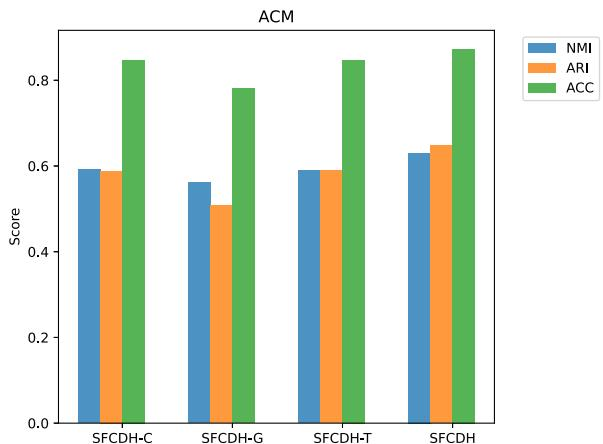  
(a) ACM

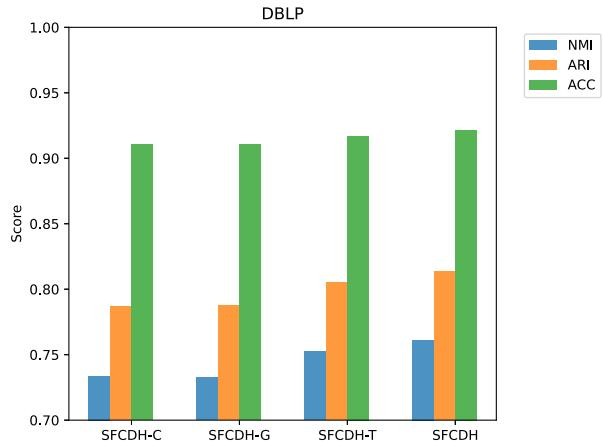  
(b) DBLP

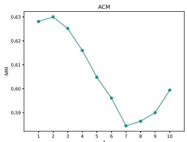  
图5. 模型不同变体在数据集上的效果。  
(a) λ的影响

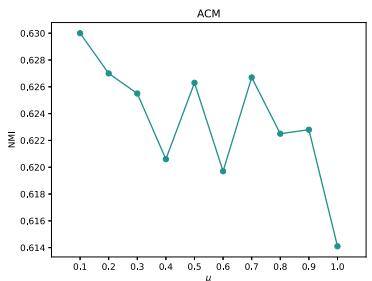  
(b) μ的影响

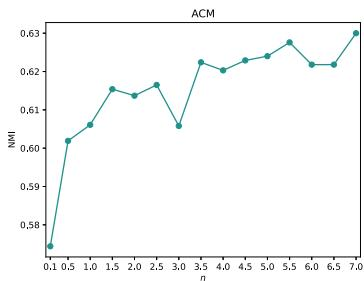  
(c) n的影响

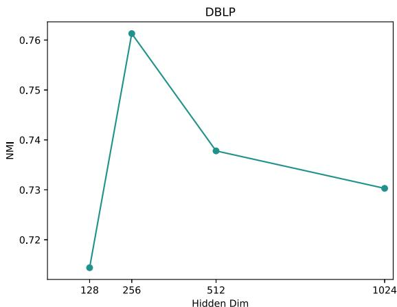  
图6. ACM数据集损失函数系数的实验结果。  
(a) DBLP

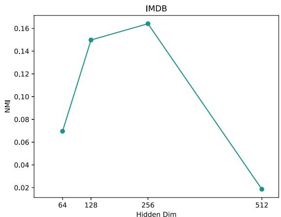  
(b) IMDB  
图7. SFCDH在不同隐藏维度下的性能。

# 5.6. 收敛性分析。

图12展示了AMiner和Texas数据集的损失趋势。初始阶段，Texas的损失值相当高，但在早期阶段迅速下降至极小值。相比之下，Aminer的损失呈现轻微但持续的波动。最终，两个数据集的损失均趋于稳定并收敛。

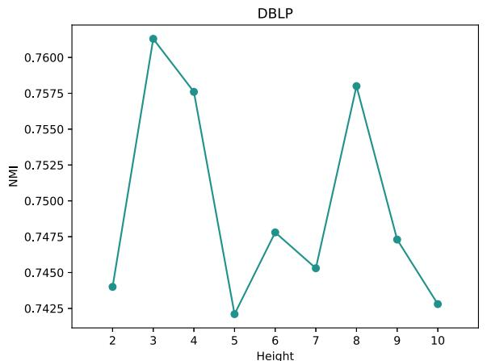  
(a)DBLP

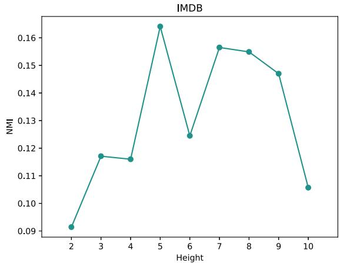  
(b）IMDB

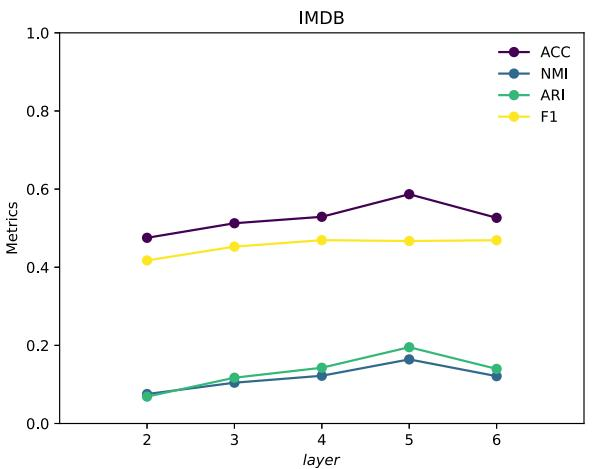  
图8. 不同层次抽象树下SFCDH的性能表现。   
图9. 网络层的性能表现。

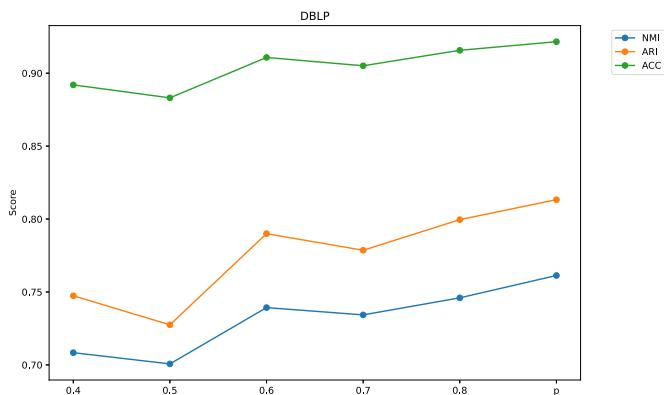  
图10. 动态掩码策略的性能表现。

# 5.7. 伪标签引导下的同质性比率变化分析

本节分析了ACM和IMDB数据集在基于伪标签的模型训练过程中的同质性比率。在图13(a)中，$\mathrm { H R } _ { 0 }$、$\mathrm { H R } _ { 1 }$和$\mathrm { H R } _ { S }$分别代表ACM数据集中元路径PAP和PSP对应的同质子图，以及高阶融合图$S$的同质性比率。随着训练轮次的增加，我们可以观察到$\mathrm { H R } _ { 0 }$上升而$\mathrm { H R } _ { 1 }$下降。然而，这些比率均优于基于数据集原始标签计算得到的同质性比率。

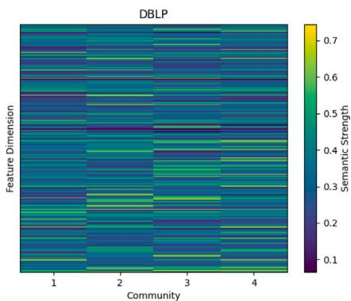  
图11. 社区可解释性。

模型中的同质性比率存在一定程度的波动，但变化范围不大，整体效果保持稳定。由于同质子图的同质性比率随训练轮次增加而下降，$\mathrm { H R } _ { S }$低于$\mathrm { H R } _ { 0 }$的上升幅度和$\mathrm { H R } _ { 1 }$。图13(b)显示，随着训练轮次增加，IMDB数据集中元路径MAM、MDM和MKM对应的同质子图（分别由$\mathrm { H R } _ { 0 }$、$\mathrm { H R } _ { 1 }$和$\mathrm { H R } _ { 2 }$表示）的同质性比率均呈下降趋势。这一趋势反映了IMDB数据集的异质性特征。如表2所示，该数据集在多个元路径子图上均表现出较低的同质性比率。由于模型在初始阶段效果不佳，无法区分属于不同社区的节点，因此图中许多异质边被误判为同质边。这使得模型在预训练阶段的同质性比率异常偏高。然而，随着训练轮次增加，SFCDH模型的效果逐步提升，社区划分也变得更加清晰。这种区分导致同质性比率逐渐下降，并逐步接近但始终高于实际的同质性比率。上述分析证明了利用伪标签聚合元路径子图的合理性和有效性。

# 5.8. 可视化

为了更直观地理解模型结果，本文采用t-SNE技术对不同模型的结果进行可视化，并比较了VGAER、HeCo、HetGNN-SF以及本文提出的SFCDH模型在DBLP数据集上的结果。如图14所示，不同颜色代表不同社区。在图14(a)中，VGAER中的几个社区存在重叠，且同一社区的节点过于离散，无法聚集。在图14(b)中，HeCo能够区分不同社区的节点，但同一社区的节点无法聚集。在图14(c)中，HetGNN-SF能够区分大部分不同社区的节点，但许多同一社区的节点无法聚集在一起，导致相对孤立的状态，同时社区之间的边界不清晰，存在重叠现象。图14(d)展示了本文提出的SFCDH模型，其中属于同一社区的节点凝聚成更密集的簇，社区之间的边界变得更加清晰。

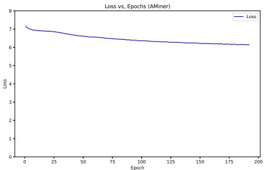  
(a)AMiner

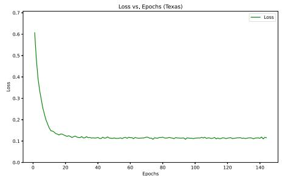  
(b) Texas

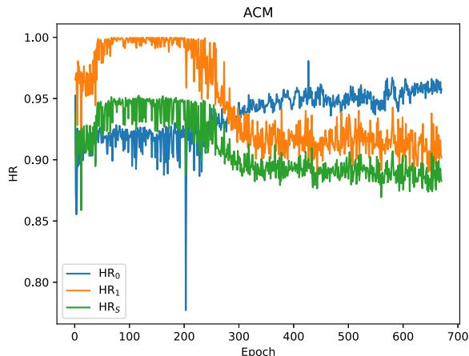  
图12. 收敛性分析。  
(a)ACM

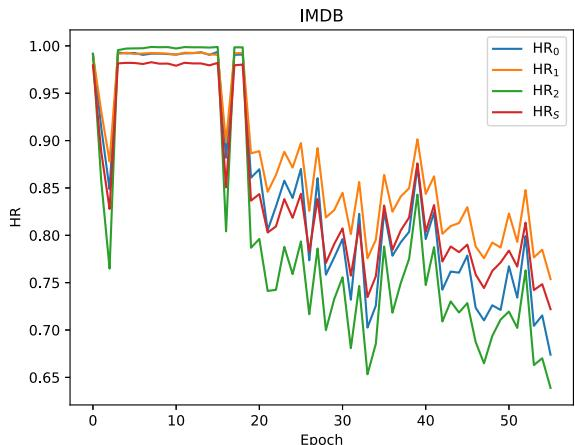  
(b)IMDB  
图13. 模型训练过程中同质性比率的变化。

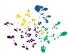  
(a)VGAER

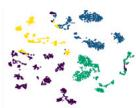  
(b)HeCo

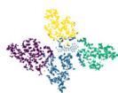  
(c) HetGNN-SF

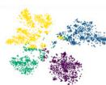  
(d) SFCDH  
图14. DBLP数据集上潜在节点嵌入的可视化。

# 5.9. 复杂度分析

为分析模型的复杂度，我们首先定义若干常量：$g$ 表示由元路径构成的同质子网络数量，$n$ 表示目标节点数量，?? 表示边数，$d$ 表示每个节点的特征维度。算法2的时间复杂度主要由以下部分组成：构建高阶融合图、构建层次抽象树、扩展同质子图与高阶融合图、利用异构掩码自编码器计算属性与特征重构损失，以及最终使用K-means算法获取社区分配矩阵。其中，构建高阶融合图涉及矩阵乘法，其复杂度为 $O \left( g \times n ^ { 2 } \right)$；构建层次抽象树的时间复杂度为 $O ( n \times \log ^ { 2 } \mathfrak { n } ) )$；掩码节点属性与计算社区原型损失 $L _ { \mathrm { { C o s } } }$ 的时间复杂度为 $O ( g \times ( e + n \times k \times$ ??)。异构掩码自编码器的时间复杂度为 $O \left( g \times \left( e \times d + n \times d ^ { 2 } \right) \right)$。因此，算法2的总复杂度为 $O \left( g \times \left( e + n \times k \times d + e \times d + n \times d ^ { 2 } \right) + n \times \log ^ { 2 } \mathrm { n } + g \times n ^ { 2 } \right)$。

为比较这12种方法的运行效率，我们在表9中展示了AMiner和Texas数据集上社区检测算法的总运行时间（单位：秒）。SFCDH的运行时间相较于异嗜性网络社区检测方法更短，但与同构网络或异构网络社区检测方法相比，其运行时间相当或略低。这是因为现有异嗜性网络社区检测方法在模型训练过程中倾向于持续更新原始图结构，这一过程较为耗时。然而，综合考虑模型整体效果，结合表3至表8的实验结果，SFCDH仍具有显著优势。

表9 运行时间

<table><tr><td></td><td>AMiner</td><td>Texas</td></tr><tr><td>HAN</td><td>89</td><td>45</td></tr><tr><td>DFCN</td><td>1086</td><td>50</td></tr><tr><td>HeCo</td><td>1717</td><td>-</td></tr><tr><td>VGAER</td><td>255</td><td>57</td></tr><tr><td>HetGNN-SF</td><td>1026</td><td>76</td></tr><tr><td>HGMAE</td><td>62</td><td>22</td></tr><tr><td>HoLe</td><td>3114</td><td>513</td></tr><tr><td>DDGAE</td><td>407</td><td>16</td></tr><tr><td>HAESF</td><td>52</td><td>5</td></tr><tr><td>AHGFC</td><td>4622</td><td>2472</td></tr><tr><td>PLCSR</td><td>2700</td><td>201</td></tr><tr><td>SFCDH</td><td>2597</td><td>58</td></tr></table>

# 6. 结论与未来工作

本文首次尝试解决异质性异构图中的节点嵌入坍塌问题。提出了一种名为SFCDH的无监督社区检测方法，该方法具有特征多级结构融合能力，并对同质图和异质图均具备强泛化性能。具体而言，SFCDH提出基于同质性比率采样（SFR）的分层结构融合模块，用于构建细粒度的高阶融合图，进而从树结构视角提取节点嵌入，使其能够泛化至具有不同同质性比率的元路径子图。此外，为增强异构图中目标节点特征与复杂语义的学习，本文提出一种结合社区原型对比学习与动态掩码自编码器的无监督图表示学习模块（UGC）。最终，将包括元路径视角与树结构视角在内的不同层级节点嵌入进行融合，用于社区检测。通过联合优化，本文在包含异质与同质异构图的6个基准数据集上证明了SFCDH相较于现有最优基线的优越性。

然而，未来可通过进一步研究提升SFCDH的性能。首先，本文的属性重构损失依赖于目标类型节点的特征，但异构图中可能存在这些特征缺失的情况。尽管图结构信息可部分弥补此类缺失，未来研究可聚焦于开发能有效处理节点特征缺失的社区检测方法。其次，本文仅探讨节点的异质性，未考虑边的异质性。边具有不同的关联性与重要性层级，在分析图结构时必须纳入考量。此外，应考虑将该方法扩展至动态异构图，以检测社区结构，并研究特征、节点与结构随时间动态变化时社区的演化规律。

# CRediT 作者贡献声明

孟颖戴：撰写 – 初稿，可视化，方法论，数据整理，概念构思。李伟民：撰写 – 审阅与编辑，监督，资源，概念构思。张欣怡：撰写 – 审阅与编辑。刘芳芳：监督，形式分析。辛明军：撰写 – 审阅与编辑，项目管理。王灿：撰写 – 审阅与编辑，验证。

# 利益冲突声明

作者声明，他们不存在可能影响本文所报告工作的已知竞争性经济利益或个人关系。

# 致谢

本研究受国家重点研发计划（编号：2022YFC3302600）资助。本研究还得到了上海大学科学与工程计算上海技术服务支持中心的支持。

# 数据可用性

数据将根据请求提供。

# 参考文献

[1] M. Wang, C. Wang, J.X. Yu, J. Zhang, 社交网络中的社区检测：基于面向过程框架的深入基准测试研究, Proc. the VLDB Endow. 8 (10) (2015) 998–1009.  
[2] C. Pizzuti, S.E. Rombo, 蛋白质-蛋白质相互作用网络聚类的算法与工具，特别关注基于种群的随机方法, Bioinformatics 30 (10) (2014) 1343–1352.  
[3] C. Von Ferber, T. Holovatch, Y. Holovatch, V. Palchykov, 公共交通网络：实证分析与建模, Eur. Phys. J. B 68 (2009) 261–275.  
[4] L. Luo, Y. Fang, X. Cao, X. Zhang, W. Zhang, 从异质图中检测社区：一种基于上下文路径的图神经网络模型, in: Proceedings of the 30th ACM International Conference on Information & Knowledge Management, 2021, pp. 1170–1180.  
[5] Y. Zhao, W. Li, F. Liu, J. Wang, A.M. Luvembe, 融合异质结构与社区语义用于异质网络中的无监督社区检测, Expert Syst. Appl. 238 (2024) 121821.  
[6] Y. Tian, K. Dong, C. Zhang, C. Zhang, N.V. Chawla, 异质图掩码自编码器, in: Proceedings of the AAAI Conference on Artificial Intelligence, 37, (8) 2023, pp. 9997–10005.  
[7] S. Luan, C. Hua, Q. Lu, J. Zhu, M. Zhao, S. Zhang, X.-W. Chang, D. Precup, 重新审视图神经网络的异质性, Adv. Neural Inf. Process. Syst. 35 (2022) 1362–1375.  
[8] X. Shi, H. Lu, Y. He, S. He, 基于成对约束对称非负矩阵分解的社交网络社区检测, in: Proceedings of the 2015 IEEE/ACM International Conference on Advances in Social Networks Analysis and Mining 2015, 2015, pp. 541–546.  
[9] D. He, X. You, Z. Feng, D. Jin, X. Yang, W. Zhang, 一种面向社区检测的网络特定马尔可夫随机场方法, in: Proceedings of the AAAI Conference on Artificial Intelligence, 32, (1) 2018.  
[10] G. Bonifazi, F. Cauteruccio, E. Corradini, M. Marchetti, A. Pierini, G. Terracina, D. Ursino, L. Virgili, 一种检测社交平台不同社区间信息传播者骨干网络的方法, Data Knowl. Eng. 140 (2022) 102048.  
[11] G. Bonifazi, S. Cecchini, E. Corradini, L. Giuliani, D. Ursino, L. Virgili, 调查TikTok危险与非危险挑战中的社区演化, J. Inf. Sci. (2022) 01655515221116519.  
[12] N. Kang, Z. Miao, Q.-K. Pan, W. Li, M.F. Tasgetiren, 面向多除草机器人任务分配问题的多目标教学优化算法, Tsinghua Sci. Technol. 29 (5) (2024) 1249–1265.  
[13] Q. Kong, J. Sun, Z. Xu, 联合正交对称非负矩阵分解用于属性网络社区检测, Knowl.-Based Syst. 283 (2024) 111192.  
[14] C. Li, X. Guo, W. Lin, Z. Tang, J. Cao, Y. Zhang, 基于模体感知的多层网络社区检测算法, Knowl.-Based Syst. 260 (2023) 110136.  
[15] Y. Liu, Z. Liu, X. Feng, Z. Li, 保留社区信息的鲁棒属性网络嵌入, in: 2022 IEEE 38th International Conference on Data Engineering, ICDE, IEEE, 2022, pp. 1874–1886.  
[16] J. Hao, W. Zhu, 基于增强特征表示的深度图聚类用于社区检测, Appl. Intell. 53 (2) (2023) 1336–1349.  
[17] H. Sun, Y. Li, B. Lv, W. Yan, L. He, S. Qiao, J. Huang, 图社区信息最大化, ACM Trans. Knowl. Discov. from Data ( TKDD) 16 (3) (2021) 1–21.  
[18] B. Li, B. Jing, H. Tong, 图社区对比学习, in: Proceedings of the ACM Web Conference 2022, 2022, pp. 1203–1213.  
[19] Y. Sun, Y. Yu, J. Han, 基于星型网络模式的异质信息网络排序聚类, in: Proceedings of the 15th ACM SIGKDD International Conference on Knowledge Discovery and Data Mining, 2009, pp. 797–806.  
[20] Z. Li, Z. Pan, Y. Zhang, G. Li, G. Hu, et al., 异质社交网络中的高效社区检测, Math. Probl. Eng. 2016 (2016).  
[21] X. Wang, H. Ji, C. Shi, B. Wang, Y. Ye, P. Cui, P.S. Yu, 异质图注意力网络, in: The World Wide Web Conference, 2019, pp. 2022–2032.  
[22] C. Zhang, D. Song, C. Huang, A. Swami, N.V. Chawla, 异质图神经网络, in: Proceedings of the 25th ACM SIGKDD International Conference on Knowledge Discovery & Data Mining, 2019, pp. 793–803.  
[23] S. Yun, M. Jeong, R. Kim, J. Kang, H.J. Kim, 图变换网络, Adv. Neural Inf. Process. Syst. 32 (2019).  
[24] D. He, D. Liu, D. Jin, W. Zhang, 一种用于检测复杂网络中异质链接社区的随机模型, in: Proceedings of the AAAI Conference on Artificial Intelligence, 29, (1) 2015.  
[25] H. Zhao, P. Rui, J. Chen, Y. Zhang, Y. Wang, S. Zhao, J. Tang, HINCHIP：保留社区层次结构的异质信息网络表示, Knowl.-Based Syst. 264 (2023) 110343.  
[26] H. Wei, G. Xiong, Q. Wei, W. Cao, X. Li, 结构感知的属性异质网络嵌入, Knowl. Inf. Syst. 65 (4) (2023) 1769–1785.  
[27] L. Yang, M. Li, L. Liu, C. Wang, X. Cao, Y. Guo, et al., 面向异质性属性的多样化消息传递, Adv. Neural Inf. Process. Syst. 34 (2021) 4751–4763.  
[28] X. Li, R. Zhu, Y. Cheng, C. Shan, S. Luo, D. Li, W. Qian, 在遇到异质性时寻找图神经网络中的全局同质性, in: International Conference on Machine Learning, PMLR, 2022, pp. 13242–13256.  
[29] E. Chien, J. Peng, P. Li, O. Milenkovic, 自适应通用广义PageRank图神经网络, in: International Conference on Learning Representations, 2021.  
[30] Y. Wu, Y. Wang, L. Hu, J. Hu, DCGNN：面向异质性图的自适应深度图卷积, Inform. Sci. 666 (2024) 120427.  
[31] B.-M. Liu, Y.-L. Gao, F. Li, C.-H. Zheng, J.-X. Liu, SLGCN：结构增强的线图卷积网络用于预测药物-疾病关联, Knowl.-Based Syst. 283 (2024) 111187.  
[32] Y. Zheng, H. Zhang, V.C. Lee, Y. Zheng, X. Wang, S. Pan, 寻找缺失的一半：面向同质性倾向和异质性倾向图的图互补学习, in: Proceedings of the 40th International Conference on Machine Learning, in: ICML’23, JMLR.org, 2023, p. 14, 1788.  
[33] Z. Wen, Y. Ling, Y. Ren, T. Wu, J. Chen, X. Pu, Z. Hao, L. He, 同质性相关：面向多视图图聚类的自适应混合图滤波器, in: AAAI, 2024, pp. 15841–15849.  
[34] D. Zou, H. Peng, X. Huang, R. Yang, J. Li, J. Wu, C. Liu, P.S. Yu, SE-GSL：一种通过结构熵优化的通用且有效的图结构学习框架, in: Proceedings of the ACM Web Conference 2023, 2023, pp. 499–510.  
[35] Y. Dong, N.V. Chawla, A. Swami, Metapath2vec：面向异质网络的可扩展表示学习, in: Proceedings of the 23rd ACM SIGKDD International Conference on Knowledge Discovery and Data Mining, 2017, pp. 135–144.  
[36] A. Li, X. Yin, B. Xu, D. Wang, J. Han, Y. Wei, Y. Deng, Y. Xiong, Z. Zhang, 通过图结构熵从超低分辨率Hi-C数据解码拓扑关联结构域, Nat. Commun. 9 (1) (2018) 3265.  
[37] W. Tu, S. Zhou, X. Liu, X. Guo, Z. Cai, E. Zhu, J. Cheng, 深度融合聚类网络, in: Proceedings of the AAAI Conference on Artificial Intelligence, 35, (11) 2021, pp. 9978–9987.  
[38] X. Wang, N. Liu, H. Han, C. Shi, 基于共对比学习的自监督异质图神经网络, in: Proceedings of the 27th ACM SIGKDD Conference on Knowledge Discovery & Data Mining, 2021, pp. 1726–1736.  
[39] C. Qiu, Z. Huang, W. Xu, H. Li, VGAER：基于图神经网络重构的社区检测, in: AAAI: DLG-AAAI’22, 2022.  
[40] C. Li, X. Liu, Y. Yan, Z. Zhao, Q. Zeng, HetGNN-SF：基于语义强度和特征相似度的异质图神经网络自监督学习, Appl. Intell. 53 (19) (2023) 21902–21919.  
[41] M. Gu, G. Yang, S. Zhou, N. Ma, J. Chen, Q. Tan, M. Liu, J. Bu, 同质性增强的结构学习用于图聚类, in: Proceedings of the 32nd ACM International Conference on Information and Knowledge Management, 2023, pp. 577–586.  
[42] X. Wu, W. Lu, Y. Quan, Q. Miao, P.G. Sun, 深度双图注意力自编码器用于社区检测, Expert Syst. Appl. 238 (2024) 122182.  
[43] P. Zhu, J. Li, Y. Wang, B. Xiao, J. Zhang, W. Lin, Q. Hu, 基于课程自反射的伪标签增强用于属性图聚类, IEEE Trans. Neural Networks Learn. Syst. (2024) 1–14.