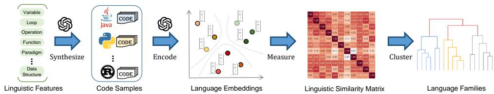
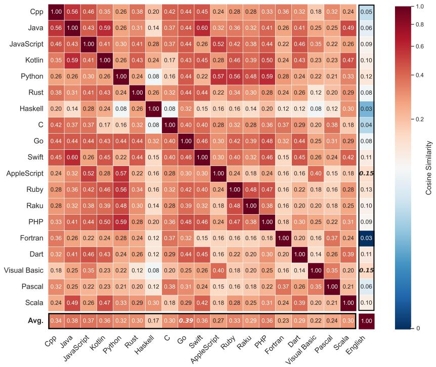
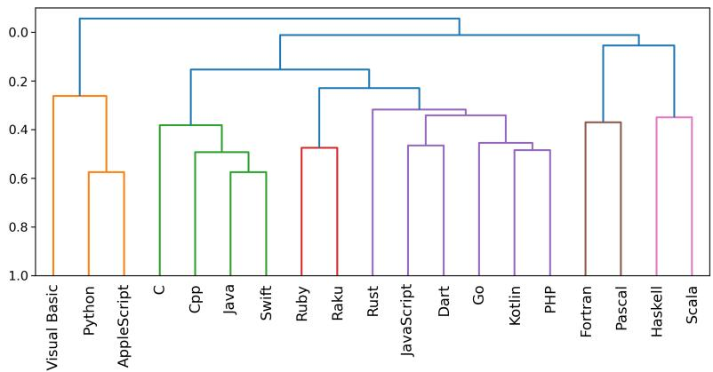
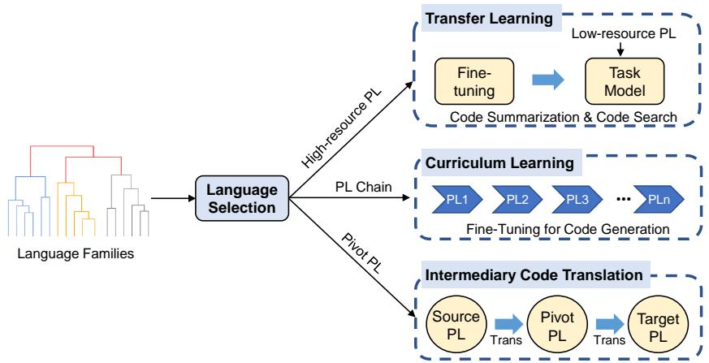
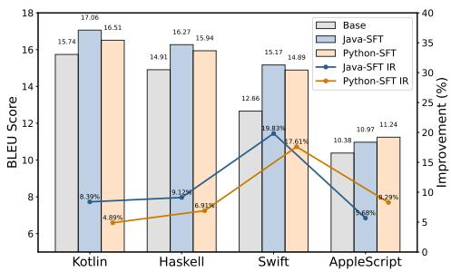
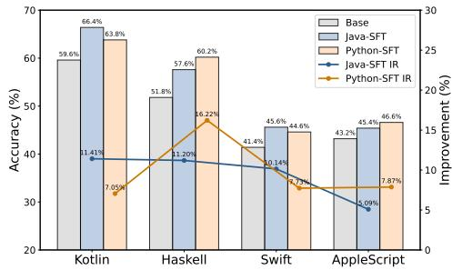
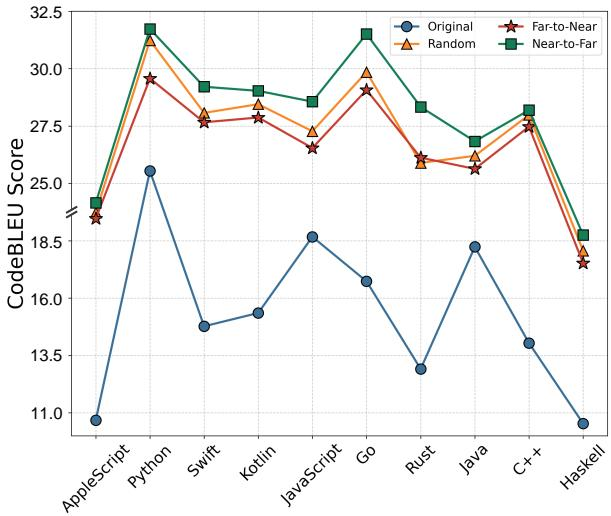

# 超越语言边界：揭示面向代码语言模型的编程语言族系

SHANGBO YUN，上海交通大学计算机科学与技术学院，中国 XIAODONG GU，上海交通大学计算机科学与技术学院，中国 JIANGHONG HUANG，上海交通大学计算机科学与技术学院，中国 BEIJUN SHEN∗，上海交通大学计算机科学与技术学院，中国

多种编程语言的快速涌现为开发多语言代码大语言模型（LLMs）带来了机遇与挑战。现有技术通常通过简单聚合多语言代码数据来训练代码LLMs，但鲜有研究深入探索编程语言之间的深层关系，以及如何利用这些关系来优化代码LLMs的训练与推理。本研究探讨两个基本问题：（1）编程语言之间存在哪些深层语言学关系？（2）如何利用这些关系来改进多语言代码LLMs？我们提出了一个基于嵌入的框架来揭示编程语言的潜在家族。我们的方法首先定义了编程语言的21个主要语言学特征，例如变量定义、控制结构和方法声明，然后利用LLMs生成跨多种语言的特征对齐代码样本。通过对来自19种语言的语义平行代码片段进行嵌入，我们构建了一个相似度矩阵并进行层次聚类，以揭示语言间的内在关系。我们的分析揭示了编程语言之间清晰的层次结构。紧密相关的语言形成了明确的聚类（例如，C、${ \mathrm { C } } { + } { + }$、Java和Swift聚集在一起），而Go则表现出作为中心语言的特征，具有最高的跨语言相似性。基于所揭示的语言家族，我们提出了三种策略来增强多语言LLM训练：跨语言学相关语言的迁移学习、语言学邻近性引导的课程学习以及基于质心的中间代码翻译。在四个代码智能任务上的实验表明，我们的方法显著提升了多语言LLM的性能。这项工作为理解编程语言提供了一个普适的视角，并推进了多语言代码LLM训练的更有效策略。

CCS概念：• 软件及其工程 软件维护与工具；• 计算方法论 自然语言处理。

其他关键词和短语：多语言代码LLMs，编程语言家族，迁移学习，课程学习

# ACM 参考文献格式：

尚波云，顾晓东，黄江红，沈北军。2025。超越语言边界：为代码语言模型揭示编程语言家族。载于《ACM国际软件工程基础会议论文集》（会议 FSE '26）。ACM，美国纽约州纽约市，21页。https://doi.org/XXXXXXX.XXXXXXX

# 1 引言

近年来，编程语言的格局急剧扩展，涌现出越来越多的语言以应对多样化的计算挑战[36]。每种语言都针对特定领域、范式和用例带来了独特的优势。从C语言的低层效率到Python的高层抽象，从Haskell的函数式优雅到Go的并发能力，编程语言的多样性反映了现代软件开发的多面性。然而，这种激增也引发了关于语言间关系、语言选择标准[17]以及有效集成多种语言的潜力[9]等关键问题。理解这些方面不仅对开发者至关重要，在大型语言模型（LLMs）重塑我们与代码交互和推理方式的背景下也尤为重要。

虽然现有的代码LLM训练方法主要依赖于多语言代码数据的简单集成[2, 7, 20, 33]，但它们很少探索编程语言之间更深层次的语言学关系，或如何利用这些关系来增强模型训练。这些关系涵盖句法结构和编程范式等多个方面。例如，C家族语言（如C、$\mathrm { C } { + } { + }$、Java和C#）具有高度相似的控制流结构，而Haskell和Scala等函数式语言则强调不可变性和高阶函数。尽管此类关系可能在先前的多语言LLM训练中被隐式利用，但尚未得到系统建模或明确研究。当前研究中的这些空白限制了我们充分发挥代码LLMs多语言潜力的能力。

在本文中，我们试图回答两个研究问题：RQ1 编程语言之间更深层次的语言学关系是什么？以及RQ2 如何利用这些语言学关系来增强代码LLMs的训练和推理？

回答这些问题对LLM训练和编程语言的未来设计具有重要意义。例如，同一家族内的语言（如基于C的语言）在学习过程中如何相互影响？跨语言共享的语法、语义或编程范式能否用于提高LLMs的泛化能力？更好地理解语言关系可以为构建更高效的训练数据集提供信息，改进LLMs的跨语言泛化能力，并指导创建更自然地符合大型模型优势和局限性的编程语言。此外，这些知识可以引导编程语言的演进，以更好地满足人类开发者和AI驱动系统的需求。

为此，我们设计了一个基于嵌入的框架，以揭示19种广泛使用的编程语言的潜在家族。我们的核心假设是，具有相似特征的语言在LLMs学习的嵌入空间中会位置相近，这一命题在自然语言处理领域已有实证基础[43]，并得到代码LLM研究的进一步支持[16, 34]。我们的框架基于基本编程元素（即变量定义、分支、循环和方法声明）定义了21个主要语言学特征，并利用LLMs为所有语言的每个特征生成代表性代码样本。接着，使用多语言代码LLM将生成的代码样本嵌入到高维向量中。然后，对每种语言的特征对齐向量进行聚类，并计算语言嵌入之间的成对相似度。最后，对相似度矩阵进行层次聚类，以揭示所研究语言之间的家族结构。

我们的分析揭示了编程语言之间清晰的相似性层次结构，我们称之为家族。共享语法特征的语言，如Java和$\mathrm { C } { + } { + }$或Fortran和Pascal，在嵌入空间中关系更近，而具有异质语言学特征的语言，如Python和Java，则显得更远。值得注意的是，Go在嵌入空间中作为中心语言出现，表现出与其他语言最高的整体相似性，而Visual Basic与英语最为接近，这与其设计理念一致。

为了证明我们发现的实用性，我们基于揭示的语言学关系提出了三种优化多语言LLM训练的策略：1）跨亲属语言的迁移学习，通过使用密切相关的高资源语言数据进行微调，提升低资源语言的性能；2）多语言微调的课程学习，根据语言邻近性以最优顺序引入语言；3）识别用于中间代码翻译任务的通用语言，利用如Go等语言的中心特性。我们在四个代码智能任务上进行了广泛的实验。结果一致表明，我们基于嵌入发现的编程语言家族可以作为更有效的多语言LLM训练的基础。例如，基于家族的从Java迁移学习使Swift代码摘要的BLEU-4分数提高了$1 9 . 8 3 \%$。我们基于嵌入距离指导的由近及远课程学习显著提升了多语言代码生成性能。此外，通过策略性地利用嵌入空间中位于源语言和目标语言之间的枢轴语言，它显著提高了中间代码翻译的准确性。

总之，本文做出了以下贡献：

• 我们首次提出了通过语言学相似性分析发现编程语言家族的自动化方法，并展示了其在改进多语言代码LLMs中的应用。
• 我们开发了新颖的分类法指导策略，用于多语言代码LLM训练中的最优语言选择，包括迁移学习和课程学习技术。
• 我们确定Go为中心编程语言，并展示了其在促进LLMs多语言代码翻译中的关键作用。

# 2 背景与相关工作

# 2.1 编程语言的分类

编程语言分类法是指基于编程语言的特征、范式或历史渊源对其进行系统分类，从而为理解语言的复杂本质提供结构化框架。尽管学术界尚未就统一的编程语言分类体系达成共识，但学界与工业界通常沿四个关键维度进行组织[18, 36]：1）编程范式界定计算模型，例如采用逐步执行的过程式语言（如C和Fortran）、运用封装与多态的面向对象语言（如Java和$\mathrm { C } { + } { + }$）、强调纯函数式的函数式语言（如Haskell和Lisp）；2）执行方法区分实现途径，例如生成原生机器码的编译型语言（如C和$\mathrm { C } { + } { + }$）、通过运行时解释执行的解释型语言（如Python和JavaScript），以及采用中间字节码编译的混合型语言（如Java和C#）；3）类型系统刻画类型语义，例如Java和$\mathrm { C } { + } { + }$在编译时进行验证的静态类型、Python和Ruby将类型检查延迟至运行时的动态类型、Java和Python实施严格约束的强类型，以及JavaScript和PHP允许隐式转换的弱类型；4）历史谱系追溯语言演进，例如具有共同语法特征的C语言家族、面向跨平台开发的Java语言家族，以及致力于数据科学与人工智能的Python语言家族。

大语言模型（LLMs）的出现催生了编程语言分类法的范式转变。LLMs优先关注代码使用模式、语义理解、句法相似性及任务特定性能[10, 24]，从而推动形成更具适应性、以应用为中心的分类体系，这与其动态性和上下文感知特性高度契合。尽管已有大量研究探索基于模型的自然语言分类分析方法[25, 26, 37]，但将这些方法拓展至编程语言分类仍是一个新兴的研究前沿。

据我们所知，本研究首次提出系统化运用LLMs自动推导语言相似性度量与谱系关联的方法，提供了一种可扩展、数据驱动的解决方案，超越了传统人工或基于规则的技术。与现有主要依赖带语言标签输入的多语言编码器-解码器模型进行自然语言研究不同，我们的方法利用LLMs处理特征对齐的代码片段作为编程语言的表征。

# 2.2 面向代码智能的多语言学习

代码智能利用人工智能技术来理解和生成源代码，促进代码搜索、程序合成和错误检测等任务[3, 41]。多语言学习通过共享的语言模式，增强了这些能力在不同编程语言间的适用性，提升了模型性能和泛化能力。该领域的研究主要聚焦于两个方向：

1) 跨语言迁移学习[1, 21]将知识从源语言迁移到目标语言，在资源匮乏的场景下尤为有效。例如，CDCS[6]应用模型无关的元学习来缓解代码搜索中源语言与目标语言之间的表征冲突。SDA-Trans[22]提出了一种语法和领域感知的程序翻译模型，通过利用语法结构和领域知识来增强跨语言迁移能力。IRCoder[30]探索了集成编译器中间表示（IRs）以提升代码大语言模型的多语言能力并促进跨语言迁移。

迁移学习中的一个关键挑战是自动识别最有益的高资源语言。针对此问题，Baltaji等人[4]对41种编程语言和四项代码相关任务进行了实证研究，通过分析语言对之间的迁移性能来建立选择准则。MIREncoder[8]则通过捕捉更丰富句法和语义特征的多模态中间表示来增强这一过程。

我们的方法与他们有显著不同。通过构建具有语义相似性的编程语言家族，我们建立了一套系统化机制，用于在迁移学习场景中识别与特定目标语言相对应的最优源语言。

2) 代码大语言模型的多语言训练，涉及在异构的多语言编程语料库上进行模型预训练，以发展跨语言的代码理解和合成能力。最先进的代码大语言模型，如CodeLlama[33]、DeepSeekCoder[7]和StarCoder[20]，通常采用统一的架构来处理多种语言，但其根本上依赖于简单的语料库聚合，而非复杂的跨语言学习方法。

近期的进展引入了更复杂的多语言学习框架。Baltaji等人[4]提出了一个在高资源与低资源语言之间进行战略性知识迁移的预测框架；Pian等人[31]引入了元学习来动态生成特定于语言的参数，同时保留共享的语言特征；Paul等人[30]则利用编译器IRs来减轻不同编程语言之间的结构和语义差异。

与现有方法不同，我们的研究开创了一种分类法引导的框架，该框架通过战略性的编程语言选择和课程排序来优化代码大语言模型的训练。

# 3 揭示编程语言家族（研究问题1）

我们首先探究编程语言之间的语言学关联，并揭示其谱系特征。

# 3.1 研究对象语言

我们选取了19种编程语言，包括 $\mathrm { C } { + } { + }$ 、Java、JavaScript、Kotlin、Python、Rust、Haskell、C、Go、Swift、AppleScript、Fortran、Dart、Ruby、Raku、PHP、Visual Basic、Pascal和Scala。这些语言的选择旨在代表广泛的编程范式，例如过程式、面向对象、函数式以及静态/动态类型编程。此外，所选语言兼顾了高资源与低资源语言，以确保覆盖的全面性。为进行对比分析，我们将英语作为参考自然语言纳入，以便为语言和结构比较提供基准。

# 3.2 研究设计

与先前依赖人工整理语言规则的研究[36]不同，我们提出了一个基于嵌入的框架来揭示编程语言的潜在家族。我们的方法利用大语言模型（LLM）来推导语言嵌入，并分析它们的谱系特征。其核心原理是，通过对大规模多语言语料库进行预训练，大语言模型已经隐式地获取了多种编程语言的知识。这种知识使得能够在统一的表示空间中对单语嵌入进行编码，从而支持对编程语言谱系的研究。

图1展示了我们研究的整体设计。我们首先为编程语言定义关键的语言特征，并利用大语言模型为每个特征精心编写代码示例。然后，使用大语言模型将这些精心编写的代码示例嵌入为语言向量。最后，我们计算嵌入之间的成对相似性，并将编程语言聚类成一个层次化的家族结构。具体而言，该流程包含五个步骤：

1)  定义语言特征。为了刻画编程语言的特征，我们基于基本的编程元素（例如，变量定义、类型系统、分支、循环和方法声明）设计了21个语言特征。这些特征最初是从每种语言官方文档中提供的语言参考中收集的12345。为了

图1. 揭示编程语言家族的工作流程。

确保鲁棒性并减少个体偏见，我们机构的三位编程语言专家首先独立地将这些元素综合成一个初步的特征集。然后，由两位作者对这个初始集进行系统性审查。每个提出的特征都根据两个核心标准进行严格评估：其作为编程范式或语法的基本和区分性方面的技术合理性，以及其跨语言表达能力，即该概念必须在所有研究语言中均可实现。每个特征都有技术原理支持，并通过所有参与者之间的结构化讨论进行迭代完善。该过程持续进行，直到达成共识并解决所有方法论上的问题。

表1总结了最终验证的特征集。其中，变量声明特征反映了Python的动态类型范式，其中类型推断在赋值时发生，无需显式类型注解。条件分支特征捕捉了Haskell的守卫结构，它通过用管道符号（|）前置布尔表达式来替代嵌套的if-then-else结构，从而简化了条件逻辑。特征$F _ { 1 0 }$和$F _ { 1 1 }$编码了C语言的函数调用属性，例如函数签名中强制性的返回类型说明、带有括号参数列表的命名函数以及省略返回值的void函数。为了表示面向对象范式，我们纳入了核心的OOP特征，例如类定义、对象实例化和继承机制[27]。对于函数式编程，我们专注于高阶函数的特征，例如map和filter的实现。它们代表了不变性和函数组合，这是函数式编程的两个核心原则[11]。

2)  整理代码示例。对于每个语言特征，我们整理出实例化每个主要语言特征的代码示例。随后可以使用大语言模型将这些代码示例嵌入，以得到向量化的特征表示。我们依赖大语言模型生成的代码，而不是来自实际项目的样本，因为我们需要一个涵盖19种编程语言的大规模并行语义代码片段语料库。从现有代码库中获取如此平衡且多样化的数据集将极具挑战性，甚至可能不可行。使用大语言模型能够跨所有语言生成语言上一致且受控的样本，这对于确保跨语言可比性至关重要。

更具体地说，我们指导GPT-4o[28]使用结构化提示生成一个并行代码语料库，该语料库包含每个特征在19种编程语言中的1,900个样本。生成的语料库总共包含39,900个代码片段，每种语言由2,100个均匀分布的样本表示。

表1. 编程语言的21个语言特征

<table><tr><td>Feature</td><td>Name</td><td>Description</td></tr><tr><td>F1</td><td>Variable Definition</td><td>How does a language define variables of various types, particularly in distinguishing static and dynamic typing?</td></tr><tr><td>F2</td><td>Conditional Branching</td><td>How does a language realize conditions and branches in program control flow?</td></tr><tr><td>F3~F4</td><td>Loop: For and While</td><td>How does a language implement loop constructs in program control flow?</td></tr><tr><td>F5</td><td>System I/O</td><td>How does a language handle standard input and output operations, such as reading user input and printing text to the screen?</td></tr><tr><td>F6~F8</td><td>Operations: Arithmetic, Logical, and Comparison</td><td>Basic features governing operations, covering syntax, hierarchy, and conditional evaluation.</td></tr><tr><td>F9</td><td>Library Integration</td><td>How does a language import and utilize standard and third-party libraries?</td></tr><tr><td>F10</td><td>Parameter Passing</td><td>What are the mechanisms for passing arguments in function calls, including distinctions between pass-by-value, pass-by-reference, and other strategies?</td></tr><tr><td>F11</td><td>Function Returns</td><td>How does a language define and manage return values from functions, including support for multiple return values or return type declarations?</td></tr><tr><td>F12</td><td>Exception Handling</td><td>How does the language manage runtime errors, including syntax and semantics of exception-throwing and catching constructs?</td></tr><tr><td>F13~F16</td><td>Data Structures: Array, List, Set, and Map</td><td>What are the built-in data abstraction mechanisms provided by the language, such as arrays, lists, sets, and maps, and how are they typically used?</td></tr><tr><td>F17~F19</td><td>OOP: Class Definition, Object Creation, Inheritance</td><td>How does the language support object-oriented constructs such as class definitions, object instantiation, encapsulation, inheritance, and polymorphism?</td></tr><tr><td>F20~F21</td><td>Functional Programming: Map and Filter</td><td>A declarative paradigm emphasizing pure functions and immutable data, with Map and Filter exemplifying key features.</td></tr></table>

# 用于生成特征对齐代码示例的提示模板

为 $FEATURE_NAME in $\complement + +$、Java、JavaScript、Kotlin、Python、Rust、Haskell、C、Go、Swift、AppleScript、Fortran、Dart、Ruby、Raku、PHP、Visual Basic、Pascal 和 Scala 生成代码范例。

# $FEATURE_NAME: $特征描述

# 您必须严格遵守以下规则：

1) 为每种语言生成100个代码片段；  
2) 这100个代码片段不仅必须符合功能规范，还应尽可能多样化；  
3) 确保不同语言间代码片段的语义一致性，即它们应实现相同的功能。

表2. 为语言特性精选的代码示例

<table><tr><td>Feature</td><td>Python</td><td>PHP</td><td>Ruby</td><td>Dart</td></tr><tr><td rowspan="7">Variable Definition</td><td>1 int_var = 42</td><td>1 $intVar = 42;</td><td>1 intVar = 42</td><td>1 int int Var = 42;</td></tr><tr><td>2 float_var = 3.14</td><td>2 $floatVar = 3.14;</td><td>2 floatVar = 3.14</td><td>2 double floatVar = 3.14;</td></tr><tr><td>3 str_var = &quot;Hello!&quot;</td><td>3 $strVar = &quot;Hello!&quot;;</td><td>3 strVar = &quot;Hello!&quot;</td><td>3 String strVar = &quot;Hello&quot;;</td></tr><tr><td>4 bool_var = True</td><td>4 $bool var = true;</td><td>4 bool var = true</td><td>4 bool bool var = true;</td></tr><tr><td>5 nil_var = None</td><td>5 nullVar = null;</td><td>5 nilVar = nil</td><td>5 var nil var = null;</td></tr><tr><td>6 binary_var = b&quot;Hello&quot;</td><td>6 $binaryVar = b&quot;Hello&quot;;</td><td>6 symbolVar = : ruby</td><td>6 String strVar = &#x27;dart&#x27;;</td></tr><tr><td>7 str_var = &quot;Escape:\n&quot;</td><td>7 $strVar = &quot;Escape:\n&quot;;</td><td>7 strVar = &quot;Escape:\n&quot;</td><td>7 String strVar = &quot;OK!\n&quot;;</td></tr><tr><td rowspan="7">Conditional Branching</td><td>1 if 10 &gt; 20:</td><td>1 if (10 &gt; 20) {</td><td>1 if 10 &gt; 20</td><td>1 if (10 &gt; 20) {</td></tr><tr><td>2 print(&quot;greater&quot;)</td><td>2 echo &quot;greater&quot;;</td><td>2 puts &quot;greater&quot;</td><td>2 print(&quot;greater&quot;);</td></tr><tr><td>3 elseif 10 == 20:</td><td>3 elseif (10 == 20) {</td><td>3 elseif 10 == 20</td><td>3 else if (10 == 20) {</td></tr><tr><td>4 print(&quot;equal&quot;)</td><td>4 echo &quot;equal&quot;;</td><td>4 puts &quot;equal&quot;</td><td>4 print(&quot;equal&quot;);</td></tr><tr><td>5 else:</td><td>5 else{</td><td>5 else</td><td>5 else{</td></tr><tr><td>6 print(&quot;less&quot;)</td><td>6 echo &quot;less&quot;;</td><td>6 puts &quot;less&quot;</td><td>6 print(&quot;less&quot;);</td></tr><tr><td></td><td>7}</td><td>7 end</td><td>7}</td></tr><tr><td rowspan="7">For Loop</td><td>1 for i in range(1,4):</td><td>1 for ($i=1:$i&lt;=3:$i++) {</td><td>1 for i in 1..3</td><td>1 for (var i=1;i&lt;=3;i++) {</td></tr><tr><td>2 for j in range(1,4):</td><td>2 for ($j=1:$j&lt;=3:$j++) {</td><td>2 for j in 1..3</td><td>2 for (var j=1;j&lt;=3;j++) {</td></tr><tr><td>3 for k in range(1,4):</td><td>3 for ($k=1:$k&lt;=3:$k++) {</td><td>3 for k in 1..3</td><td>3 for (var k=1;k&lt;=3;k++) {</td></tr><tr><td>4 print(&quot;For Loop&quot;)</td><td>4 echo &quot;For Loop&quot;;</td><td>4 puts &quot;For Loop&quot;</td><td>4 print(&quot;For Loop&quot;);</td></tr><tr><td></td><td>5}</td><td>5 end</td><td>5}</td></tr><tr><td></td><td>6}</td><td>6 end</td><td>6}</td></tr><tr><td></td><td>7}</td><td>7 end</td><td>7}</td></tr><tr><td rowspan="7">Arithmetic Operations</td><td>1 z = x + y;</td><td>1 $z = $x + $y;</td><td>1 z = x + y;</td><td>1 var z = x + y;</td></tr><tr><td>2 e = y - x;</td><td>2 $e = $y - $x;</td><td>2 e = y - x;</td><td>2 var e = y - x;</td></tr><tr><td>3 j = x * y;</td><td>3 $j = $x * $y;</td><td>3 j = x * y;</td><td>3 var j = x * y;</td></tr><tr><td>4 o = y / x;</td><td>4 $o = $y / $x;</td><td>4 o = y / x;</td><td>4 var o = y / x;</td></tr><tr><td>5 t = y % x;</td><td>5 $t = $y % $x;</td><td>5 t = y % x;</td><td>5 var t = y % x;</td></tr><tr><td>6 y1 = x ** 2;</td><td>6 $y1 = $x ** 2;</td><td>6 y1 = x ** 2;</td><td>6 var y1 = x * x;</td></tr><tr><td>7 x += 2;</td><td>7 $x += 2;</td><td>7 x += 2;</td><td>7 x += 2;</td></tr><tr><td rowspan="16">Object Oriented</td><td>1 class V:</td><td>1 class V{</td><td>1 class V{</td><td>1 class V{</td></tr><tr><td>2 def s(self)&gt;str:</td><td>2 public function s() {</td><td>2 def s</td><td>2 String s();</td></tr><tr><td>3 return &quot;s&quot;</td><td>3 return &quot;s&quot;;</td><td>3 &quot;s&quot;</td><td>3 return &quot;s&quot;;</td></tr><tr><td>4</td><td>4}</td><td>4 end</td><td>4}</td></tr><tr><td>5 def f(self)&gt;str:</td><td>5 public function f() {</td><td>5 def f</td><td>5 String f() {</td></tr><tr><td>6 return &quot;f&quot;</td><td>6 return &quot;f&quot;;</td><td>6 &quot;f&quot;</td><td>6 return &quot;f&quot;;</td></tr><tr><td>7</td><td>7}</td><td>7 end</td><td>7}</td></tr><tr><td>8</td><td>8}</td><td>8 end</td><td>8}</td></tr><tr><td>9 class C(V):</td><td>9 class C extends V{</td><td>9 class C &lt; V</td><td>9 class C extends V{</td></tr><tr><td>10 def s(self)&gt;str:</td><td>10 public function s() {</td><td>10 def s</td><td>10 String s();</td></tr><tr><td>11 return &quot;c-s&quot;</td><td>11 return &quot;c-s&quot;;</td><td>11 &quot;c-s&quot;</td><td>11 return &quot;c-s&quot;;</td></tr><tr><td>12</td><td>12}</td><td>12 end</td><td>12}</td></tr><tr><td>13 def f(self)&gt;str:</td><td>13 public function f() {</td><td>13 def f</td><td>13 String f() {</td></tr><tr><td>14 return &quot;c-f&quot;</td><td>14 return &quot;c-f&quot;;</td><td>14 &quot;c-f&quot;</td><td>14 return &quot;c-f&quot;;</td></tr><tr><td></td><td>15}</td><td>15 end</td><td>15}</td></tr><tr><td></td><td>16}</td><td>16end</td><td>16}</td></tr><tr><td rowspan="3">Functional Programming</td><td>1 c = list(range(0, 21))</td><td>1 $c = [0, 20];</td><td>1 c = [0, 20]</td><td>1 List&lt;int&gt; c = [0, 20];</td></tr><tr><td>2 f = list(map(lambda x: x * 9/5 +32, c)</td><td>2 $f = map(function($x)) {</td><td>2 f = c.map{x | x*9/5+32}</td><td>2 Listdouble&gt; f = c.map(x =&gt; x * 9/5 + 32).toList();</td></tr><tr><td>3 puts finspect</td><td>3 return $x * 9/5 + 32;</td><td>3 puts finspect</td><td>3 print(f);</td></tr></table>

为确保质量，我们由三位编程语言专家进行人工抽查。他们检查 $1 0 \%$ 的样本，依据四个标准进行评估：是否符合功能规范、最大多样性、句法有效性以及功能一致性。若发现不符合要求的实例，专家会扩大检查范围，并指示LLM重新生成或修正输出，直至所有标准均得到满足。表2展示了针对六种代表性特性（变量声明、分支、循环、算术运算、面向对象和函数式编程）在Python、PHP、Ruby和Dart语言中生成的若干代码样本。

3) 语言嵌入。我们将精选的代码样本编码为高维向量，以捕捉其语言特征。为此，我们采用LLM嵌入模型（例如OpenAI的text-embedding6）为每种编程语言计算特定于功能的嵌入向量。每个特征向量对应其关联代码向量的质心，最终的语言嵌入通过聚合相应语言的所有特征向量得到。这种平行语料库方法有效地在嵌入空间中保留了语言特有的差异。

  
图2. 编程语言间两两相似度的热力图。红色越深表示相似度越高。底行代表与其他语言（不包括英语）的平均相似度。

4) 相似性分析。在共享的多语言嵌入空间中，我们通过两两相似性分析定量评估语言间的关系。语言嵌入 $\mathcal { L } _ { a }$ 和 $\mathcal { L } _ { b }$ 之间的归一化余弦相似度计算如下：

$$
\operatorname {S i m i l a r i t y} \left(\mathcal {L} _ {a}, \mathcal {L} _ {b}\right) = \frac {1}{2} + \frac {1}{2} \cos \left(\mathbf {v} _ {a}, \mathbf {v} _ {b}\right) \tag {1}
$$

其中 ${ \bf v } _ { a }$ 和 $\mathbf { v } _ { b }$ 分别表示 $\mathcal { L } _ { a }$ 和 $\mathcal { L } _ { b }$ 的嵌入向量，而 $\cos ( \mathbf { v } _ { a } , \mathbf { v } _ { b } )$ 表示传统的余弦相似度度量（范围：[-1,1]）。此变换确保相似度度量被限制在[0,1]区间内，既保持了可解释性，也与既定的研究惯例保持一致。

5) 语言聚类。最后，我们使用Ward最小方差算法[42]进行层次聚类[37]，以分析编程语言的谱系关系。聚类过程基于两两语言相似度矩阵进行，构建出语言关系的树状图。最佳聚类数量 $K$ 通过肘部准则[39]自动确定，从而揭示反映编程语言间语言亲缘性的内在分组。

# 3.3 结果与分析

跨语言相似性分析。图2展示了19种编程语言的成对相似性矩阵。我们观察到主流语言，包括C、$\mathrm { C } { + } { + }$、Java、JavaScript和Go，在嵌入空间中表现出紧密的邻近性，相似性得分范围在$0 . 3 7 { \sim } 0 . 5 6$ $\scriptstyle \mu = 0 . 4 3$、$\sigma { = } \pm 0 . 0 5$）。这种趋同性反映了它们在当代软件开发中共享的句法结构、控制流范式以及库实现。

相反，与其他语言相比，Haskell和Fortran表现出显著较低的相似性，其平均系数分别仅为0.17和0.23，揭示了它们独特的表示特性。这种观察到的差异性源于其独特的计算范式和语言实现。Haskell的纯函数式范式，以惰性求值、模式匹配和高阶函数为特征，与主流命令式语言建立了根本性差异。相应地，Fortran作为一门开创性的科学计算语言，展现出为数值计算专门优化的、根本不同的语法和数据结构架构，导致其与当代通用语言存在显著的架构差异。

发现1：主流语言，例如$C$和Java，在嵌入空间中表现出紧密的邻近性，而特定范式的语言则占据孤立的位置。

平均相似性。相似性矩阵的最后一行量化了每种语言与其他语言的平均相似性。Go获得了最高的跨语言相似性（0.39），占据了嵌入空间的几何中心。这种中心性源于Go的三个内在语言特性：跨语言的词汇通用性、与多义结构相比降低的语义复杂性，以及稳定的跨语言表示对齐。这一发现与现有研究[38]相符，该研究指出在比较语言分析中，Go表现出最大的LLM可解释性。

Java占据第二中心位置，与其他语言的语义相似度为0.38，表明其与主流编程范式有很强的语义对齐。相比之下，Haskell由于纯函数式范式独特的计算模型和表示特性，表现出与其他语言最大的语言差异性（0.17）。

发现2：在编程语言中，Go具有最大的跨语言语义相似性，位于多语言嵌入空间的几何中心。

与英语的关系。相似性矩阵的最右列度量了每种编程语言与英语之间的成对相似性系数。正如预期，英语占据了表示空间的最外围，由于自然语言与形式语言之间的根本结构差异，显示出与编程语言最小的语言相似性$_ { ( \mu = 0 . 0 8 8 ) }$。在所研究的编程语言中，Haskell和Fortran表现出与英语最大的差异性$_ { ( \mu = 0 . 0 3 ) }$，反映了它们专门化的计算范式。相反，Visual Basic和AppleScript显示出与英语更高的句法对齐，这是优先考虑类似自然语言可读性的刻意设计决策的结果。

图3. 编程语言的层次聚类。Y轴表示两种语言或聚类之间的相似性。相同颜色的语言被划分到同一聚类中，其中蓝色将不同的聚类聚合在一起。

# 发现三：Visual Basic 的语法与英语最为相似，而 Haskell 和 Fortran 在结构上与自然语言范式差异最为显著。

语言聚类（语系）。我们对成对语言相似度矩阵进行层次聚类分析，结果如图3所示。总体而言，我们识别出六个语言语系，其特征体现在语义特性、类型系统、编程范式、句法结构和典型用例上。

聚类1：C语系，包括C、$\mathrm { C } { + } { + }$、Java和Swift。该组语言共享句法相似性、静态类型，并遵循命令式编程范式。这些语言展现出共同的历史渊源，因为$\mathrm { C } { + } { + }$直接由C演化而来，而Java和Swift则广泛吸纳了C和$\mathrm { C } { + } { + }$的句法元素与设计理念。

聚类2：现代多范式语言，包含Rust、JavaScript、Dart、Go、Kotlin和PHP。这些语言通过句法简洁性、类型灵活性以及复杂的并发模型（例如Goroutines、async/await）来强调开发效率。其范式融合设计结合了函数式、过程式和面向对象的方法。

聚类3：脚本语言，包括Visual Basic、Python和AppleScript，其特点是采用受自然语言启发的句法和动态类型。这些语言采用基于解释器的执行方式，通过灵活的变量使用和快速原型构建能力，使其在脚本编写和自动化任务中表现优异。

聚类4：Ruby与Raku，强调动态、富有表现力的句法和元编程能力。

聚类5：Fortran与Pascal，分别服务于数值计算和结构化编程教学。

聚类6：Haskell与Scala，以高级函数式编程特性和严谨的类型系统著称。

为评估所得语言语系的结构稳定性，我们计算了聚类验证指标。所得轮廓系数为0.41，表明各聚类间具有清晰的分离性和

有意义的组织结构。这些聚类结果有效揭示了编程语言间的基本组织原则，验证了我们的嵌入方法捕捉语言关系的能力。

# 发现四：我们的嵌入驱动分析揭示了六个语言学上连贯的编程语言聚类，这些聚类通过其类型系统、计算范式、句法结构以及领域特定实现而区分开来。

与现有分类体系的相关性。通过分析识别出的聚类显示出与传统编程语言分类体系的高度一致性。例如，C语言家族聚类（C、$\mathrm { C } { + } { + }$、Java、Swift）通过共享的语法规范、静态类型体系和显式控制流结构保持内聚性。Visual Basic、Python和AppleScript等脚本语言因其动态类型、基于解释器的执行方式以及注重开发效率的共同特征而形成紧密聚类。类似地，Haskell-Scala聚类反映了它们基础性的函数式编程原则。尽管Scala具备多范式灵活性和JVM集成特性，两种语言都持续表现出强静态类型、不可变数据结构和声明式编程模型，我们的方法准确捕捉了这些特征。

这些家族结构得到了先前基于神经元的大语言模型分析的进一步佐证。通过神经元激活追踪和跨语言表征对齐等技术，Kargaran等人[16]发现C家族语言$( \mathrm { C } , \mathrm { C } { + + } , \mathrm { C } { \# } )$和Java在内部模型表征中紧密聚集，而Python和PHP与JavaScript更紧密对齐。这些发现与我们的层次聚类结果一致，为我们的基于嵌入的方法提供了外部验证，表明该方法捕捉到了具有语言学意义的特征，这些特征既与人工定义的分类体系产生共鸣，也反映了语言模型的内在结构。

值得注意的是，我们的分类体系通过直接反映从大语言模型嵌入中推断出的功能性语言特征和现代使用模式，超越了简单复制现有分类的范畴。它揭示了能更好反映当代开发实践操作特性和实用需求的新颖分组。一个引人注目的例证是Rust、JavaScript、Dart、Go、Kotlin和PHP的稳定聚类，尽管它们在类型系统（静态与动态）、执行模型（编译与解释）和支持范式方面存在差异。这种趋同现象可能归因于它们对现代开发效率、复杂并发支持和动态编程能力的共同重视。

# 发现5：通过语言嵌入分析揭示的语系在表征基本语义特征方面与传统分类法和模型神经元发现表现出强相关性，但同时也揭示了语言实际使用模式的差异。

需要指出的是，我们的方法对所使用的具体嵌入模型保持不可知性。为计算每种编程语言的特征特定嵌入，我们采用了三种不同的模型：OpenAI的text-embedding-ada-002、BGE和UniXCoder。尽管这些模型在训练目标和架构上存在差异，但所有模型都产生了高度相似的聚类结构。这些结果表明所发现的语系具有稳健性。

此外，我们的流程计算效率较高。为$3 9 . 9 \mathrm { k }$个代码片段生成代码的步骤耗时51小时，成本为$\$ 83美元，而嵌入和聚类过程在标准工作站上总计耗时不足10分钟。该设计在计算复杂度上与语言数量和特征数量呈线性关系，使得能够以最小的工程开销直接扩展到更大的类型学空间。

  
图4. 编程语言语系对代码大语言模型训练与推理的启示。

# 4 对代码大语言模型训练与推理的启示（研究问题二）

为验证我们的发现并阐明所揭示的语系分类在代码大语言模型开发中的实际适用性，我们设计并开展了一系列针对性实验。我们选取了三个代表性场景作为概念验证演示，每个场景分配一至两项具体任务，如图4所示。通过四项代码智能任务（即代码摘要、搜索、生成与翻译），我们评估所提出的语言分类法能否为语言选择与训练策略提供指导。

具体而言，我们探究以下研究子问题：

• 研究问题2.1：语系分类是否有助于高资源与低资源编程语言间的迁移学习？（第4.1节）  
• 研究问题2.2：语系分类能否通过策略性课程设计优化多语言大语言模型的微调过程？（第4.2节）  
• 研究问题2.3：语系分析能否帮助确定代码翻译任务中的最优枢纽编程语言？（第4.3节）

这一实验设计使我们能够展示所提出分类法在多样化任务与学习范式中的实用性，从而确认研究发现具有可推广性，并能适用于更广泛的场景。

# 4.1 面向低资源语言的迁移学习

先前的研究表明，在高资源语言上对LLMs进行微调可以提升低资源语言的性能[9]。该方法面临的一个实际挑战是如何确定最优的高资源语言[5]。我们的研究为这一问题提供了新的见解，即我们可以在语言家族中与低资源语言最相似的高资源语言上对代码LLMs进行微调。为验证该策略的有效性，我们分别在Java和Python这两种高资源语言上对代码LLMs进行微调，

  
(a) 代码摘要

  
(b) 代码搜索   
图5. 低资源语言迁移学习结果。IR表示改进率，计算为相对于未微调基线的相对性能增益。

并将知识分别迁移到四种低资源语言（Kotlin、Haskell、Swift和AppleScript）。我们在所有源-目标语言对之间进行了广泛的实验。

**实验设置**。我们通过两个代码智能任务评估性能：代码摘要和代码搜索。性能分别使用BLEU-4[29]（用于摘要）和Top-10准确率[23]（用于搜索）这两个各自任务的指标来衡量。我们选择StarCoderBase-15.5B[19]作为基础模型，因为其公开可用的训练数据集统计信息有助于区分高资源和低资源编程语言。为减轻数据泄露，我们通过抓取六种编程语言的GitHub仓库构建了一个新数据集，产生了超过9,000个代码-描述对。我们应用了时间过滤策略，确保测试样本仅来源于StarCoderBase-15.5B训练截止日期后更新的仓库。数据集被划分为两个子集：一个微调子集，包含1,500个Java和Python的并行代码-描述对；一个测试子集，分别包含Kotlin、Haskell、Swift和AppleScript各700个样本。

**结果**。如图5所示，使用Java和Python数据对StarCoderBase-15.5B进行微调，显著提升了所有评估的低资源语言的任务性能。Java-SFT模型（使用Java数据微调）在Kotlin、Haskell、Swift和AppleScript上，代码摘要性能提升了$5 . 6 8 \% \sim 1 9 . 8 3 \%$，代码搜索性能提升了$5 . 0 9 \% \sim 1 1 . 4 1 \%$。Python-SFT模型（使用Python数据微调）同样提升了性能，代码摘要增益为$7 . 0 5 \% \sim 1 6 . 2 2 \%$，代码搜索增益为$4 . 8 9 \% \sim 1 7 . 6 1 \%$。这些结果证实了从高资源语言（Java和Python）到其对应的低资源语言的知识迁移是成功的。

更重要的是，我们的分析表明，语言家族层级内的语言亲缘性强烈影响迁移效果。具体而言，在两项任务中，Kotlin和Swift使用Java-SFT模型比使用Python-SFT模型表现出更大的性能提升，这与它们和Java更近的系统发育关系一致。相反，AppleScript使用Python-SFT模型获得了更显著的增益，这反映了其与Python语言特性更强的关联性。

为评估这些改进的稳健性，我们对所有评估语言进行了额外的统计分析。对于每种模型配置（Base、Java-SFT、Python-SFT），我们

执行了三次独立运行，并计算了BLEU分数和准确率分数的均值、标准差以及$9 5 \%$置信区间。在四个目标语言上，摘要任务的标准差保持在0.35 BLEU以下，搜索准确率的标准差保持在$0 . 9 \%$以下，表明各次运行间性能稳定。将Java-SFT和Python-SFT与基础模型进行比较的配对t检验揭示了具有统计学显著性的差异$( p < 0 . 0 5 )$，Cohen's $d$值范围在0.42至0.71之间，对应中等效应量。这些发现证实了图5中呈现的性能增益具有一致性，不太可能源于随机变异。

**发现6**：通过在系统发育上相关的高资源语言上进行微调，可以显著增强代码语言模型在低资源语言上的能力。

# 4.2 多语言课程学习

所揭示的编程语言族系为优化代码大语言模型的微调序列提供了实践指导。基于这些洞见，我们提出了一种专为多语言代码训练设计的课程学习策略。其核心原则是：在结构上与模型已掌握（即已充分预训练）的编程语言更为接近的语言更易于学习[15, 26]。因此，我们指定英语为基础语言，并根据嵌入空间中的邻近度，构建从英语逐步过渡到其他语言的课程。通过利用精通英语的基础模型，嵌入空间中与英语的语义相似性可作为相对学习复杂度的代理指标，并作为课程设计的指导信号。

为了研究训练顺序的影响，我们设计了三种对比课程：

(1) 由近及远：按照与英语相似度递减的顺序引入语言，从而逐步增加学习难度：AppleScript → Python → Swift → Kotlin → JavaScript → $ \mathrm { G o {  R u s t {  J a v a {  C + +  } H } } }$ → Haskell。
(2) 由远及近：按照与英语相似度递增的顺序引入语言，从最不相似的语言开始：Haskell → $ \mathrm { C + + \{  \int a v a \mathrm {  \mathrm { R u s t } \mathrm {  \mathrm { G o } \mathrm {  \ } } } }  ,$ → JavaScript → Kotlin → Swift → Python → AppleScript。
(3) 随机（对照）：以随机顺序引入语言，没有结构化递进：1) $\mathrm { C + + } \longrightarrow \mathrm { G o { \longrightarrow } \mathrm { R u s t { \longrightarrow } H a s k e l l { \longrightarrow } S w i f t { \longrightarrow } A p p l e S c r i p t { \longrightarrow } J a v a { \longrightarrow } P y t h o n { \longrightarrow } \mathrm { \Lambda } } }$ → Kotlin → JavaScript；2) Python → Swift → $\mathrm { f t  \ C + + \longrightarrow \ J a v a \longrightarrow \ G o \longrightarrow \ K o t l i n  \ H a s k e l l {  } }$ → AppleScript → Rust → JavaScript；3) Rust → Kotlin → Haskell → $ C { + + } $ → JavaScript → Go → Python → Swift → Java → AppleScript。

我们通过在代表性代码生成任务上的对照实验来评估这些课程的有效性。

实验设置。我们采用增量微调方法，按照课程序列对大语言模型进行微调。为确保独立的适应过程，我们在语言转换之间重置了学习率和优化器状态。模型性能使用CodeBLEU [32] 在代码生成任务上进行评估。鉴于我们使用英语作为基础语言，我们选用LLaMA2-7B [40]，因为其在自然语言处理方面已证明具备较强能力。我们的研究涵盖十种编程语言：$\mathrm { C } { + } { + }$、Go、Rust、Haskell、Swift、AppleScript、Java、Python、Kotlin和JavaScript。

图6. 代码生成的课程学习结果。

为降低数据污染风险，我们从GitHub仓库精心构建了一个数据集，所有测试样本均晚于LLaMA2-7B的训练截止日期。我们为上述编程语言收集了文件处理代码片段及其对应注释，每种语言总计1,800个样本。在每一轮训练和测试中，我们分配1,260个样本 $( 7 0 \% )$ 用于微调，并保留540个样本 $( 3 0 \% )$ 用于评估。

结果。如图6所示，与原始的、未经微调的模型相比，所有基于课程的微调策略都显著提高了CodeBLEU分数。其中，“由近及远”课程取得了最佳性能，平均CodeBLEU分数达到28.03（较基线提升 $8 2 . 6 7 \%$），并且在所有评估的编程语言中始终保持着顶级结果。“随机”课程排名第二，平均CodeBLEU分数分别为27.07、27.25和26.90（提升 $7 6 . 4 1 \%$、$7 7 . 5 8 \%$ 和 $7 5 . 3 0 \%$），优于“由远及近”课程，后者取得了最低的相对增益，平均分数为26.49（提升 $7 2 . 6 3 \%$）。为清晰起见，图中仅包含随机课程 $\# 1$ 作为代表性案例。

在所有经过微调的模型中，Python和Go表现出相对较强的性能。这一现象可能源于两个因素：(1) 它们类似自然语言的语法降低了大语言模型的学习复杂度；(2) 它们在实践中的广泛采用提供了更丰富的训练信号。值得注意的是，Go在微调后表现出显著的性能提升，这表明其与其他语言的结构共性有助于在课程学习过程中实现有效的跨语言知识迁移。

发现7：与其它排序方法相比，基于语言相似性的课程策略显著提升了大语言模型的性能。

表3. Python $\to \mathsf { Y }$ 任务上的中间代码翻译结果

<table><tr><td>X</td><td>Py→X→C++</td><td>Py→X→Go</td><td>Py→X→Java</td><td>Py→X→JS</td><td>Py→X→PHP</td><td>Py→X→Ruby</td><td>Avg.</td></tr><tr><td>None</td><td>87.80</td><td>87.80</td><td>80.49</td><td>87.80</td><td>85.98</td><td>89.02</td><td>86.48</td></tr><tr><td>C++</td><td>-</td><td>89.63(+1.83)</td><td>90.24(+9.75)</td><td>90.24(+2.44)</td><td>90.85(+4.87)</td><td>87.80(-1.22)</td><td>89.75(+3.53)</td></tr><tr><td>Go</td><td>88.41(+0.61)</td><td>-</td><td>90.85(+10.36)</td><td>89.63(+1.83)</td><td>89.63(+3.65)</td><td>92.68(+3.66)</td><td>90.24(+4.02)</td></tr><tr><td>Java</td><td>87.80(+0.00)</td><td>88.41(+0.61)</td><td>-</td><td>92.07(+4.27)</td><td>90.24(+4.26)</td><td>96.95(+7.93)</td><td>91.09(+3.41)</td></tr><tr><td>JS</td><td>87.80(+0.00)</td><td>85.98(-1.82)</td><td>75.00(-5.49)</td><td>-</td><td>84.15(-1.83)</td><td>91.46(+2.44)</td><td>84.88(-1.34)</td></tr><tr><td>PHP</td><td>85.98(-1.82)</td><td>80.49(-7.31)</td><td>89.02(+8.53)</td><td>86.59(-1.21)</td><td>-</td><td>88.41(-0.61)</td><td>86.10(-0.48)</td></tr><tr><td>Ruby</td><td>85.98(-1.82)</td><td>85.37(-2.43)</td><td>85.37(+4.88)</td><td>89.02(+1.22)</td><td>85.37(-0.61)</td><td>-</td><td>86.22(+0.25)</td></tr></table>

# 4.3 中间代码翻译

受自然语言的启发——英语常作为跨语言交流的中介语言——我们旨在确定一种最优的枢轴编程语言，以促进大语言模型（LLM）介导的代码翻译。这种枢轴语言可以弥合源编程语言与目标编程语言之间的鸿沟，从而在语言距离较远的编程范式之间实现更顺畅的知识迁移。

具体而言，对于需要翻译的给定代码片段，首先要求LLM以选定的枢轴语言生成中间翻译。中间输出通过一组测试用例进行验证，以确保功能正确性。一旦验证通过，LLM便将中间表示翻译为目标语言，从而完成整个翻译过程。

实验设置。我们评估了不同编程语言作为基于LLM的中间代码翻译的枢轴语言的有效性。我们的实验聚焦于Python ${  } \mathrm { X } {  } \mathrm { Y }$ 翻译任务，其中X作为枢轴语言，Y代表目标语言。选择Python作为源语言，是因为其在代码智能基准测试中的既定地位，以及直接进行Python ${  } \mathrm { Y }$ 翻译所固有的挑战[14]。本研究调查了六种枢轴语言 $( \mathrm { C } + +$ 、Go、Java、JavaScript、PHP和Ruby），这些语言的选择基于以下原则性考量：它们在生产代码库中的普遍性[13]、对多样化编程范式的代表性、对主要类型系统的覆盖，以及涵盖高资源和低资源语言。

我们采用Qwen2.5-Coder-14B [12]作为基础模型，选择该模型是因为其已展示的代码生成能力和计算可处理性。评估采用PolyHumanEval [?]基准测试，该测试包含164个精心设计的编程问题，并配有特定语言的测试套件。翻译质量通过计算准确率（CA）[35]指标进行量化，该指标定义为成功通过所有相应测试用例的生成代码样本的比例。

结果。表3总结了实验结果。结果显示，不同编程语言作为中间表示的有效性存在显著差异。Go和Java作为枢轴语言表现出优越的性能，与基线相比，计算准确率至少提高了3.4个百分点。其中，Go带来的提升最为显著（4.02分），在所有目标语言中均能持续改善翻译质量。其主要原因在于，Go所观察到的优势与其在学习到的嵌入空间中的位置（图2）高度吻合，它占据了命令式范式和函数式范式之间一个中心且结构上中立的区域，并且

与其他语言的平均相似度最高（0.39）。这种跨语言的邻近性使得Go能够在中间翻译过程中更忠实地保留语义和类型层面的信息，从而促进更稳定的知识迁移。在多个翻译方向上观察到的一致改进进一步证实了Go作为一种通用枢轴语言的作用，而非特定任务的产物。

相比之下，当JavaScript、PHP和Ruby作为枢轴语言时，其性能与直接翻译相当甚至更差。对于PHP和Ruby，它们与目标语言相对较低的平均相似度限制了其提升翻译质量的有效性。尽管JavaScript与许多目标语言表现出较高的相似度，但其作为中介语言的性能仍不尽如人意。错误分析表明，涉及JavaScript的翻译失败大多由类型不匹配引起。这可能归因于JavaScript的动态和弱类型特性，这使得在翻译过程中难以传递准确的类型信息。

发现8：中间代码翻译的有效性与枢轴语言和目标语言之间的语言邻近性存在强相关性。Go因其在编程语言分类学中的中心位置，成为最优的通用中介语言。

# 5 讨论

# 5.1 未来方向

编程语言族系的意义存在于代码大语言模型与编程语言这两个更广阔的领域之中。在本节中，我们勾勒出几个可能有助于推动该领域发展的未来方向。

5.1.1 族内与族间学习。可以更加重视族内和跨族学习。族内学习旨在开发统一的代码大语言模型，用于同一族系内不同语言的理解、生成和翻译，利用共享的语言特征来增强对低资源语言的支持。另一方面，族间学习旨在训练代码大语言模型，通过从每个族系中选择代表性语言来捕捉编程语言的多样性，在最小化训练资源需求的同时优化模型的适应性。

5.1.2 设计AI友好型语言。未来的研究可以探索开发专门为与大语言模型兼容性而优化的新型编程语言，即AI友好型语言。与认知科学的跨学科合作将进一步使语言设计同时符合人类认知和大语言模型的推理机制。此方向旨在提高人机结对编程的效率和效果。

5.1.3 编程语言学研究。虽然数据驱动的方法能够准确建模实际使用中的语义关系，但它并不总是与历史的、范式的或类型理论的分类相一致。一个前景广阔的研究方向是综合这些互补的视角，以建立一个稳健的编程语言分类体系。这种整合将同时推进句法和内在语言分析，并促进对这些语言领域之间相互关系和共同特征的探索。

# 5.2 局限性与有效性威胁

本研究存在若干可能影响我们研究结果有效性的局限性：首先，我们基于21个精心设计的特征所构建的代码片段来推导编程语言嵌入向量。尽管这些语言特征能有效捕捉编程语言的基本句法元素，但它们可能无法完全刻画所有语言特有的属性。我们将此特征集的优化工作留待未来研究，以期更精确地建模编程语言的共享模式与独特方面。

其次，我们的研究仅限于19种编程语言。虽然这些语言涵盖了大多数主流语言和编程范式，但纳入更广泛的语言可能有助于提升我们研究结论的普适性。此外，我们使用GPT-4o对编程语言表示进行编码，并利用StarCoderBase-15.5B、LLaMA2-7B和Qwen2.5-Coder-14B模型执行四项代码智能任务；然而，从这些模型和任务中得出的见解可能无法完全推广到其他模型和任务。尽管我们相信我们的研究发现具有普适性，但未来的工作应探索更多样的语言、任务和模型，以增强有效性。

第三，由于缺乏公认的编程语言族系“基本事实”，我们难以客观评估本工作的准确性和质量。为减轻此威胁，我们从两个角度进行验证：1）通过展示其与传统编程语言分类及先前模型神经元分析结果的一致性；2）通过阐明所推断的语言间关系如何为多语言代码智能任务中的语言选择和训练策略提供参考。

# 6 结论

本文提出了一种新颖的基于嵌入的框架，通过21种语言特征的并行代码表示来量化编程语言关系。据我们所知，这是首次通过自动化人工智能技术对编程语言分类学进行的全面研究。我们的方法从19种编程语言中识别出六个语言家族，其中Go语言表现出最高的中心性。该分类体系能够为多语言代码LLM的训练和推理优化语言选择与课程设计。在四项任务（即代码摘要、代码搜索、代码生成和代码翻译）上的实验结果表明了持续的性能提升。我们希望这项研究能够启发该方向的未来研究。

# 数据可用性

本研究所使用的全部代码与数据均已在以下地址公开：https://github.com/magicalYY/ artifact-fse26。内容包括：（i）用于生成代码样本、计算嵌入向量及执行聚类分析的代码；（ii）基于19种编程语言的21项语言特征所生成的代码样本；以及（iii）全部实验数据集与结果。

# 致谢

本研究由国家重点研发计划（项目编号：2023YFB4503802）、国家自然科学基金（项目编号：62232003）以及上海市自然科学基金（项目编号：25ZR1401175）资助。

# 参考文献

[1] Wasi Uddin Ahmad, Saikat Chakraborty, Baishakhi Ray, and Kai-Wei Chang. 2021. 面向程序理解与生成的统一预训练。arXiv preprint arXiv:2103.06333 (2021).

[2] Toufique Ahmed and Premkumar Devanbu. 2022. 面向软件工程的多语言训练。In Proceedings of the 44th International Conference on Software Engineering. 1443–1455.
[3] Miltiadis Allamanis, Earl T Barr, Premkumar Devanbu, and Charles Sutton. 2018. 面向大代码与自然性的机器学习综述。ACM Computing Surveys (CSUR) 51, 4 (2018), 1–37.
[4] Razan Baltaji, Saurabh Pujar, Louis Mandel, Martin Hirzel, Luca Buratti, and Lav Varshney. 2023. 跨多种编程语言的学习迁移。arXiv preprint arXiv:2310.16937 (2023).
[5] Razan Baltaji, Saurabh Pujar, Louis Mandel, Martin Hirzel, Luca Buratti, and Lav R. Varshney. 2023. 跨多种编程语言的学习迁移。CoRR abs/2310.16937 (2023).
[6] Yitian Chai, Hongyu Zhang, Beijun Shen, and Xiaodong Gu. 2022. 基于元学习的跨领域深度代码搜索。In Proceedings of the 44th international conference on software engineering. 487–498.
[7] DeepSeek AI. 2024. DeepSeek-Coder。https://github.com/deepseek-ai/DeepSeek-Coder. Accessed: 2025-05-06.
[8] Akash Dutta and Ali Jannesari. 2024. Mirencoder：基于多模态IR的性能优化预训练嵌入。In Proceedings of the 2024 International Conference on Parallel Architectures and Compilation Techniques. 156–167.
[9] Daya Guo, Shuai Lu, Nan Duan, Yanlin Wang, Ming Zhou, and Jian Yin. 2022. Unixcoder：面向代码表示的统一跨模态预训练。In Proceedings of Annual Meeting of the Association for Computational Linguistics (ACL).
[10] Muhammad Umair Haider, Umar Farooq, A. B. Siddique, and Mark Marron. 2024. 探究黑盒代码语言模型。CoRR abs/2407.04868 (2024).
[11] John Harrison. 1997. 函数式编程导论。Lecture Notes, Cam (1997).
[12] Binyuan Hui, Jian Yang, Zeyu Cui, Jiaxi Yang, Dayiheng Liu, Lei Zhang, Tianyu Liu, Jiajun Zhang, Bowen Yu, Kai Dang, et al. 2024. Qwen2.5-Coder技术报告。arXiv preprint arXiv:2409.12186 (2024).
[13] Hamel Husain, Ho-Hsiang Wu, Tiferet Gazit, Miltiadis Allamanis, and Marc Brockschmidt. 2019. CodeSearchNet挑战：语义代码搜索现状评估。CoRR abs/1909.09436 (2019).
[14] Mingsheng Jiao, Tingrui Yu, Xuan Li, Guanjie Qiu, Xiaodong Gu, and Beijun Shen. 2023. 论神经代码翻译的评估：分类学与基准。In 38th IEEE/ACM International Conference on Automated Software Engineering, ASE 2023, Luxembourg, September 11-15, 2023. IEEE, 1529–1541.
[15] Karthikeyan K, Zihan Wang, Stephen Mayhew, and Dan Roth. 2020. 多语言BERT的跨语言能力：一项实证研究。In 8th International Conference on Learning Representations, ICLR 2020, Addis Ababa, Ethiopia, April 26-30, 2020. OpenReview.net.
[16] Amir Hossein Kargaran, Yihong Liu, François Yvon, and Hinrich Schütze. 2025. 代码语言模型中编程概念与神经元如何共享。In Findings of the Association for Computational Linguistics, ACL 2025, Vienna, Austria, July 27 - August 1, 2025. Association for Computational Linguistics, 26905–26917.
[17] Jonathan Katzy, Maliheh Izadi, and Arie van Deursen. 2023. 论编程语言模型训练与评估中语言选择的影响。In 23rd IEEE International Working Conference on Source Code Analysis and Manipulation, SCAM 2023, Bogotá, Colombia, October 2-3, 2023. IEEE, 271–276.
[18] Sandeep Kumar et al. 2020. 从过去到现在的编程语言——时间线。International Journal of Creative Research Thoughts (IJCRT) 8, 2 (2020), 36–41.
[19] Raymond Li, Loubna Ben Allal, Yangtian Zi, and et al. 2023. StarCoder：愿源码与你同在！Trans. Mach. Learn. Res. (2023).
[20] Raymond Li, Loubna Ben Allal, Yangtian Zi, Niklas Muennighoff, Denis Kocetkov, Chenghao Mou, Marc Marone, Christopher Akiki, Jia Li, Jenny Chim, et al. 2023. Starcoder：愿源码与你同在！arXiv preprint arXiv:2305.06161 (2023).
[21] Zhiming Li. 2021. 面向程序分析的跨语言迁移学习框架。In 36th IEEE/ACM International Conference on Automated Software Engineering, ASE 2021, Melbourne, Australia, November 15-19, 2021. IEEE, 1074–1078.
[22] Fang Liu, Jia Li, and Li Zhang. 2023. 面向无监督程序翻译的语法与领域感知模型。In 2023 IEEE/ACM 45th International Conference on Software Engineering (ICSE). IEEE, 755–767.
[23] Shuai Lu, Daya Guo, Shuo Ren, Junjie Huang, Alexey Svyatkovskiy, Ambrosio Blanco, Colin Clement, Dawn Drain, Daxin Jiang, Duyu Tang, et al. 2021. CodeXGLUE：一个用于代码理解与生成的机器学习基准数据集。In Proceedings of the Neural Information Processing Systems Track on Datasets and Benchmarks 1, NeurIPS Datasets and Benchmarks 2021, December 2021, virtual.
[24] Wei Ma, Shangqing Liu, Mengjie Zhao, Xiaofei Xie, Wenhan Wang, Qiang Hu, Jie Zhang, and Yang Liu. 2024. 揭示代码预训练模型：探究语法与语义能力。ACM Trans. Softw. Eng. Methodol. 33, 7 (2024), 169:1–169:29.

[25] Xinyu Ma, Xuebo Liu, and Min Zhang. 2023. 使用费雪信息矩阵在多语言翻译模型中聚类伪语言家族。In Proceedings of the 2023 Conference on Empirical Methods in Natural Language Processing, EMNLP 2023, Singapore, December 6-10, 2023. Association for Computational Linguistics, 13794–13804.
[26] Kaushal Kumar Maurya and Maunendra Sankar Desarkar. 2022. Meta-XNLG：一种基于语言聚类的零样本跨语言迁移与生成的元学习方法。In Findings of the Association for Computational Linguistics: ACL 2022, Dublin, Ireland, May 22-27, 2022. Association for Computational Linguistics, 269–284.
[27] Bertrand Meyer. 1997. 面向对象软件构建。Vol. 2. Prentice hall Englewood Cliffs.
[28] OpenAI. 2024. GPT-4o。https://openai.com/index/hello-gpt-4o/. Accessed: 2025-05-06.
[29] Kishore Papineni, Salim Roukos, Todd Ward, and Wei-Jing Zhu. 2002. Bleu：一种机器翻译自动评估方法。In Proceedings of the 40th Annual Meeting of the Association for Computational Linguistics (ACL). 311–318.
[30] Indraneil Paul, Goran Glavaš, and Iryna Gurevych. 2024. Ircoder：中间表示使语言模型成为鲁棒的多语言代码生成器。arXiv preprint arXiv:2403.03894 (2024).
[31] Weiguo Pian, Hanyu Peng, Xunzhu Tang, Tiezhu Sun, Haoye Tian, Andrew Habib, Jacques Klein, and Tegawendé F Bissyandé. 2023. MetaTPTrans：一种用于多语言代码表示学习的元学习方法。In Proceedings of the AAAI Conference on Artificial Intelligence, Vol. 37. 5239–5247.
[32] Shuo Ren, Daya Guo, Shuai Lu, Long Zhou, Shujie Liu, Duyu Tang, Neel Sundaresan, Ming Zhou, Ambrosio Blanco, and Shuai Ma. 2020. CodeBLEU：一种代码合成自动评估方法。CoRR abs/2009.10297 (2020).
[33] Baptiste Roziere, Jonas Gehring, Fabian Gloeckle, Sten Sootla, Itai Gat, Xiaoqing Ellen Tan, Yossi Adi, Jingyu Liu, Romain Sauvestre, Tal Remez, et al. 2023. Code llama：面向代码的开放基础模型。arXiv preprint arXiv:2308.12950 (2023).
[34] Baptiste Rozière, Marie-Anne Lachaux, Lowik Chanussot, and Guillaume Lample. 2020. 编程语言的无监督翻译。In Advances in Neural Information Processing Systems 33: Annual Conference on Neural Information Processing Systems 2020, NeurIPS 2020, December 6-12, 2020, virtual.
[35] Baptiste Rozière, Marie-Anne Lachaux, Lowik Chanussot, and Guillaume Lample. 2020. 编程语言的无监督翻译。In NeurIPS.
[36] Michael Scott and Jonathan Aldrich. 2025. 编程语言语用学（第五版）。Morgan Kaufmann.
[37] Xu Tan, Jiale Chen, Di He, Yingce Xia, Tao Qin, and Tie-Yan Liu. 2019. 基于语言聚类的多语言神经机器翻译。In Proceedings of the 2019 Conference on Empirical Methods in Natural Language Processing and the 9th International Joint Conference on Natural Language Processing, EMNLP-IJCNLP 2019, Hong Kong, China, November 3-7, 2019. Association for Computational Linguistics, 963–973.
[38] Qingxiao Tao, Tingrui Yu, Xiaodong Gu, and Beijun Shen. 2024. 揭示大型语言模型在代码翻译中的潜力：我们还有多远？。In 31st Asia-Pacific Software Engineering Conference, APSEC 2024, Chongqing, China, December 3-6, 2024. IEEE, 353–362.
[39] Robert L Thorndike. 1953. 谁属于这个家族？Psychometrika 18, 4 (1953), 267–276.
[40] Hugo Touvron, Louis Martin, Kevin Stone, Peter Albert, and et al. 2023. Llama 2：开放基础与微调聊天模型。CoRR abs/2307.09288 (2023).
[41] Yao Wan, Zhangqian Bi, Yang He, Jianguo Zhang, Hongyu Zhang, Yulei Sui, Guandong Xu, Hai Jin, and Philip S. Yu. 2024. 面向代码智能的深度学习：综述、基准与工具包。ACM Comput. Surv. 56, 12 (2024), 309:1–309:41.
[42] Joe H Ward Jr. 1963. 优化目标函数的层次分组。Journal of the American statistical association 58, 301 (1963), 236–244.
[43] Zhaofeng Wu, Xinyan Velocity Yu, Dani Yogatama, Jiasen Lu, and Yoon Kim. 2025. 语义中心假说：语言模型跨语言与跨模态共享语义表示。In The Thirteenth International Conference on Learning Representations, ICLR 2025, Singapore, April 24-28, 2025. OpenReview.net.