# In Line with Context: Repository-Level Code Generation via Context Inlining

CHAO HU, Shanghai Jiao Tong University, China

WENHAO ZENG, Shanghai Jiao Tong University, China

YULING SHI, Shanghai Jiao Tong University, China

BEIJUN SHEN, Shanghai Jiao Tong University, China

XIAODONG GU∗, Shanghai Jiao Tong University, China

Repository-level code generation has attracted growing attention in recent years. Unlike function-level code generation, it requires the model to understand the entire repository, reasoning over complex dependencies across functions, classes, and modules. However, existing approaches such as retrieval-augmented generation (RAG) or context-based function selection often fall short: they primarily rely on surface-level similarity and struggle to capture the rich dependencies that govern repository-level semantics. In this paper, we introduce InlineCoder, a novel framework for repository-level code generation. InlineCoder enhances the understanding of repository context by inlining the unfinished function into its call graph, thereby reframing the challenging repository understanding as an easier function-level coding task. Given a function signature, InlineCoder first generates a draft completion, termed an anchor, which approximates downstream dependencies and enables perplexity-based confidence estimation. This anchor drives a bidirectional inlining process: (i) Upstream Inlining, which embeds the anchor into its callers to capture diverse usage scenarios; and (ii) Downstream Retrieval, which integrates the anchor’s callees into the prompt to provide precise dependency context. The enriched context, combining draft completion with upstream and downstream perspectives, equips the LLM with a comprehensive repository view. Extensive experiments on the DevEval and RepoExec benchmarks demonstrate that InlineCoder substantially outperforms a wide range of state-of-the-art baselines, with average relative gains of $2 9 . 7 3 \%$ in EM, $2 0 . 8 2 \%$ in ES, and $4 9 . 3 4 \%$ in BLEU on RepoExec compared to the strongest baseline. These results highlight its effectiveness in understanding repository contexts as well as its generalization across domains.

# ACM Reference Format:

Chao Hu, Wenhao Zeng, Yuling Shi, Beijun Shen, and Xiaodong Gu. 2026. In Line with Context: Repository-Level Code Generation via Context Inlining. 1, 1 (January 2026), 22 pages. https://doi.org/10.1145/nnnnnnn. nnnnnnn

# 1 Introduction

With the rapid development of code LLMs, repository-level code generation has attracted growing attention in recent years [23, 27, 53, 63]. Unlike function-level generation, repository-level generation requires reasoning over entire repositories, accounting for coding conventions, API usage, and intricate inter-function dependencies [54]. Success in this setting demands not only syntactically correct and semantically valid code but also consistency with the repository’s broader design and dependencies [16, 24, 37, 45, 66].

A key obstacle in repository-level generation is the repository context itself. While it contains the crucial information needed for accurate generation, directly feeding the entire repository into

an LLM is infeasible due to context window limitations and the overwhelming amount of irrelevant or redundant code [49]. This raises a central challenge: How can we distill and represent the most relevant context from a vast codebase to support effective code generation?

Prior work has approached this challenge through various retrieval strategies. The most common is retrieval-augmented generation (RAG), which retrieves similar code snippets to the unfinished function [10, 11, 29, 32, 55, 63]. However, similarity does not necessarily imply relevance in code: lexically similar snippets may be functionally unrelated, leading to noisy or misleading prompts. Agent-based pipelines further extend these capabilities by enabling iterative retrieval and LLMguided evaluation of retrieval targets [4, 36, 64]. More advanced methods incorporate program analysis, such as control-flow or data-flow graphs, to capture semantic dependencies more accurately [6, 32, 33, 42, 44]. While effective for fine-grained tasks such as line-level completion or API prediction, these methods rely heavily on local context and often fail to generalize to function-level generation, where entire implementations must be synthesized from scratch.

To overcome these limitations, we propose InlineCoder, a novel framework for repository-level code generation. Our key insight is that a function’s role within a repository is determined by its position in the repository’s call stack: it is constrained by its upstream callers (how it is used) while its implementation depends on its downstream callees (what it depends on). InlineCoder enhances context understanding by inlining the unfinished function into its call chain, thereby reformulating repo-level generation into the much easier function-level generation task. Given a function signature, InlineCoder first produces a draft implementation–an anchor to approximate potential dependencies. This draft then drives a bidirectional inlining process: (1) Upstream Inline, where we inline the anchor into its callers to provide rich usage scenarios. (2) Downstream Retrieval, where we incorporate all invoked callees by the draft, capturing its dependency context. Finally, we integrate the draft code with the inlined context into a comprehensive prompt, enabling the LLM to generate the final, contextually-aware code.

We evaluate InlineCoder on two widely-used repository-level code generation benchmarks, DevEval [27] and RepoExec [23], using three backbone LLMs: DeepSeek-V3 [30], Qwen3-Coder [60], and GPT5-mini [41]. InlineCoder demonstrates the best overall performance. Notably, on RepoExec, it achieves average relative gains of $2 9 . 7 3 \%$ in EM, $2 0 . 8 2 \%$ in ES, and $4 9 . 3 4 \%$ in BLEU compared to the strongest baseline. Ablation studies confirm that each component of InlineCoder contributed to the final effectiveness. Moreover, targeted analyses on specific code structures, as well as experiments across repositories from diverse domains and under varied contextual environments, demonstrate that InlineCoder consistently yields significant gains—highlighting its robustness and generalizability for repository-level code generation.

The main contributions of this paper are as follows:

• We propose a novel repository-level code generation framework that situates the target function within its upstream (callers) and downstream (callee) contexts.   
• We are the first to inline a function into its callers’ context, allowing the LLM to gain a deeper understanding of the function’s intended purpose and usage patterns.   
• We conduct extensive evaluations on multiple benchmarks. Results demonstrate that our method achieves consistent improvements over state-of-the-art baselines across diverse context environment and across multiple domains.

# 2 Motivation

A central challenge in repository-level code generation lies in effectively incorporating repository context into models [6]. Current approaches typically adopt a retrieval-based framework, where relevant snippets are selected based on text similarity or structural proximity. While this strategy

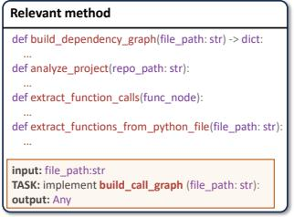  
(a) Prepended Context

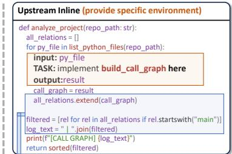  
(b) Inlined Context

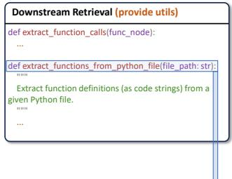

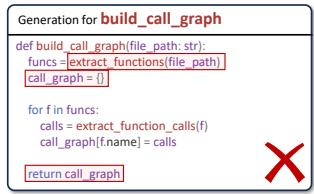

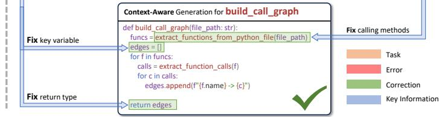  
Fig. 1. A Motivating Example. Inlining The target function into its call chain creates a more context-aware task formulation, leading to repository-consistent completions.

provides local context, it rarely offers a systematic way to represent how a function is actually used by its callers (upstream) or how it depends on its callees (downstream) [63].

Some recent efforts attempt to incorporate call-chain information, but they often do so by simply prepending retrieved functions before the unfinished target signature [32]. This linear concatenation neglects the functional role of the target within its true calling environment. As a result, the model may remain unaware of input/output constraints or calling conventions, leading to an incomplete or misleading understanding of function semantics. Without adapting retrieved snippets to the actual calling sites, models can easily fail to infer correct variable bindings, return types, or the appropriate API variants used across the repository [64].

Figure 1 (a) illustrates an example of these shortcomings. Conventional methods often isolate the target function and attach utility functions or snippets above it, failing to capture genuine calling relationships. Consequently, the model incorrectly calls the unrelated utility extract_functions and produces a dict instead of the expected list[str].

This example motivates a new paradigm of context incorporation, as illustrated in Figure 1 (b): we can inline the target function directly within its calling context, thereby providing Inlined Context. This approach transforms structured call-graph information into a form that the model can readily interpret, exposing crucial signals such as variable bindings, return formats, and valid API usage. As the example shows, the inlined context enables the model to generate repository-consistent code: the correct function now returns a list[str] and invokes the appropriate callees. By coupling targeted context retrieval with inlining, our method enables context-aware, repository-aligned code generation that addresses the shortcomings of conventional retrieval-based strategies.

# 3 Methodology

# 3.1 Overall Framework

Given the signature of an unfinished function $x$ within a repository $\mathcal { D }$ , the goal of repo-level code generation is to produce the function body $y$ by leveraging contextual information $c$ from $\mathcal { D }$ . The main challenge of this task is to extract useful context $c$ as accurately as possible and let the

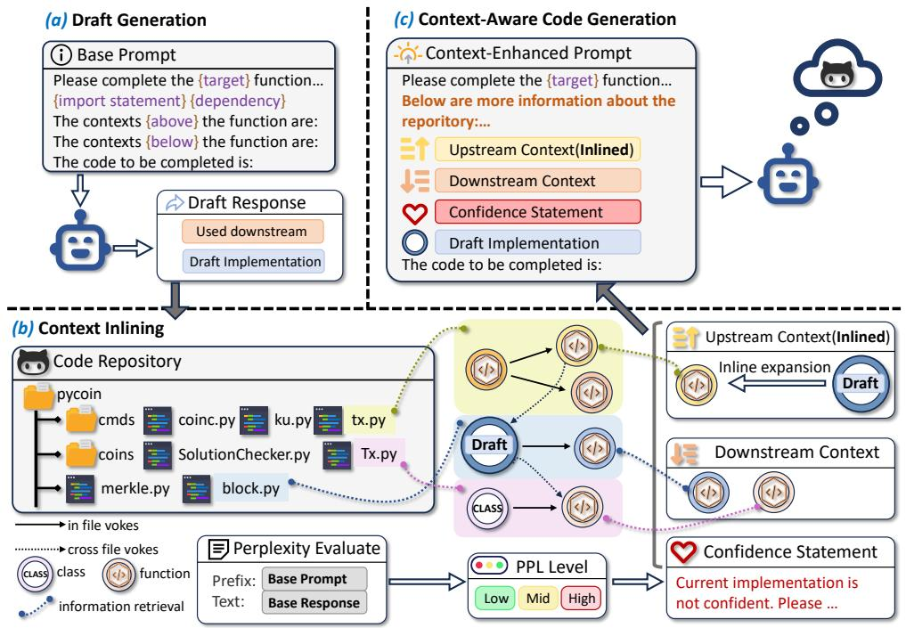  
Fig. 2. Framework of InlineCoder.

model understand the information in context $c$ , which entails reasoning over entire repositories, understanding complex dependencies across functions, classes, and modules.

To tackle this challenge, we propose InlineCoder, a novel framework for repository-level code generation. Unlike previous techniques that retrieve similar snippets in the context, the core idea of InlineCoder is to situate the target function within its call-graph environment. As illustrated in Figure 2, InlineCoder follows a three-stage pipeline:

1) Draft Generation (Section 3.2): Given the base prompt built around the target function signature, InlineCoder first produces a preliminary implementation of the unfinished function, which serves as an anchor. This draft not only offers an approximate view of potential downstream dependencies to help situate the target function within the repository’s call graph but also provides a basis for Perplexity evaluation.   
2) Context Inlining (Section 3.3): The draft is then inlined into its callers to capture upstream usage scenarios, while relevant callee implementations are retrieved and incorporated downstream. This process yields a coherent, linearized representation that flattens both upstream and downstream contextual information into a unified view for the model.   
3) Context Integration (Section 3.4): InlineCoder integrates all relevant information into a contextenhanced prompt that consists of: (a) the base prompt (function signature $^ +$ imports), (b) the retrieved upstream and downstream context, and (c) the initial draft. This enriched prompt provides the LLM with comprehensive guidance, enabling it to generate the final implementation that is both semantically accurate and consistent with the repository environment. The details of each stage are elaborated in the following subsections.

# 3.2 Draft Generation

The draft generation stage produces a preliminary implementation of the target function, referred to as the anchor. This draft then serves as a semantically enriched artifact that guides subsequent retrieval and provides a reference point for the final generation.

To generate this draft, we first build an initial prompt that offers the LLM a comprehensive view of local context and dependencies. We collect all import statements from the target file and append the full code of all directly referenced dependencies (e.g., variables, functions, classes) discovered within the repository, maintaining the original import order. This cross-file reference information is provided by the datasets (i.e., REPOEXEC [23] and DevEval [27]) We then add the signature of the unfinished function along with its natural language description.

This structured prompt is then fed to the LLM, which produces both a candidate implementation of the function body (draft) and a list of the API calls used within it. The resulting draft plays a dual role: On one hand, it acts as a seed for retrieval; the identified API calls provide explicit, high-confidence signals for the subsequent Downstream Retrieval process. On the other hand, it serves as a reference for generation; the draft is used to calculate a perplexity-based confidence score to inform the final generation stage, and it also acts as a draft implementation that can be refined during final generation.

# 3.3 Context Inlining

Building on the initial implementation during draft generation, we introduce a dual-pronged inlining process to assemble both its upstream and downstream context. The core insight is grounded in the observation that a function’s role is defined by its position within the repository’s call graph. Its behavior is constrained by its upstream callers (how it is used), while its implementation depends on its downstream callees (what it depends on).

3.3.1 Upstream Inlining. Upstream inlining aims to provide the LLM with a rich understanding of how the target function is intended to be used. The process starts by identifying all callers of the target function. We traverse the repository’s AST to identify all call sites where the target function is invoked. For each call site, we extract the corresponding calling function, which we refer to as a caller. Unlike traditional methods that merely prepend caller context to the prompt, InlineCoder proposes a novel context inlining technique . As shown in Figure 3, we embed the draft directly into its callers, producing a coherent, linearized representation of the function context. This is achieved through a four-step transformation:

(1) Parameter Substitution: Let ${ \mathrm { A r g s } } = \left[ a _ { 1 } , a _ { 2 } , \ldots , a _ { m } \right]$ denote the argument list at the call site, and Params $\mathbf { \Phi } = [ p _ { 1 } , p _ { 2 } , \dots \cdot \cdot , p _ { m } ]$ denote the formal parameters in the callee definition. We define a substitution function over identifiers:

$$
\sigma : \mathcal {I} \rightarrow \mathcal {I} ^ {\prime}, \quad \sigma (x) = \left\{\begin{array}{l l}a _ {i}&\text {i f} x = p _ {i} \in \operatorname {P a r a m s},\\x&\text {o t h e r w i s e},\end{array}\right. \tag {1}
$$

where $\boldsymbol { \mathcal { I } }$ is the identifier set of the callee body, and $\scriptstyle { { \cal { T } } ^ { \prime } }$ denotes the set of identifiers after substitution.

We lift $\sigma$ to statements, $s \to s ^ { \prime }$ , by recursively applying it to all identifiers in a statement $s \in S$ , where $s$ is the set of statements in the callee body, and $S ^ { \prime }$ denotes the statements after identifier substitution.

For the callee body $\mathtt { B o d y } _ { f } = \{ s _ { 1 } , \ldots , s _ { N } \}$ , the parameter-substituted body is:

$$
\sigma \left(\operatorname {B o d y} _ {f}\right) = \left\{\sigma (s) \mid s \in \operatorname {B o d y} _ {f} \right\} \subseteq S ^ {\prime}. \tag {2}
$$

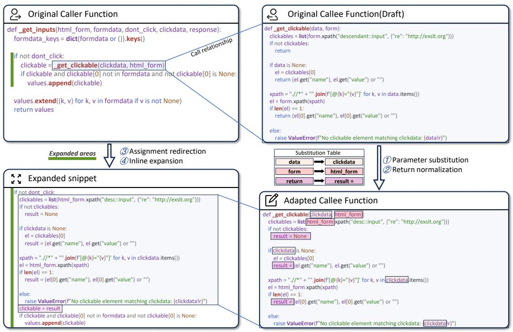  
Fig. 3. Function Inlining.

(2) Return Normalization: We define a transformation function $\tau : S  S$ operating on statements:

$$
\tau (s) = \left\{ \begin{array}{l l} \text {r e s u l t} = \exp & \text {i f} s \equiv \text {r e t u r n} \exp , \\ \text {r e s u l t} = \text {N o n e} & \text {i f} s \equiv \text {r e t u r n}, \\ s & \text {o t h e r w i s e .} \end{array} \right. \tag {3}
$$

Lifting $\tau$ to statement sets, we obtain the normalized body:

$$
\tau (\text {B o d y}) = \{\tau (s) \mid s \in \text {B o d y} \}. \tag {4}
$$

(3) Assignment Redirection: Suppose the original call site has the form $\textsf { x } = \textsf { f } ( a _ { 1 } , \ldots \ldots , a _ { m } )$ . After parameter substitution and return normalization, this assignment is redirected to $\times \ =$ result, binding the call result to the caller’s variable.   
(4) Inline Expansion: The transformed callee body is obtained by sequentially applying the parameter substitution $\sigma$ (defined in Equation 1) and return normalization $\tau$ (defined in Equation 3):

$$
\operatorname {B o d y} _ {f} ^ {*} = \tau (\sigma (\operatorname {B o d y} _ {f})). \tag {5}
$$

Inline expansion replaces the original call with Body∗?? , preserving indentation and surrounding syntactic structure in the caller’s function.

This inlining process ensures semantic equivalence while making the target function’s intended behavior explicit in context. By embedding the draft implementation directly into its upstream caller bodies, the procedure converts a distributed, structured set of cross-file call relations into a single, linearized function-local environment. As a result, the LLM receives a compact, execution-oriented

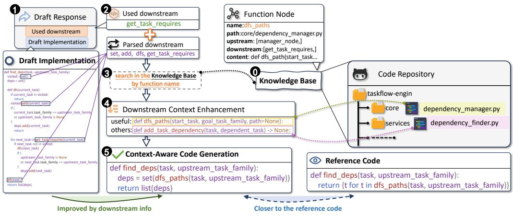  
Fig. 4. Downstream Retrieval.

view of the target function’s role, which facilitates the inference of input/output expectations, preserves the logical flow of computations, and highlights the relationships between variables and control structures. This transformation also reduces ambiguity and eliminates the distractions inherent in separately retrieved snippets, enabling the model to focus on the essential behavioral patterns of the target function within its repository context.

3.3.2 Downstream Retrieval. Downstream retrieval aims to equip the LLM with the dependent functions of the target function. While the draft may initially implement functionality from scratch, high-quality code often depends on existing functions within the repository. To identify these dependent functions, we consider two complementary sources: (i) parsing the draft’s AST to extract all invoked function calls, denoted as $Q _ { \mathrm { A S T } }$ , and (ii) collecting the LLM-generated list of predicted callees, denoted as $Q _ { \mathrm { L L M } }$ . We then explicitly take their union to construct the overall query vocabulary:

$$
Q = Q _ {\mathrm {A S T}} \cup Q _ {\mathrm {L L M}} = \left\{q _ {1}, q _ {2}, \dots , q _ {m} \right\}, \tag {6}
$$

where each $q _ { i }$ denotes a candidate function name. Given a repository represented as a collection of function units $\mathcal { F } = \{ f _ { 1 } , f _ { 2 } , . . . , f _ { n } \}$ , each with an associated function identifier name $( f _ { j } )$ , we apply a substring-based retrieval strategy:

$$
\mathcal {G} = \left\{f _ {j} \in \mathcal {F} \mid \exists q _ {i} \in Q, q _ {i} \subseteq \operatorname {n a m e} \left(f _ {j}\right) \right\}. \tag {7}
$$

where $\mathcal { G }$ denotes the set of candidate downstream functions. $\mathcal { G }$ is finally used to form the downstream context, providing enhancements to Prompt. To prevent data leakage, we exclude the target function itself from $\mathcal { G }$ . The objective is to maximize coverage of potentially useful repository APIs that the target function may leverage, thereby providing the LLM with a richer and more accurate implementation environment.

Thus, downstream retrieval bridges the gap between a noisy, from-scratch draft and a concise, high-quality solution grounded in repository knowledge by ensuring that the retrieved functions are tightly aligned with the model’s actual generation trajectory. This process enables the system to surface the most relevant utility functions exactly when they are needed, avoiding both under-retrieval (missing key APIs) and over-retrieval (introducing irrelevant noise). As a result, the LLM is equipped with a targeted and contextually coherent function set, which maximizes

reuse of repository knowledge and ultimately promotes higher-quality, repository-consistent code generation.

# 3.4 Context-Aware Code Generation

Having gathered both the draft implementation and enriched contextual information, we guide the LLM to produce the final code.

We allow the model to operate in a dual mode: it may either reuse the initial draft or refine it based on the enriched context. The draft serves as a valuable starting point, but it may contain inaccuracies or incomplete logic. To calibrate how much the model should rely on this draft, we introduce a confidence mechanism based on perplexity (PPL) [19]. For a draft implementation $R = \left( r _ { 1 } , \ldots , r _ { M } \right)$ conditioned on the base prompt ??, the PPL is defined as:

$$
\operatorname {P P L} (R \mid B) = \exp \left(- \frac {1}{M} \sum_ {j = 1} ^ {M} \log p \left(r _ {j} \mid B, r _ {<   j}\right)\right). \tag {8}
$$

where $p ( r _ { j } \mid B , r _ { < j } )$ denotes the conditional probabilities estimated by the language model. This formulation provides a direct measure of confidence: lower values of PPL(?? | ??) indicate greater model confidence in the draft.

We categorize the model’s confidence in the draft code (Section 3.4) into three levels based on their perplexity: low confidence $\mathrm { ( P P L > 2 ) }$ ), medium confidence (PPL∈[1.3, 2]), and high confidence $( \mathrm { P P L } { < } 1 . 3 )$ . The thresholds are carefully tuned so that roughly $4 0 \%$ of the samples fall into the low-confidence group, $4 0 \%$ into the medium-confidence group, and $2 0 \%$ into the high-confidence group.

In case of high confidence (low PPL), the model is prompted to trust and closely follow the draft. When the draft obtains medium confidence, the model is advised to modify or improve the draft. In cases of low confidence, the model is prompted to critically reassess the draft, with freedom to regenerate from scratch. Each confidence level is mapped to a natural-language guidance integrated into the final prompt:

• High confidence: “The current implementation and the comments are good, please refer to it and keep these comments.”   
• Medium confidence: “The current implementation is somewhat uncertain and comments are reasonable. Please refer to it partially.”   
• Low confidence: “The current implementation is not confidently correct. Please consider regenerating it.”

The final prompt, as illustrated in Figure 5, aggregates all contextual signals, including imports, enriched context, the generation mode guidance, the draft, and the target signature. This structural prompt provides the LLM with a multi-perspective view: repository dependencies, usage patterns, prior draft guidance, and explicit task specifications, enabling the model to generate a final function body that is contextually grounded, semantically consistent, and repository-aware.

Figure 4 shows a working example illustrating the entire workflow. (1) The model produces a complex draft that attempts to reimplement a depth-first search (DFS) procedure from scratch, without leveraging existing utilities in the repository. (2) Based on this draft response, two sources of potential callees are extracted—function calls parsed from the AST and the LLM-predicted callees—which are unified into a query set ??. (3) This query is then used to search within the repository’s knowledge base via substring matching, yielding a candidate set $c$ of downstream functions. Among these retrieved functions, the system identifies the existing utility dfs_paths. (4) In the next stage, this downstream information $c$ is injected into the prompt as additional context. (5) The model is then guided to perform the final Context-Aware Code Generation.

# Prompt Template Prompt Template for The Final Context-Enhanced Code Generation

Please complete the {target} function in the middle of a repository. And also provide the downstream functions that are called in the target function.

The contexts above the function are: {dependencies}{context_below}{context_above} The contexts below the function are: {import statements}

Below are examples of the functions calling the target functions and the result of inling the current target function into calling functions. Please make sure your implementation fits well while inlining into the caller function.

Caller function [0]:

{upstream_function}

Below is the inlined result: { inlined_result}

Caller function [1]:……

Below are the useful downstream functions:

Downstream function [0]:

{downstream_function}

Downstream function [1]: ……

Below are current version of the target function:

{guidance_Info}

{draft solution}

The code to be completed is:{target_signature} {docstring}

Input-Output Arguments: {argument_prompt}

Inlined Context Enhancement

  
Fig. 5. Prompt Template for The Final Context-Enhanced Code Generation.

Base Prompt

The response should follow the format of the example below: {JSON_example}Please make sure to follow the format strictly. The response should be a valid JSON object.

Your response:

# 4 Experiment Setup

We comprehensively evaluate the effectiveness of InlineCoder by addressing the following research questions (RQs):

RQ1 (Overall Effectiveness): How does InlineCoder perform on repository-level code generation tasks compared to state-of-the-art baselines?   
RQ2 (Ablation Study): To what extent do the key components of InlineCoder contribute to its overall performance?   
RQ3 (Qualitative Analysis): How does the upstream-downstream retrieval mechanism in InlineCoder provide effective context for code generation?   
RQ4 (Domain Generalization): How does the performance of InlineCoder generalize across different programming domains?

# 4.1 Datasets

We conduct our experiments on two prominent repository-level code generation benchmarks: DevEval [27] and REPOEXEC [23]. We focus on completing the entire body of the unfinished functions.

• DevEval is a repository-level benchmark that aligns with real-world codebases, providing 1,825 annotated samples in Python from 115 repositories across 10 domains to systematically evaluate LLMs’ coding abilities.   
• REPOEXEC is a benchmark for repository-level code generation that provides 355 functions in Python with ground-truth annotations.

# 4.2 Evaluation Metrics

Following established practices in repository-level code generation research [6, 32, 63], we evaluate the quality of the generated code from multiple dimensions using the following metrics. Let $y$

denote the reference code snippet (ground truth), and $\tilde { y }$ denote the generated code produced by the model. Identifiers such as variable names, API calls, and function names are extracted from a code snippet $y$ into a set $I ( y )$ . These definitions form the basis for the following evaluation metrics.

• Exact Match (EM) checks whether the generated code exactly matches the reference snippet, yielding a binary score.   
• Edit Similarity (ES) [22] provides a finer-grained measure based on Levenshtein distance, computed as

$$
\operatorname {E S} (y, \tilde {y}) = 1 - \frac {\operatorname {L e v} (y , \tilde {y})}{\max  (| y | , | \tilde {y} |)}, \tag {9}
$$

where $\operatorname { L e v } ( y , \tilde { y } )$ denotes the Levenshtein distance between $y$ and $\tilde { y }$ , defined as the minimum number of insertions, deletions, or substitutions required to transform $y$ into $\tilde { y }$ .

• BLEU [43] evaluates the n-gram overlap between the candidate and the reference, defined as

$$
\mathrm {B L E U} = \mathrm {B P} \cdot \exp \left(\sum_ {n = 1} ^ {N} w _ {n} \log p _ {n}\right), \tag {10}
$$

where $\scriptstyle { { \mathcal { P } } _ { n } }$ is the modified n-gram precision, $w _ { n }$ are weights (typically uniform, $\begin{array} { r } { w _ { n } = \frac { 1 } { N } , } \end{array}$ ), and ${ \mathrm { B P } } = \operatorname* { m i n } \left( 1 , e ^ { 1 - { \frac { \left| { \tilde { y } } \right| } { \left| { y } \right| } } } \right)$ is the brevity penalty.

• Identifier Match F1 (ID.F1) [32] evaluates identifier-level overlap, such as API and variable names, with the F1 score. Let $I ( y )$ and $I ( \tilde { y } )$ denote the sets of identifiers extracted from the reference and generated code, respectively. Precision, recall, and the ID.F1 score are defined as

$$
P r e c i s i o n = \frac {\left| I (y) \cap I (\tilde {y}) \right|}{\left| I (\tilde {y}) \right|}, \quad R e c a l l = \frac {\left| I (y) \cap I (\tilde {y}) \right|}{\left| I (y) \right|}, \quad I D. F 1 = \frac {2 \cdot P r e c i s i o n \cdot R e c a l l}{P r e c i s i o n + R e c a l l}. \tag {11}
$$

We did not adopt execution-based metrics such as Pass@k (the passing rate of generated code on test cases). Unlike programming-contest benchmarks [9, 38], repository-level code completion tasks differ substantially in structure and dependencies [13]. In our experiments, we also observed that execution-based scores fluctuate considerably across runs. The same model outputs often result in test failures due to subtle environmental issues that are unrelated to the model itself. These fluctuations could lead to misleading or non-comparable Pass@k results.

# 4.3 Baselines

We compare InlineCoder against a suite of baselines spanning a large variety of techniques, including in-file context methods, text-similarity-based retrieval, and static-analysis-based approaches.

• In-File leverages the full in-file context without utilizing any cross-file information.   
• Vanilla follows the basic prompt construction provided in existing benchmarks such as DevEval [27] and RepoExec [23], where related repository context is merely prepended before the target function without deep integration.   
• RepoCoder [63] is a retrieval-augmented framework that iteratively combines similaritybased retrieval with code LLMs to exploit repository-level context for code completion. Specifically, we implemented its function body completion pipeline, using UniXcoder1 [14] as the embedding model. For evaluation, we adopted the results from the third retrieval-iteration stage, as reported to be the most effective in the original work.

Table 1. Performance Comparison on the DevEval Dataset. The best performing baseline is underlined.   

<table><tr><td rowspan="2">Methods</td><td colspan="4">DeepSeek-V3</td><td colspan="4">Qwen3-Coder</td><td colspan="4">GPT5-mini</td></tr><tr><td>EM</td><td>ES</td><td>BLEU</td><td>ID.F1</td><td>EM</td><td>ES</td><td>BLEU</td><td>ID.F1</td><td>EM</td><td>ES</td><td>BLEU</td><td>ID.F1</td></tr><tr><td>In-File</td><td>7.56</td><td>59.81</td><td>43.58</td><td>71.54</td><td>7.95</td><td>56.15</td><td>40.07</td><td>68.75</td><td>0.85</td><td>40.87</td><td>19.93</td><td>51.56</td></tr><tr><td>Vanilla</td><td>11.45</td><td>66.20</td><td>52.64</td><td>76.99</td><td>9.86</td><td>60.02</td><td>46.49</td><td>74.92</td><td>4.34</td><td>58.32</td><td>42.93</td><td>64.43</td></tr><tr><td>RepoCoder</td><td>11.12</td><td>68.61</td><td>55.19</td><td>77.26</td><td>2.90</td><td>45.00</td><td>29.09</td><td>72.57</td><td>3.65</td><td>59.50</td><td>43.72</td><td>62.40</td></tr><tr><td>GraphCoder</td><td>1.91</td><td>67.71</td><td>46.89</td><td>66.56</td><td>0.00</td><td>59.85</td><td>35.03</td><td>61.87</td><td>3.21</td><td>55.99</td><td>37.72</td><td>61.85</td></tr><tr><td>DRACO</td><td>0.64</td><td>47.72</td><td>28.06</td><td>46.17</td><td>0.00</td><td>51.91</td><td>31.25</td><td>41.12</td><td>1.27</td><td>42.93</td><td>23.60</td><td>45.19</td></tr><tr><td>InlineCoder</td><td>11.56</td><td>70.50</td><td>57.12</td><td>78.01</td><td>11.23</td><td>67.39</td><td>53.30</td><td>76.91</td><td>4.45</td><td>65.21</td><td>46.72</td><td>65.45</td></tr></table>

• DRACO [6] enhances repository-level code completion via dataflow-guided retrieval, constructing a repo-specific context graph to provide precise and relevant information for LLMs. We have adapted the prompt template of this baseline method to support the complete function body completion task.   
• GraphCoder [32] employs a graph-based retrieval-generation framework using code context graphs and a coarse-to-fine retrieval process to acquire repository-specific knowledge more effectively. We have adapted the prompt template of this baseline method to support the complete function body completion task.

# 4.4 Implementation Details

For the draft generation stage, we employed the identical Vanilla prompts used in the baseline methods for each dataset: the basic prompt construction methods provided by DevEval and RE-POEXEC, respectively. For context retrieval, we parse Python code and build call graphs with the assistance of Tree-Sitter2 and Pydepcall3.

To evaluate our framework across different models, we used three advanced backbone LLMs: DeepSeek- $\cdot \vee 3 ^ { 4 }$ [30], Qwen3-Coder5 [60], and GPT-5-mini6 [41]. We employ Qwen2.5-Coder- $1 . 5 \mathrm { B } ^ { 7 }$ [18] as the probability estimator for confidence estimation in the final stage. We configure each model to its native context window size to accommodate long input sequences, as our evaluation tasks require substantial context but generate concise outputs. The configured input limits are 128 000 tokens for DeepSeek-V3, 262 144 tokens for Qwen3-Coder, and 400 000 tokens for GPT-5-mini. Output generation was limited to 10 000 tokens for all models to ensure focused completions. To ensure deterministic and reproducible decoding, all models used a temperature of 0.0, rendering the top- $\mathcal { P }$ sampling parameter ineffective. All experiments were run on a compute server with Intel Xeon Silver 4214R CPUs and NVIDIA A40 GPUs.

# 5 Experiments Results

# 5.1 RQ1: Overall Effectiveness

Table 1 and 2 compare the performance of various methods on the DevEval and RepoExec datasets across three backbone models.

Table 2. Performance Comparison on the REPOEXEC Dataset. The best performing baseline is underlined.   

<table><tr><td rowspan="2">Methods</td><td colspan="4">DeepSeek-V3</td><td colspan="4">Qwen3-Coder</td><td colspan="4">GPT5-mini</td></tr><tr><td>EM</td><td>ES</td><td>BLEU</td><td>ID.F1</td><td>EM</td><td>ES</td><td>BLEU</td><td>ID.F1</td><td>EM</td><td>ES</td><td>BLEU</td><td>ID.F1</td></tr><tr><td>In-File</td><td>0.56</td><td>53.80</td><td>30.94</td><td>71.87</td><td>0.85</td><td>53.36</td><td>33.18</td><td>69.84</td><td>0.00</td><td>24.98</td><td>5.07</td><td>53.59</td></tr><tr><td>Vanilla</td><td>0.85</td><td>54.63</td><td>31.57</td><td>72.50</td><td>1.63</td><td>54.96</td><td>34.17</td><td>70.91</td><td>0.00</td><td>24.47</td><td>4.79</td><td>57.22</td></tr><tr><td>RepoCoder</td><td>0.28</td><td>53.01</td><td>30.43</td><td>72.08</td><td>1.69</td><td>56.75</td><td>36.13</td><td>71.17</td><td>0.00</td><td>33.87</td><td>13.33</td><td>57.63</td></tr><tr><td>GraphCoder</td><td>0.00</td><td>39.69</td><td>14.37</td><td>48.65</td><td>0.00</td><td>30.68</td><td>9.00</td><td>51.98</td><td>0.00</td><td>40.19</td><td>14.88</td><td>45.11</td></tr><tr><td>DRACO</td><td>0.28</td><td>52.98</td><td>29.25</td><td>47.29</td><td>0.00</td><td>55.27</td><td>33.72</td><td>48.08</td><td>0.00</td><td>33.55</td><td>12.28</td><td>51.83</td></tr><tr><td>InlineCoder</td><td>2.22</td><td>62.01</td><td>43.41</td><td>72.84</td><td>2.54</td><td>59.20</td><td>37.53</td><td>71.26</td><td>0.00</td><td>49.27</td><td>29.06</td><td>57.65</td></tr></table>

Overall, InlineCoder achieves substantial and stable improvements across all three backbones. Notably, InlineCoder achieves stable improvement compared to Vanilla, a baseline method which is also used in the draft generation stage of InlineCoder. To quantify the gains, we compute the relative percentage improvements over the strongest baseline for each backbone model, and then report the averaged results across the three models. On DevEval, the average relative improvements reach $5 . 1 3 \%$ in EM, $\mathbf { 1 0 . 8 6 \% }$ in ES, and $1 0 . 6 7 \%$ in BLEU; on RepoExec, the gains are even larger, with $2 9 . 7 3 \%$ in EM, $2 0 . 8 2 \%$ in ES, and $4 9 . 3 4 \%$ in BLEU, highlighting InlineCoder’s robustness across models and datasets.

The In-File baseline—using only intra-file context—remains competitive, sometimes outperforming GraphCoder and DRACO. This suggests that preserving local context is critical. By contrast, GraphCoder and DRACO often underperform because they were originally designed for line-level completion and rely on assumptions (e.g., partial function bodies or dataflow analysis) that do not hold in function-body generation. Additionally, they discard in-file context, which can contain crucial local information, further limiting their effectiveness in repository-level code generation.

We notice that the EM scores in our experiments are relatively lower compared to those reported in prior work. This discrepancy arises from differences in completion objectives: while previous studies primarily evaluate single-line completion, our task requires completing entire function bodies, which is inherently more challenging.

# Answer to RQ1

InlineCoder substantially outperforms all baseline methods, demonstrating consistent improvements across diverse datasets and models. The results highlight the effectiveness of context inlining in improving repository-level code generation.

# 5.2 RQ2: Ablation Study

We conduct an ablation study on the DevEval dataset using the DeepSeek-V3 backbone. The ablated variants include: removing upstream context retrieval (w/o upstream), removing usage-context inlining (w/o inline), removing downstream context retrieval (w/o downstream), removing the confidence statement derived from the draft’s perplexity (w/o confidence), and removing the draft implementation itself from the context-aware code generation (w/o draft).

As shown in Table 3, eliminating any key component results in performance degradation, which confirms their effectiveness. Removing the draft implementation causes the largest drop, showing that anchoring generation to concrete candidates is crucial for accuracy and semantic alignment. The removal of inlining and upstream/downstream context also consistently degrades performance, underscoring their complementary roles. Notably, the performance of w/o inline is comparable to

Table 3. Ablation Study for Dataflow Analysis on the DevEval Dataset   

<table><tr><td rowspan="2">Configuration</td><td colspan="4">DeepSeek-V3</td></tr><tr><td>EM</td><td>ES</td><td>BLEU</td><td>ID.F1</td></tr><tr><td>InlineCoder</td><td>11.56</td><td>70.50</td><td>57.12</td><td>78.01</td></tr><tr><td>w/o upstream</td><td>9.48 (-2.12)</td><td>65.12 (-5.38)</td><td>51.34 (-5.78)</td><td>77.43 (-0.58)</td></tr><tr><td>w/o inline</td><td>9.15 (-2.41)</td><td>65.95 (-4.55)</td><td>52.35 (-4.77)</td><td>78.01 (0.00)</td></tr><tr><td>w/o downstream</td><td>9.75 (-1.81)</td><td>65.87 (-4.63)</td><td>52.25 (-4.87)</td><td>77.60 (-0.41)</td></tr><tr><td>w/o confidence</td><td>10.74 (-0.82)</td><td>67.79 (-2.71)</td><td>54.24 (-2.88)</td><td>77.30 (-0.71)</td></tr><tr><td>w/o draft</td><td>7.67 (-3.89)</td><td>59.09 (-11.41)</td><td>44.24 (-12.88)</td><td>76.29 (-1.72)</td></tr></table>

Table 4. Comparison of the Last Line of the Return Statement   

<table><tr><td>Methods</td><td>EM</td><td>BLEU</td><td>ES</td></tr><tr><td>Vanilla</td><td>35.40</td><td>50.17</td><td>58.72</td></tr><tr><td>RepoCoder</td><td>37.15</td><td>52.77</td><td>61.57</td></tr><tr><td>InlineCoder</td><td>37.92</td><td>53.80</td><td>62.51</td></tr></table>

that of w/o upstream, suggesting that upstream information alone provides limited benefit if not properly linearized. Finally, removing the confidence statement leads to moderate but stable drops, showing that perplexity-based scoring helps select more effective prompts.

# Answer to RQ2

Each proposed component of the InlineCoder contributes positively to performance. The draft implementation plays the most critical role, and function usage context inlining is essential for effectively leveraging context information, and cross-file retrieval (upstream and downstream) provides complementary gains. This confirms that InlineCoder benefits from a carefully designed integration of contextual signals.

# 5.3 RQ3: Qualitative Analysis

5.3.1 Improved performance on return statements. To further investigate the role of upstream context in function completion, we focus on the generation of the return statement, which is typically located at the last line of the target function. Specifically, we extract the final line of code from both the baseline generations and InlineCoder, and evaluate their accuracy against the reference code. Following common practice in single-line code evaluation, we adopt EM, BLEU, and ES as metrics, all of which were introduced in Section 4.2. Experiments are conducted on the DevEval dataset using the DeepSeek-V3 backbone. We compare InlineCoder with two representative methods: Vanilla and RepoCoder (a strong baseline leveraging multiple generations).

As shown in Table 4, InlineCoder consistently achieves the best performance across all metrics. In particular, InlineCoder improves EM scores by $2 . 0 7 \%$ on return statements. While RepoCoder also leverages iterative generation, it still falls short of InlineCoder, suggesting that naive multigeneration alone is insufficient. Instead, incorporating structured upstream usage information provides more reliable guidance for producing accurate final statements. These findings confirm that upstream information plays a crucial role in shaping the correctness and naturalness of the

Table 5. Comparison of Call Statements   

<table><tr><td>Methods</td><td>EM</td><td>Jaccard</td><td>F1</td><td>Coverage</td><td>DIR</td></tr><tr><td>Vanilla</td><td>29.86</td><td>53.10</td><td>60.67</td><td>63.16</td><td>69.21</td></tr><tr><td>RepoCoder</td><td>21.48</td><td>52.80</td><td>63.01</td><td>65.13</td><td>70.45</td></tr><tr><td>InlineCoder</td><td>30.74</td><td>54.99</td><td>62.88</td><td>65.40</td><td>71.86</td></tr></table>

return expressions, complementing the benefits of inlining and retrieval strategies demonstrated in earlier experiments.

5.3.2 Improved performance on function-call statements. To investigate the role of downstream information in improving function-call correctness, we conducted a targeted evaluation on the generated invocation statements using the DevEval dataset with the DeepSeek-V3 backbone. For each generated function, we extracted all invocation statements and compared them against the reference annotations. We adopted several evaluation metrics to assess this alignment, including EM, Jaccard Similarity, F1 Score, Coverage, and Downstream Invocation Recall (DIR) [23]. These metrics collectively measure the accuracy and completeness of both callee names and full invocation instances. For comparison, we also conducted experiments on Vanilla, RepoCoder, and InlineCoder.

As shown in Table 5, the proposed context-aware generation (InlineCoder) achieves the overall best performance. In particular, InlineCoder improves EM by $4 . 2 7 \%$ on function-call statements. These results demonstrate that incorporating downstream information substantially improves the correctness and coverage of invocation statements, thereby strengthening the functional reliability of generated code.

# Answer to RQ3

InlineCoder significantly improves the accuracy of both return and function-call statements across multiple evaluation metrics, demonstrating the effectiveness of its novel approach to leveraging upstream and downstream information through inlined context.

# 5.4 RQ4: Domain Generalization

To further investigate the generalizability of our approach across different domains, we adopt the domain taxonomy provided by the DevEval [27] dataset and evaluate four metrics: EM, ES, BLEU, and ID.F1. Experiments are conducted on the DevEval dataset using the DeepSeek-V3 backbone. The results over ten domains are summarized in Figure 6.

In terms of Exact Match (EM), InlineCoder achieves the best performance in 9 out of 10 domains. For ES, it outperforms the baselines in 8 domains. On BLEU, InlineCoder leads in 9 domains, while on ID.F1, it achieves the best results across all 10 domains. Compared to the Vanilla baseline, InlineCoder demonstrates consistent improvements in almost all domains.

The only relatively weaker performance is observed in the Scientific-Engineering domain, which may be attributed to the nature of this domain: its tasks are primarily oriented towards scientific computing, where the cross-function invocation structure is relatively sparse. Consequently, the downstream and upstream information leveraged by our method provides limited additional benefit in this domain.

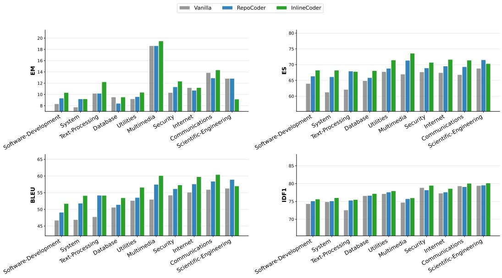  
Fig. 6. Comparison of Effectiveness across Various Domains.

# Answer to RQ4

InlineCoder demonstrates robust generalization across diverse domains, consistently surpassing baselines in nearly all settings. The results validate that inlined upstream and downstream signals provide reliable improvements even under varied repository structures.

# 5.5 Case Study

Figure 7 presents a case study comparing InlineCoder against other baselines. The target function for completion is parse_unique_urlencoder. The figure is organized in a $2 \times 5$ grid, where the top row displays key contextual information retrieved by different approaches from the repository, while the bottom row shows the ground truth reference implementation alongside generations from InlineCoder and baseline methods.

This case study demonstrates the effectiveness of InlineCoder’s in capturing both upstream and downstream contexts. Through function inlining, InlineCoder successfully identifies and leverages crucial contextual information that directly impacts implementation correctness. In contrast, baseline approaches such as RepoCoder, which relies on similarity-based retrieval, and DRACO, which employs dataflow analysis, retrieve contextual information that, although structurally relevant, offers limited utility for the specific implementation task.

The advantages of our approach are particularly evident in two key aspects. First, in handling downstream dependencies, only InlineCoder correctly utilizes the parse_qs utility function with proper parameters. While RepoCoder attempts to use a similarly named parse_qsl function, its parameter usage differs significantly from the reference implementation. This precision in API usage stems directly from InlineCoder’s downstream retrieval mechanism, which not only identifies the correct utility function but also captures its implementation details, ensuring accurate function names and parameter specifications. Second, InlineCoder demonstrates effectiveness in handling return value. As the case shows, InlineCoder consistently generates the correct return type dict.

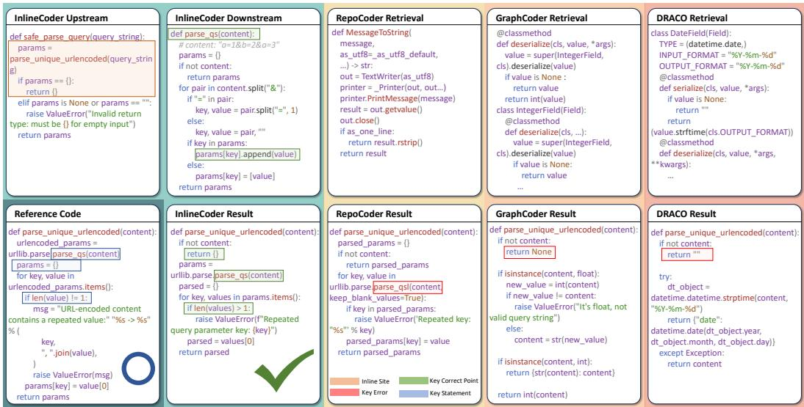  
Fig. 7. A case about the effectiveness of the bidirectional call inlining.

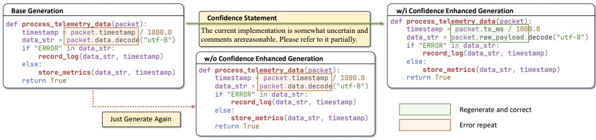  
Fig. 8. A case about the impact of confidence guidance on mitigating self-repetition bias.

In contrast, baseline methods exhibit inconsistent behavior—sometimes returning dict, but also frequently producing str, int, or None. This accuracy in return type handling is achieved through InlineCoder’s upstream inlining, which identifies the caller function safe_parse_query.

Figure 8 provides another case about how our confidence statement mitigates anchoring bias. In “Base Generation,” the LLM defaults to general priors (e.g., packet.timestamp) instead of capturing enhanced context information. Without confidence guidance, the model exhibits strong self-repetition, replicating its initial erroneous draft verbatim despite the presence of the correct inlined context.

Conversely, when InlineCoder identifies the draft as a medium-confidence result, it prepends a confidence statement. This re-frames the task from simple generation to active modification, forcing the LLM to re-evaluate its draft against the inlined information. Consequently, the model successfully identifies structural discrepancies and adopts correct conventions, demonstrating that while context inlining provides the necessary knowledge, confidence guidance serves as the essential trigger to ensure repository-level information is utilized rather than overshadowed by initial model biases.

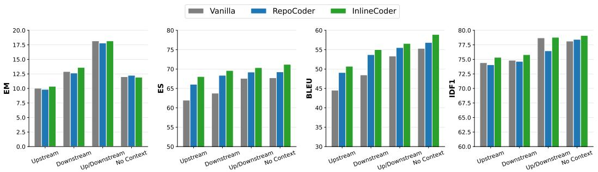  
Fig. 9. Effectiveness Comparison in Different Context Environments.

# 6 Discussion

# 6.1 Performance Analysis Across Various Context Environments

Figure 9 illustrates how repository environments influence the effectiveness of InlineCoder. To quantify this impact, we performed a stratified analysis on the DevEval dataset — a benchmark curated from real-world Python projects on GitHub — using DeepSeek-V3, categorizing samples into four groups based on their inherent structural characteristics: Upstream $( 1 6 . 3 8 \% )$ ), Downstream $\left( 1 5 . 2 9 \% \right)$ , Up/Downstream $( 6 . 0 3 \% )$ , and No Context $( 7 4 . 3 6 \% )$ . Here, the No Context group represents isolated functions that naturally lack caller-callee dependencies in their original repositories, rather than intentionally removing their contexts.

The results show that InlineCoder consistently outperforms baselines in nearly all scenarios. Notably, we observe that overall scores in the No Context setting are generally higher than those in context-dependent categories. This is attributed to the fact that functions without upstream or downstream relations are typically independent, resulting in a lower reliance on repositorywide information. The inherent simplicity of these standalone tasks leads to higher baseline performance. Conversely, the lower scores observed in complex repository environments (i.e., those with caller-callee relationships) suggest that the primary challenge lies in the model’s difficulty in comprehending and integrating intricate structural context.

Furthermore, across the four categories, InlineCoder achieves the most significant performance gain in the Upstream setting. This substantial improvement empirically validates the effectiveness of our design in capturing and utilizing upstream caller information.

# 6.2 Threats to Validity

Like most existing repository-level code generation benchmarks [8, 20, 23, 26, 27, 61, 63], our empirical evaluation is conducted on Python repositories, which may limit the generalizability of our findings to other programming languages or different types of software projects. We mitigate this threat in two ways. First, we evaluate our method on two distinct datasets that span multiple domains and project scales. Second, the fundamental principle of InlineCoder—leveraging upstream usage context and downstream dependency context—is language-agnostic. The framework relies on Abstract Syntax Tree (AST) analysis, a standard technique applicable to virtually all modern programming languages. Although our implementation is specific to Python, the core methodology can be readily extended to other programming languages such as Java, $\mathrm { C } { + } { + }$ , or TypeScript. And in strongly typed languages such as $\mathrm { C } { + } { + }$ , AST analysis can also provide more upstream and downstream information.

# 7 Related Work

Code Large Language Models (LLMs), such as Code Llama [47], DeepSeek-Coder [15], and Qwen-Coder [18], have demonstrated remarkable potential in automating software development tasks [2, 3, 5, 12, 17, 25, 35, 39, 40, 46, 52, 56, 67, 68]. By internalizing extensive code knowledge from vast corpora into billions of parameters, these models can solve a wide array of general-purpose programming problems [21, 34, 49, 51, 62]. Building upon these foundational capabilities, repository-level code generation has evolved significantly [23, 27, 53, 63], with prior work broadly categorized into retrieval-augmented generation [53, 63], graph-based and structured retrieval [4, 32, 33], agentic/iterative refinement [1, 7, 28], static-analysis-informed prompting [6, 31], and fine-tuning [58, 59].

Retrieval-augmented generation. Early efforts demonstrated that retrieving relevant code snippets from the repository can substantially improve generation quality. Methods such as RepoCoder [63], RepoFuse [29], and RepoFusion [53] leverage retrieval mechanisms to supply the model with repository-wide context. LongCodeZip [50] selects multiple relevant contexts based on the inherent perplexity from LLMs. Other works explore prompt selection strategies to choose the most useful snippets from large repositories [54]. These approaches establish the value of repository-level context but typically rely on similarity or topical relevance rather than relational call-graph signals.

Graph-based and structured retrieval. To capture structural relationships beyond lexical similarity, a line of work constructs graph representations of code. CodexGraph [33] builds code graph databases that enable structured querying, while GraphCoder [32] models control-flow and data dependencies using context graphs. RepoHyper and related approaches use semantic repo-level graphs with search-expand-refine strategies to locate relevant code elements [4]. These methods enhance retrieval precision by leveraging structural relationships; however, they are primarily oriented toward identifying structurally similar or semantically related code snippets, rather than explicitly incorporating upstream or downstream usage signals into the prompts.

Agentic and iterative refinement. Agentic frameworks and iterative planners perform multistep reasoning and use external tools (static analysis, testing, or execution) to refine outputs. Examples include CodeRAG, which combines dual graphs with agentic reasoning and specialized tools for graph traversal and code testing [28]; RRR, which allows iterative exploration using static analysis [7]; and CodePlan, which frames repo-level coding as a planning problem with incremental dependency analysis [1]. These works highlight the benefit of multi-step problem decomposition but do not systematically leverage caller–callee signals encoded by call graphs as prompt augmentations.

Static analysis and context pruning. Several works incorporate static analysis to prune or enrich the prompt context. STALL $^ +$ integrates static analysis into prompting, decoding, and post-processing stages [31]; DRACO uses dataflow-guided retrieval to focus on flow-relevant fragments [6]; and hierarchical methods model repositories at function granularity with topological dependencies to reduce noisy context [65]. These techniques enhance relevance and reduce noise; however, they remain primarily focused on context selection or compression, rather than the injection of explicit upstream/downstream usage information or confidence signals derived from preliminary model outputs.

Fine-tuning methods. Other lines of work focus on domain-specialized model training strategies [44]: RTLRepoCoder fine-tunes for Verilog completion [63], curriculum datasets target hard patterns [48]. There are also efforts to improve retrievers (e.g., via reinforcement learning) and to combine retrieval with reinforcement or reflexive training [57, 58].

In contrast to these works, InlineCoder introduces several key novelties. First, unlike traditional RAG or graph-based methods that rely on surface-level similarity or static structures, our approach reframes repository-level generation as a function-level task by inlining the unfinished function into its call stack, capturing both upstream usage constraints and downstream dependencies dynamically. Second, we leverage a draft completion as an anchor to drive bidirectional retrieval, enabling precise context integration without extensive fine-tuning. This allows for iterative refinement that enhances generation precision and repository coherence, addressing limitations in existing methods that often overlook orthogonal dimensions of function dependencies and usages.

# 8 Conclusion

In this paper, we present InlineCoder, a novel repository-level code generation framework that enhances LLMs by inlining relevant upstream and downstream context from the code repository. By systematically integrating contextual information from both function callers and callees, InlineCoder provides a richer, more natural understanding of the target function’s environment in the specific repository. Extensive experiments on the DevEval and REPOEXEC datasets show that InlineCoder consistently outperforms strong baselines across multiple metrics. Ablation studies and targeted analyses confirm that the core innovation of inlining—incorporating both upstream and downstream context—is the primary driver behind significant improvements in return statement accuracy and function-call precision. Beyond these empirical gains, InlineCoder demonstrates robust generalization across diverse programming domains and maintains stable performance when integrated with different backbone LLMs.

# Data Availability

All code and data used in this study are publicly available at: https://github.com/ythere-y/InlineCoder.

# Acknowledgments

This research is funded by the National Key Research and Development Program of China (Grant No. 2023YFB4503802), the National Natural Science Foundation of China (Grant No. 62232003), and the Natural Science Foundation of Shanghai (Grant No. 25ZR1401175).

# References

[1] Ramakrishna Bairi, Atharv Sonwane, Aditya Kanade, Vageesh D C, Arun Iyer, Suresh Parthasarathy, Sriram Rajamani, Balasubramanyan Ashok, and Shashank Shet. 2024. Codeplan: Repository-level coding using llms and planning. Proceedings of the ACM on Software Engineering 1, FSE (2024), 675–698.   
[2] Antonio Valerio Miceli Barone and Rico Sennrich. 2017. A parallel corpus of python functions and documentation strings for automated code documentation and code generation. arXiv preprint arXiv:1707.02275 (2017).   
[3] Brett A Becker, Paul Denny, James Finnie-Ansley, Andrew Luxton-Reilly, James Prather, and Eddie Antonio Santos. 2023. Programming is hard-or at least it used to be: Educational opportunities and challenges of ai code generation. In Proceedings of the 54th ACM Technical Symposium on Computer Science Education V. 1. 500–506.   
[4] Zhangqian Bi, Yao Wan, Zheng Wang, Hongyu Zhang, Batu Guan, Fangxin Lu, Zili Zhang, Yulei Sui, Hai Jin, and Xuanhua Shi. 2024. Iterative refinement of project-level code context for precise code generation with compiler feedback. arXiv preprint arXiv:2403.16792 (2024).   
[5] Silin Chen, Shaoxin Lin, Xiaodong Gu, Yuling Shi, Heng Lian, Longfei Yun, Dong Chen, Weiguo Sun, Lin Cao, and Qianxiang Wang. 2025. Swe-exp: Experience-driven software issue resolution. arXiv preprint arXiv:2507.23361 (2025).   
[6] Wei Cheng, Yuhan Wu, and Wei Hu. 2024. Dataflow-guided retrieval augmentation for repository-level code completion. arXiv preprint arXiv:2405.19782 (2024).   
[7] Ajinkya Deshpande, Anmol Agarwal, Shashank Shet, Arun Iyer, Aditya Kanade, Ramakrishna Bairi, and Suresh Parthasarathy. 2024. Class-Level Code Generation from Natural Language Using Iterative, Tool-Enhanced Reasoning over Repository. arXiv preprint arXiv:2405.01573 (2024).

[8] Yangruibo Ding, Zijian Wang, Wasi Ahmad, Hantian Ding, Ming Tan, Nihal Jain, Murali Krishna Ramanathan, Ramesh Nallapati, Parminder Bhatia, Dan Roth, et al. 2023. Crosscodeeval: A diverse and multilingual benchmark for cross-file code completion. Advances in Neural Information Processing Systems 36 (2023), 46701–46723.   
[9] Xueying Du, Mingwei Liu, Kaixin Wang, Hanlin Wang, Junwei Liu, Yixuan Chen, Jiayi Feng, Chaofeng Sha, Xin Peng, and Yiling Lou. 2024. Evaluating large language models in class-level code generation. In Proceedings of the IEEE/ACM 46th International Conference on Software Engineering. 1–13.   
[10] Xinyu Gao, Yun Xiong, Deze Wang, Zhenhan Guan, Zejian Shi, Haofen Wang, and Shanshan Li. 2024. Preferenceguided refactored tuning for retrieval augmented code generation. In Proceedings of the 39th IEEE/ACM International Conference on Automated Software Engineering. 65–77.   
[11] Yunfan Gao, Yun Xiong, Xinyu Gao, Kangxiang Jia, Jinliu Pan, Yuxi Bi, Yixin Dai, Jiawei Sun, Haofen Wang, and Haofen Wang. 2023. Retrieval-augmented generation for large language models: A survey. arXiv preprint arXiv:2312.10997 2, 1 (2023).   
[12] Leonidas Gee, Milan Gritta, Gerasimos Lampouras, and Ignacio Iacobacci. 2024. Code-optimise: Self-generated preference data for correctness and efficiency. arXiv preprint arXiv:2406.12502 (2024).   
[13] Xiaodong Gu, Meng Chen, Yalan Lin, Yuhan Hu, Hongyu Zhang, Chengcheng Wan, Zhao Wei, Yong Xu, and Juhong Wang. 2025. On the effectiveness of large language models in domain-specific code generation. ACM Transactions on Software Engineering and Methodology 34, 3 (2025), 1–22.   
[14] Daya Guo, Shuai Lu, Nan Duan, Yanlin Wang, Ming Zhou, and Jian Yin. 2022. UniXcoder: Unified Cross-Modal Pretraining for Code Representation. In Findings of the Association for Computational Linguistics: ACL 2022. 2563–2575.   
[15] Daya Guo, Qihao Zhu, Dejian Yang, Zhenda Xie, Kai Dong, Wentao Zhang, Guanting Chen, Xiao Bi, Yu Wu, YK Li, et al. 2024. DeepSeek-Coder: When the Large Language Model Meets Programming–The Rise of Code Intelligence. arXiv preprint arXiv:2401.14196 (2024).   
[16] Mehadi Hassen and Philip K Chan. 2017. Scalable function call graph-based malware classification. In Proceedings of the Seventh ACM on Conference on Data and Application Security and Privacy. 239–248.   
[17] Baizhou Huang, Shuai Lu, Weizhu Chen, Xiaojun Wan, and Nan Duan. 2023. Enhancing large language models in coding through multi-perspective self-consistency. arXiv preprint arXiv:2309.17272 (2023).   
[18] Binyuan Hui, Jian Yang, Zeyu Cui, Jiaxi Yang, Dayiheng Liu, Lei Zhang, Tianyu Liu, Jiajun Zhang, Bowen Yu, Keming Lu, et al. 2024. Qwen2. 5-coder technical report. arXiv preprint arXiv:2409.12186 (2024).   
[19] Fred Jelinek, Robert L Mercer, Lalit R Bahl, and James K Baker. 1977. Perplexity—a measure of the difficulty of speech recognition tasks. The Journal of the Acoustical Society of America 62, S1 (1977), S63–S63.   
[20] Carlos E Jimenez, John Yang, Alexander Wettig, Shunyu Yao, Kexin Pei, Ofir Press, and Karthik Narasimhan. 2023. Swe-bench: Can language models resolve real-world github issues?, 2024. URL https://arxiv. org/abs/2310.06770 7 (2023).   
[21] Majeed Kazemitabaar, Justin Chow, Carl Ka To Ma, Barbara J Ericson, David Weintrop, and Tovi Grossman. 2023. Studying the effect of AI code generators on supporting novice learners in introductory programming. In Proceedings of the 2023 CHI conference on human factors in computing systems. 1–23.   
[22] VI Lcvenshtcin. 1966. Binary coors capable or ‘correcting deletions, insertions, and reversals. In Soviet physics-doklady, Vol. 10.   
[23] Nam Le Hai, Dung Manh Nguyen, and Nghi DQ Bui. 2024. Repoexec: Evaluate code generation with a repository-level executable benchmark. arXiv e-prints (2024), arXiv–2406.   
[24] Daniel Le Métayer and David Schmidt. 1996. Structural operational semantics as a basis for static program analysis. ACM Computing Surveys (CSUR) 28, 2 (1996), 340–343.   
[25] Han Li, Yuling Shi, Shaoxin Lin, Xiaodong Gu, Heng Lian, Xin Wang, Yantao Jia, Tao Huang, and Qianxiang Wang. 2025. Swe-debate: Competitive multi-agent debate for software issue resolution. arXiv preprint arXiv:2507.23348 (2025).   
[26] Jia Li, Ge Li, Xuanming Zhang, Yihong Dong, and Zhi Jin. 2024. Evocodebench: An evolving code generation benchmark aligned with real-world code repositories. arXiv preprint arXiv:2404.00599 (2024).   
[27] Jia Li, Ge Li, Yunfei Zhao, Yongmin Li, Huanyu Liu, Hao Zhu, Lecheng Wang, Kaibo Liu, Zheng Fang, Lanshen Wang, et al. 2024. DevEval: A Manually-Annotated Code Generation Benchmark Aligned with Real-World Code Repositories. In Findings of the Association for Computational Linguistics ACL 2024. 3603–3614.   
[28] Jia Li, Xianjie Shi, Kechi Zhang, Lei Li, Ge Li, Zhengwei Tao, Jia Li, Fang Liu, Chongyang Tao, and Zhi Jin. 2025. CodeRAG: Supportive Code Retrieval on Bigraph for Real-World Code Generation. arXiv:2504.10046 [cs.SE] https: //arxiv.org/abs/2504.10046   
[29] Ming Liang, Xiaoheng Xie, Gehao Zhang, Xunjin Zheng, Peng Di, Hongwei Chen, Chengpeng Wang, Gang Fan, et al. 2024. Repofuse: Repository-level code completion with fused dual context. arXiv preprint arXiv:2402.14323 (2024).   
[30] Aixin Liu, Bei Feng, Bing Xue, Bingxuan Wang, Bochao Wu, Chengda Lu, Chenggang Zhao, Chengqi Deng, Chenyu Zhang, Chong Ruan, et al. 2024. Deepseek-v3 technical report. arXiv preprint arXiv:2412.19437 (2024).   
[31] Junwei Liu, Yixuan Chen, Mingwei Liu, Xin Peng, and Yiling Lou. 2024. Stall+: Boosting llm-based repository-level code completion with static analysis. arXiv preprint arXiv:2406.10018 (2024).

[32] Wei Liu, Ailun Yu, Daoguang Zan, Bo Shen, Wei Zhang, Haiyan Zhao, Zhi Jin, and Qianxiang Wang. 2024. Graphcoder: Enhancing repository-level code completion via code context graph-based retrieval and language model. arXiv preprint arXiv:2406.07003 (2024).   
[33] Xiangyan Liu, Bo Lan, Zhiyuan Hu, Yang Liu, Zhicheng Zhang, Fei Wang, Michael Qizhe Shieh, and Wenmeng Zhou. 2025. CodexGraph: Bridging Large Language Models and Code Repositories via Code Graph Databases. In Proceedings of the 2025 Conference of the Nations of the Americas Chapter of the Association for Computational Linguistics: Human Language Technologies (Volume 1: Long Papers), Luis Chiruzzo, Alan Ritter, and Lu Wang (Eds.). Association for Computational Linguistics, Albuquerque, New Mexico, 142–160. https://doi.org/10.18653/v1/2025.naacl-long.7   
[34] Vadim Liventsev, Anastasiia Grishina, Aki Härmä, and Leon Moonen. 2023. Fully autonomous programming with large language models. In Proceedings of the Genetic and Evolutionary Computation Conference. 1146–1155.   
[35] Ziyang Luo, Can Xu, Pu Zhao, Qingfeng Sun, Xiubo Geng, Wenxiang Hu, Chongyang Tao, Jing Ma, Qingwei Lin, and Daxin Jiang. 2023. Wizardcoder: Empowering code large language models with evol-instruct. arXiv preprint arXiv:2306.08568 (2023).   
[36] Yingwei Ma, Qingping Yang, Rongyu Cao, Binhua Li, Fei Huang, and Yongbin Li. 2025. Alibaba lingmaagent: Improving automated issue resolution via comprehensive repository exploration. In Proceedings of the 33rd ACM International Conference on the Foundations of Software Engineering. 238–249.   
[37] Jonathan I Maletic and Andrian Marcus. 2001. Supporting program comprehension using semantic and structural information. In Proceedings of the 23rd International Conference on Software Engineering. ICSE 2001. IEEE, 103–112.   
[38] Erik Nijkamp, Bo Pang, Hiroaki Hayashi, Lifu Tu, Huan Wang, Yingbo Zhou, Silvio Savarese, and Caiming Xiong. 2022. Codegen: An open large language model for code with multi-turn program synthesis. arXiv preprint arXiv:2203.13474 (2022).   
[39] Kristian B Ølgaard, Anders Logg, and Garth N Wells. 2009. Automated code generation for discontinuous Galerkin methods. SIAM Journal on Scientific Computing 31, 2 (2009), 849–864.   
[40] Kristian B Ølgaard and Garth N Wells. 2010. Optimizations for quadrature representations of finite element tensors through automated code generation. ACM Transactions on Mathematical Software (TOMS) 37, 1 (2010), 1–23.   
[41] OpenAI. 2025. Introducing GPT-5. https://openai.com/index/introducing-gpt-5/.   
[42] Siru Ouyang, Wenhao Yu, Kaixin Ma, Zilin Xiao, Zhihan Zhang, Mengzhao Jia, Jiawei Han, Hongming Zhang, and Dong Yu. 2024. Repograph: Enhancing ai software engineering with repository-level code graph. arXiv preprint arXiv:2410.14684 (2024).   
[43] Kishore Papineni, Salim Roukos, Todd Ward, and Wei-Jing Zhu. 2002. Bleu: a method for automatic evaluation of machine translation. In Proceedings of the 40th annual meeting of the Association for Computational Linguistics. 311–318.   
[44] Huy N Phan, Hoang N Phan, Tien N Nguyen, and Nghi DQ Bui. 2025. Repohyper: Search-expand-refine on semantic graphs for repository-level code completion. In 2025 IEEE/ACM Second International Conference on AI Foundation Models and Software Engineering (Forge). IEEE, 14–25.   
[45] Gordon D Plotkin. 2004. The origins of structural operational semantics. The Journal of Logic and Algebraic Programming 60 (2004), 3–15.   
[46] Saurabh Pujar, Luca Buratti, Xiaojie Guo, Nicolas Dupuis, Burn Lewis, Sahil Suneja, Atin Sood, Ganesh Nalawade, Matt Jones, Alessandro Morari, et al. 2023. Automated code generation for information technology tasks in yaml through large language models. In 2023 60th ACM/IEEE Design Automation Conference (DAC). IEEE, 1–4.   
[47] Baptiste Roziere, Jonas Gehring, Fabian Gloeckle, Sten Sootla, Itai Gat, Xiaoqing Ellen Tan, Yossi Adi, Jingyu Liu, Romain Sauvestre, Tal Remez, et al. 2023. Code llama: Open foundation models for code. arXiv preprint arXiv:2308.12950 (2023).   
[48] Hitesh Sagtani, Rishabh Mehrotra, and Beyang Liu. 2024. Improving FIM Code Completions via Context and Curriculum Based Learning. arXiv:2412.16589 [cs.IR] https://arxiv.org/abs/2412.16589   
[49] Freda Shi, Xinyun Chen, Kanishka Misra, Nathan Scales, David Dohan, Ed H Chi, Nathanael Schärli, and Denny Zhou. 2023. Large language models can be easily distracted by irrelevant context. In International Conference on Machine Learning. PMLR, 31210–31227.   
[50] Yuling Shi, Yichun Qian, Hongyu Zhang, Beijun Shen, and Xiaodong Gu. 2025. LongCodeZip: Compress Long Context for Code Language Models. arXiv preprint arXiv:2510.00446 (2025).   
[51] Yuling Shi, Songsong Wang, Chengcheng Wan, and Xiaodong Gu. 2024. From code to correctness: Closing the last mile of code generation with hierarchical debugging. arXiv preprint arXiv:2410.01215 (2024).   
[52] Yuling Shi, Hongyu Zhang, Chengcheng Wan, and Xiaodong Gu. 2024. Between Lines of Code: Unraveling the Distinct Patterns of Machine and Human Programmers. In 2025 IEEE/ACM 47th International Conference on Software Engineering (ICSE). IEEE Computer Society, 51–62.   
[53] Disha Shrivastava, Denis Kocetkov, Harm De Vries, Dzmitry Bahdanau, and Torsten Scholak. 2023. Repofusion: Training code models to understand your repository. arXiv preprint arXiv:2306.10998 (2023).

[54] Disha Shrivastava, Hugo Larochelle, and Daniel Tarlow. 2023. Repository-level prompt generation for large language models of code. In International Conference on Machine Learning. PMLR, 31693–31715.   
[55] Weihang Su, Yichen Tang, Qingyao Ai, Zhijing Wu, and Yiqun Liu. 2024. DRAGIN: dynamic retrieval augmented generation based on the information needs of large language models. arXiv preprint arXiv:2403.10081 (2024).   
[56] Rahul Vadisetty, Anand Polamarasetti, Sameerkumar Prajapati, Jinal Bhanubhai Butani, et al. 2023. Leveraging Generative AI for Automated Code Generation and Security Compliance in Cloud-Based DevOps Pipelines: A Review. Available at SSRN 5218298 (2023).   
[57] Jicheng Wang, Yifeng He, and Hao Chen. 2024. RepoGenReflex: Enhancing Repository-Level Code Completion with Verbal Reinforcement and Retrieval-Augmented Generation. arXiv:2409.13122 [cs.SE] https://arxiv.org/abs/2409.13122   
[58] Yanlin Wang, Yanli Wang, Daya Guo, Jiachi Chen, Ruikai Zhang, Yuchi Ma, and Zibin Zheng. 2024. Rlcoder: Reinforcement learning for repository-level code completion. arXiv preprint arXiv:2407.19487 (2024).   
[59] Peiyang Wu, Nan Guo, Junliang Lv, Xiao Xiao, and Xiaochun Ye. 2025. RTLRepoCoder: Repository-Level RTL Code Completion through the Combination of Fine-Tuning and Retrieval Augmentation. arXiv:2504.08862 [cs.SE] https://arxiv.org/abs/2504.08862   
[60] An Yang, Anfeng Li, Baosong Yang, Beichen Zhang, Binyuan Hui, Bo Zheng, Bowen Yu, Chang Gao, Chengen Huang, Chenxu Lv, et al. 2025. Qwen3 technical report. arXiv preprint arXiv:2505.09388 (2025).   
[61] Hao Yu, Bo Shen, Dezhi Ran, Jiaxin Zhang, Qi Zhang, Yuchi Ma, Guangtai Liang, Ying Li, Qianxiang Wang, and Tao Xie. 2024. Codereval: A benchmark of pragmatic code generation with generative pre-trained models. In Proceedings of the 46th IEEE/ACM International Conference on Software Engineering. 1–12.   
[62] Wenhao Zeng, Yaoning Wang, Chao Hu, Yuling Shi, Chengcheng Wan, Hongyu Zhang, and Xiaodong Gu. 2025. Pruning the Unsurprising: Efficient Code Reasoning via First-Token Surprisal. arXiv preprint arXiv:2508.05988 (2025).   
[63] Fengji Zhang, Bei Chen, Yue Zhang, Jacky Keung, Jin Liu, Daoguang Zan, Yi Mao, Jian-Guang Lou, and Weizhu Chen. 2023. RepoCoder: Repository-Level Code Completion Through Iterative Retrieval and Generation. In Proceedings of the 2023 Conference on Empirical Methods in Natural Language Processing. 2471–2484.   
[64] Kechi Zhang, Jia Li, Ge Li, Xianjie Shi, and Zhi Jin. 2024. Codeagent: Enhancing code generation with tool-integrated agent systems for real-world repo-level coding challenges. arXiv preprint arXiv:2401.07339 (2024).   
[65] Lei Zhang, Yunshui Li, Jiaming Li, Xiaobo Xia, Jiaxi Yang, Run Luo, Minzheng Wang, Longze Chen, Junhao Liu, Qiang Qu, and Min Yang. 2025. Hierarchical Context Pruning: Optimizing Real-World Code Completion with Repository-Level Pretrained Code LLMs. Proceedings of the AAAI Conference on Artificial Intelligence 39, 24 (Apr. 2025), 25886–25894. https://doi.org/10.1609/aaai.v39i24.34782   
[66] Dan Zhao, Li Miao, Dafang Zhang, et al. 2015. Reusable function discovery by call-graph analysis. Journal of Software Engineering and Applications 8, 04 (2015), 184.   
[67] Tianyu Zheng, Ge Zhang, Tianhao Shen, Xueling Liu, Bill Yuchen Lin, Jie Fu, Wenhu Chen, and Xiang Yue. 2024. Opencodeinterpreter: Integrating code generation with execution and refinement. arXiv preprint arXiv:2402.14658 (2024).   
[68] Li Zhong, Zilong Wang, and Jingbo Shang. 2024. Debug like a human: A large language model debugger via verifying runtime execution step-by-step. arXiv preprint arXiv:2402.16906 (2024).