# Simulation of perovskite thin layer crystallization with varying evaporation rates – supporting information

M. Majewski1, S. Qiu2, O. Ronsin1, L. Lüer2, V. M. Le Corre2, T. Du2, 3, C. Brabec2, 3, H.-J. Egelhaaf2, 3, J. Harting1, 4

1Helmholtz Institute Erlangen-Nürnberg for Renewable Energy (HIERN), Forschungszentrum Jülich GmbH   
2Institute of Materials for Electronics and Energy Technology (i-MEET), Department of Materials Science and Engineering, Friedrich-Alexander-Universität Erlangen-Nürnberg, Erlangen, Germany   
3Helmholtz Institute Erlangen-Nürnberg for Renewable Energy (HIERN), Immerwahr Straße 2, 91058 Erlangen, Germany   
4Department of Chemical and Biological Engineering and Department of Physics, Friedrich-Alexander-Universität Erlangen-Nürnberg, Fürther Straße 248, 90429 Nürnberg, Germany

# Table of Contents

1. SI on the simula1on model...   
2. SI to main text sec1on ‘Simula1on procedure and experimental approach’ ...................... 9   
3. SI to main text sec1on ‘Impact of the drying rate on the morphology and model valida1on 17   
4. SI to main text sec1on ‘Dependence of the device performance on film morphology’..... 25   
5. Literature.... .. 31

# 1. SI on the simulation model

This chapter presents the Phase Field model used in this work, which is a reduction of the multi-component model presented in1. In the current case, the system is modeled with three volume fractions: one field variable for the solute that can crystallize $( \varphi _ { 1 }$ , perovskite material), one for the solvents that can evaporate $\left( \varphi _ { 2 } \right)$ , and one for the air $\left( \varphi _ { 3 } \right)$ . Additionally, there are two order parameters. In the liquid phase, both order parameters are zero. In the crystalline phase, the crystalline order parameter $\phi _ { c }$ is equal to one and the vapor order parameter is equal to zero. In the vapor phase, the vapor order parameter $\phi _ { v a p }$ is equal to one and the crystalline order parameter is equal to zero. Using a single solute and a single crystalline phase to represent the perovskite formation is a huge simplification since the crystallization of perovskite involves sophisticated chemistry with the formation of several ion complexes and sometimes colloidal aggregates and/or solid-

state precursor crystals2. However, our focus is on the physics of nucleation and growth and their impact on the morphology formation. For this, we will show that we can gain very useful insights without taking into account the details of the solution chemistry. This is possible because, in the investigated system, it has been shown that direct perovskite crystallization is dominant, without SSI stage. In the simulation, the crystals nucleate spontaneously from random thermal fluctuations and may touch each other. To handle the interaction between impinging crystals, an additional labelling field $\theta$ is used. It is defined only in the crystalline phase, where the crystalline order parameter (and the volume fraction of solute) exceeds a certain threshold. Air is included in the system as a buffer material to be able to handle a deformable interface between the condensed phase and the vapor phase1. Finally, two additional fields ? and $P$ allow to track the velocity and pressure in the film, respectively.

# 1.1. Gibbs free energy

The energetic contributions of the system are collected in a free energy functional. This Gibbs Free energy $G$ can be split into a non-local and a local contribution

$$
G = \int_ {V} \Delta G _ {V} d V = \int_ {V} \left(\Delta G _ {V} ^ {\text {n o n l o c}} + \Delta G _ {V} ^ {\text {l o c}}\right) d V. \tag {S1}
$$

The non-local term $\Delta G _ { V } ^ { n o n l o c }$ describes the surface tension arising from the various interfaces in the system and reads

$$
\varDelta G _ {V} ^ {n o n l o c} = \sum_ {i = 1} ^ {3} \frac {\kappa_ {i}}{2} (\nabla \varphi_ {i}) ^ {2} + \frac {\epsilon_ {v a p} ^ {2}}{2} (\nabla \phi_ {v a p}) ^ {2} + \frac {\epsilon_ {c} ^ {2}}{2} (\nabla \phi_ {c}) ^ {2} + p (\phi_ {c}) \frac {\pi \epsilon_ {g}}{2} \delta_ {D} (\nabla \theta), \qquad \qquad \mathrm {(S 2)}
$$

where $\kappa _ { i }$ defines the strength of the surface tension related to the respective composition gradients, $\epsilon _ { v a p }$ defines the strength of the surface tension between vapor and non-vapor phase, $\epsilon _ { c }$ defines the strength of the surface tension between crystalline and noncrystalline phases and $\epsilon _ { g }$ defines the grain boundary energy. The term $\delta _ { D } ( \nabla \theta )$ equals one if there is a step in the marker field $\theta$ (at grain boundaries) and zero otherwise. Therefore, this term gives rise to an energy contribution at the interface between crystals, leading to the formation of boundaries between the crystals and enabling the handling of polycrystalline systems.

The local contribution $\Delta G _ { V } ^ { l o c }$ to the free energy can be written as

$$
\begin{array}{l} \varDelta G _ {V} ^ {l o c} \\ = \left(1 - p \left(\phi_ {v a p}\right)\right) \Delta G _ {v} ^ {c o n d} \left(\varphi_ {i}, \phi_ {c}\right) + p \left(\phi_ {v a p}\right) \Delta G _ {v} ^ {v a p} \left(\phi_ {v a p}\right) + \Delta G _ {v} ^ {c r y s t v a p} \left(\phi_ {c}, \phi_ {v a p}\right) \tag {S3} \\ + \Delta G _ {v} ^ {\text {n u m}} (\varphi_ {i}), \\ \end{array}
$$

where the energy term for the condensed phase $\Delta G _ { v } ^ { c o n d } ( \phi _ { i } , \phi _ { c } )$ is written as

$$
\begin{array}{l} \Delta G _ {v} ^ {\text {c o n d}} \left(\varphi_ {i}, \phi_ {c}\right) \\ = \rho_ {1} \varphi_ {1} ^ {2} \left(g \left(\phi_ {c}\right) W + p \left(\phi_ {c}\right) \Delta G _ {v} ^ {c r y s t}\right) \\ + \frac {R T}{\nu_ {0}} \left(\sum_ {i = 1} ^ {3} \varphi_ {i} \ln (\varphi_ {i}) + \sum_ {i = 1} ^ {3} \sum_ {j > i} ^ {3} \varphi_ {i} \varphi_ {j} \chi_ {i j, L L} + \sum_ {j = 2} ^ {3} \phi_ {c} ^ {2} \varphi_ {1} \varphi_ {j} \chi_ {1 j, S L}\right). \tag {S4} \\ \end{array}
$$

The contribution inside the first brackets accounts for the change in energy density attributed to the change from the liquid to the solid phase. $g ( \phi _ { c } )$ and $p ( \phi _ { c } )$ are interpolation functions3 chosen such that there is a higher energetical potential in the fluid phase than in the crystalline phase, and an energy barrier upon liquid-solid transition from $\phi _ { c } = 0$ to $\phi _ { c } = 1$ . The following functions are used:

$$
p \left(\phi_ {c}\right) = \phi_ {c} ^ {2} \left(3 - 2 \phi_ {c}\right) \tag {S5}
$$

$$
g \left(\phi_ {c}\right) = \phi_ {c} ^ {2} \left(1 - \phi_ {c}\right) ^ {2} \tag {S6}
$$

$\rho$ is the density of the material, ? defines the height of the energy barrier between liquid and crystalline phase, $\Delta G _ { v } ^ { c r y s t } = L _ { f u s } ( T / T _ { m } - 1 )$ is the energy gain upon crystallization, whereby $\tau$ is the temperature, $T _ { m }$ the melting temperature and $L _ { f u s }$ the enthalpy of fusion. The second part accounts for the entropic contribution and the enthalpic interactions between the different materials. $R$ is the gas constant, $\nu _ { 0 }$ is the molar volume of a lattice size and $\chi _ { i j , L L }$ is the Flory Huggins interaction parameter between amorphous materials ? and $j . \chi _ { 1 j , S L }$ stands for the additional enthalpic interactions in the crystalline phase of the solute (material 1) between the crystalline solute and the solvent and/or air supposed to be amorphous. Note that in the binary blend considered here, only the solute material ('perovskite') can crystallize, and hence there are no $\chi _ { i j , S S }$ parameters4. The values of $L _ { f u s }$ , $W$ , $\varepsilon _ { c }$ are chosen so that the heat of fusion and surface tension are in a reasonable order of magnitude (75 J/kg and 60mJ/m2, respectively), so that there is always an energy barrier to be overcome upon crystallization, and so that the interface is at least 6 grid nodes thick for proper space convergence.

The vapor phase is assumed to be an ideal mixture so that the energy contribution in the vapor phase can be written as

$$
\Delta G _ {v} ^ {v a p} \left(\varphi_ {i}\right) = \frac {R T}{\nu_ {0}} \sum_ {i = 1} ^ {3} \varphi_ {i} \ln \left(\frac {\varphi_ {i}}{\varphi_ {s a t , i}}\right), \tag {S7}
$$

where $\varphi _ { s a t , i } = P _ { s a t , i } / P _ { 0 }$ , with $P _ { s a t , i }$ being the vapor pressure and $P _ { 0 }$ a reference pressure. The interaction between the crystalline and the vapor order parameter $\Delta G _ { v } ^ { c r y s t v a p } \left( \varphi _ { 1 } , \phi _ { c } , \phi _ { v a p } \right)$ reads

$$
\Delta G _ {v} ^ {\text {c r y s t v a p}} \left(\varphi_ {1}, \phi_ {c}, \phi_ {v a p}\right) = E \left(\varphi_ {1}, \phi_ {c}\right) \phi_ {c} ^ {2} \phi_ {v a p} ^ {2}, \tag {S8}
$$

with $E$ defining the strength of this interaction:

$$
E \left(\varphi_ {1}, \phi_ {k}\right) = E _ {0} \frac {d _ {s v}}{f \left(\varphi_ {1} \phi_ {c} , d _ {s v} , c _ {s v} , W _ {s v}\right)} \tag {S9}
$$

where $E _ { 0 }$ defines the interaction strength and $d _ { s v } , c _ { s v } , W _ { s v }$ defining the strength, the center, and the width of the penalty function f:

$$
\log (f (x, d, c, w)) = \frac {1}{2} \log (d) \left(1 + \tanh  (w (x - c))\right) \tag {S10}
$$

with d, c, and w defining the strength, the center and the width of the penalty. This contribution is added to prevent the vapor phase from penetrating into the crystalline phase and vice versa. This helps to ensure the stability of the crystals at the solid-vapor interface3. Finally, the purely numerical contribution $\Delta G _ { v } ^ { n u m } ( \varphi _ { \mathrm { i } } )$ ensures that the volume fractions stay in the range ]0,1[.

$$
\Delta G _ {v} ^ {\text {n u m}} \left(\varphi_ {i}\right) = \sum_ {i = 1} ^ {3} \frac {\beta}{\varphi_ {i}} \tag {S11}
$$

The coefficient $\beta$ is chosen as small as possible to have the least possible impact on the thermodynamic properties and nevertheless provide numerical stability.

# 1.2. Cahn Hilliard & stochastic Allen Cahn equation

The evolution of the volume fraction fields is given by the advective Cahn Hilliard equation

$$
\frac {\partial \varphi_ {i}}{\partial t} + \boldsymbol {v} \nabla \varphi_ {i} = \frac {v _ {0}}{R T} \nabla \left[ \sum_ {j = 1} ^ {2} \Lambda_ {i j} \nabla \left(\mu_ {j} - \mu_ {3}\right) \right] \tag {S12}
$$

This is the generalized form of the advection-diffusion equation, where $\Lambda _ { i j }$ are the symmetric Onsager mobility coefficients, which depend themselves on the composition and the phase state. They are typically lower in the crystalline phase and higher if a large volume fraction of solvent is present3. The Cahn Hilliard mobility coefficients are expressed as:

$$
\Lambda_ {i i} ^ {c o n d} = \omega_ {\mathrm {i}} \left(1 - \frac {\omega_ {i}}{\sum_ {k = 1} ^ {n} \omega_ {k}}\right) \tag {S13}
$$

$$
\Lambda_ {i j} ^ {\text {c o n d}} = - \frac {\omega_ {i} \omega_ {j}}{\sum_ {k = 1} ^ {n} \omega_ {k}} \tag {S14}
$$

with

$$
\omega_ {i} = N _ {i} \varphi_ {i} f \left(\phi_ {c}, d _ {s l}, w _ {s l}, c _ {s l}\right) \prod_ {j = 1} ^ {n} \left(D _ {s, i} ^ {\varphi_ {j} \rightarrow 1}\right) ^ {\varphi_ {j}} \tag {S15}
$$

where ?@&→! i $D _ { s , i } ^ { \varphi _ { j }  1 }$ s the self-diffusion coefficient in the pure material. $\mu _ { j } - \mu _ { 3 }$ is the exchange chemical potential evaluated from the functional derivatives of the free energy $G$ :

$$
\mu_ {j} - \mu_ {3} = \frac {\delta G}{\delta \varphi_ {j}} - \frac {\delta G}{\delta \varphi_ {3}} = \frac {\partial \Delta G _ {V}}{\partial \varphi_ {j}} + \nabla \left(\frac {\partial \Delta G _ {V}}{\partial \nabla \varphi_ {j}}\right) - \frac {\partial \Delta G _ {V}}{\partial \varphi_ {3}} - \nabla \left(\frac {\partial \Delta G _ {V}}{\partial \nabla \varphi_ {3}}\right) \tag {S16}
$$

Nucleation, growth, coarsening and impingement of the crystals are described by the dynamic evolution of the crystalline order parameter based on the stochastic advective Allen Cahn equation:

$$
\frac {\partial \phi_ {c}}{\partial t} + \boldsymbol {v} \nabla \phi_ {c} = - \frac {v _ {0}}{R T} M _ {c} \frac {\delta \Delta G _ {v}}{\delta \phi_ {c}} + \zeta_ {A C} \tag {S17}
$$

where $M _ { c }$ is the mobility coefficient of the solid-liquid interface and $\zeta _ { A C }$ is an uncorrelated gaussian noise with zero mean and a standard deviation of

$$
\left\langle \zeta_ {A C} (x, t), \zeta_ {A C} \left(x ^ {\prime}, t ^ {\prime}\right) \right\rangle = \frac {2 \nu_ {0}}{N _ {a}} M _ {c} \delta \left(t - t ^ {\prime}\right) \delta \left(x - x ^ {\prime}\right) \tag {S18}
$$

where $N _ { a }$ is the Avogadro Number. In the simulations presented in this work, since liquidliquid demixing is not possible, the fluctuations on the crystalline order parameter are dominant for triggering nucleation. This is the reason why fluctuations have not been taken

into account in the Cahn-Hilliard equation. Nevertheless, it was checked that including fluctuations on the volume fraction fields does not change the crystallization behavior.

# 1.3. Evaporation

The top of the simulation box is initialized with a layer of air above the drying film. To simulate the evaporation of the solvent, an outflux $\scriptstyle { j ^ { z = z _ { m a x } } }$ of solvent is applied at the top of the simulation box $\left( z = z _ { m a x } \right.$ ):

$$
j ^ {z = z _ {\max }} = \alpha \sqrt {\frac {\nu_ {0}}{2 \pi R T \rho}} P _ {0} \left(\varphi_ {2} ^ {v a p} - \varphi_ {2} ^ {\infty}\right) \tag {S19}
$$

This expression corresponds to the Hertz-Knudsen theory5–7, where $\alpha$ is the evaporationcondensation coefficient, $P _ { 0 }$ is a reference pressure, and $\varphi _ { i } ^ { \infty } = P _ { i } ^ { \infty } / P _ { 0 }$ , with $P _ { i } ^ { \infty }$ being the solvent pressure in the environment. $\varphi _ { i } ^ { v a p }$ is the calculated volume fraction in the vapor resulting from the local liquid-vapor equilibrium at the film surface.

The evolution of the vapor order parameter $\phi _ { v a p }$ is governed by the advective Allen Cahn equation for the vapor phase

$$
\frac {\partial \phi_ {v a p}}{\partial t} + \boldsymbol {v} \nabla \phi_ {v a p} = - \frac {v _ {0}}{R T} M _ {v a p} \frac {\delta \Delta G _ {v}}{\delta \phi_ {v a p}} \tag {S20}
$$

where $M _ { v a p }$ is the Allen Cahn mobility of the liquid-vapor interface. $M _ { v a p }$ is chosen high enough to ensure that the liquid-vapor equilibrium is maintained locally during the whole simulation time. Note that the air has also to be attributed a vapor pressure. Its value has no physical meaning, but has to be set to an (unrealistically) high value in order to prevent the air from penetrating the condensed phase. 8 The diffusive constant of the solute in the vapor phase is chosen small enough such that diffusive mass transport of separated domains through the vapor phase is prohibited. The diffusive constants of the solvent and the air in the vapor phase are chosen large enough to ensure a constant volume fraction of solvent through the whole vapor phase. Under these conditions, it is possible to obtain the correct drying kinetics by setting the outflux only at the top of the simulation box and not directly at the liquid-vapor interface8. This allows to have deformable liquid-vapor interfaces in the system and to obtain a rough film, even with pinholes.

# 1.4. Fluid dynamics

The equations of fluid dynamics are used to calculate the velocity field ? which results from capillary forces that arise at all interfaces and thus resolve advective mass transport. Advective mass transport is responsible for crystals at the film surface being pushed downwards during evaporation due to liquid-vapor surface tension, and for neighbouring crystals to be attracted as a result of the flow field between them. At the here relevant system scales, the Reynolds number is always small, and fluid inertia can be neglected. Also, gravity can be neglected when compared to the resulting capillary forces generated. The fluid flow is assumed to be incompressible and can be described by a single velocity field3. As a result, the continuity equation reads:

$$
\nabla \boldsymbol {v} = 0 \tag {S21}
$$

and the momentum conservation equation can be written as

$$
- \nabla P + \nabla \left(2 \eta_ {m i x} S\right) + F _ {\varphi} + F _ {\phi} = 0, \tag {S22}
$$

where $P$ is the pressure field ensuring incompressibility, which is a result of the resolution of the fluid mechanics equations, but has no relevant physical meaning for the current investigations and will not be discussed in any detail in the following. ? is the strain rate tensor $\eta _ { m i x }$ is the composition- and phase-dependent viscosity3:

$$
\frac {1}{\eta_ {m i x}} = f \left(\delta_ {D} \left(\theta_ {k}\right) \phi_ {c} \varphi_ {1}, d _ {\eta}, c _ {\eta}, w _ {\eta}\right) \sum_ {\mathrm {i} = 1} ^ {3} \frac {\phi_ {i}}{\eta_ {i}} \tag {S23}
$$

where $\eta _ { i }$ is the viscosity of material i, $\delta _ { D } ( \theta _ { k } )$ is one if the orientation parameter is present and zero otherwise, $d _ { \eta } , c _ { \eta } , w _ { \eta }$ defining the strength, the center, and the width of the penalty function. The capillary forces arising from the volume fraction and order parameter fields can be written as9:

$$
F _ {\varphi} = \nabla \left[ \sum_ {i = 1} ^ {3} \kappa_ {i} \left(\left| \nabla \varphi_ {i} \right| ^ {2} I - \nabla \varphi_ {i} \times \nabla \varphi_ {i}\right) \right] \tag {S24}
$$

and

$$
F _ {\phi} = \nabla \left[ \epsilon_ {c} ^ {2} \left(| \nabla \phi_ {c} | ^ {2} I - \nabla \phi_ {c} \times \nabla \phi_ {c}\right) + \epsilon_ {v a p} ^ {2} \left(\left| \nabla \phi_ {v a p} \right| ^ {2} I - \nabla \phi_ {v a p} \times \nabla \phi_ {v a p}\right) \right] \tag {S25}
$$

where ? is the unit tensor.

In the present model, the chosen viscosity values are unrealistically high. Unfortunately, this is necessary to allow tractable simulation runtimes. However, we expect this assumption to have no impact on the transport processes at stake in the drying film, basing on following considerations. Crystallization starts in a solution at volume fractions of typically $20 \mathrm { - } 3 0 \%$ , when the solution viscosity is somewhat larger and the diffusion coefficients smaller than in pure solvents, but let's assume $5 \cdot 1 0 ^ { - 3 } P a \cdot s$ and $1 0 ^ { - 9 } m ^ { 2 } \cdot s ^ { - 1 }$ as reasonable values. The time scale of the processes at stake (drying, crystallization) are in the range of $1 - 1 0 s$ . On the one hand, the characteristic diffusion length is as large as $L \approx \sqrt { D t } \approx 1 0 \mu m$ , which ensures that the composition of the liquid solution remains fully homogeneous. On the other hand, crystal transport in this solution might happen through convection and/or diffusion. Using the Stokes-Einstein relationship, the diffusion coefficient of a 10?? crystal in the solution is expected to be about $D = 4 \cdot 1 0 ^ { - 1 2 } m ^ { 2 } \cdot s ^ { - 1 }$ , to be compared with the kinematic viscosity of about $1 0 ^ { - 6 } m ^ { 2 } \cdot s ^ { - 1 }$ . This suggest that convection is the dominant transport mechanism for the nanocrystals. To summarize, the situation to be simulated is that crystal transport occurs by convection in an homogeneous liquid solution, crystal diffusion being a negligible mechanism at first order. This is still the case in our model, even though the viscosities are unrealistically high and decoupled from the diffusion coefficients values: the use of realistic diffusion coefficients ensures homogeneity of the solution, and the fluid mechanics ensures convective crystal transport. Thereby, even with the very high viscosity values chosen, capillary forces from interfaces with typical surface tensions $\sigma = 2 0 m N \cdot m ^ { - 1 }$ can generate flows with velocities around $1 0 0 n m \cdot s ^ { - 1 }$ . This is sufficient for crystal transport considering that the system's characteristic length is a few hundredth of nanometers and and the drying characteritic time around 10?. Of course, crystal transport is underestimated, which might impact the

final crystal spatial arrangement in the dry film, and therefore the exact value of roughness and pinhole density. However, crystal formation is not affected: it has been checked that crystal nucleation and growth processes are insensitive to the convective flows (see Figure S1), as expected in a homogeneous solution. Therefore the processes (confinement, supersaturation) responsible for the changes of morphology with drying rate (increase of roughness and pinholes density, decrease of crystal size with decrease of drying rate) are not impacted by the magnitude of the convective flows, which explains the qualitative robustness of our findings (see Figure S2).

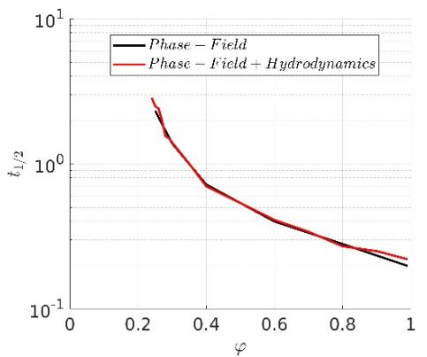

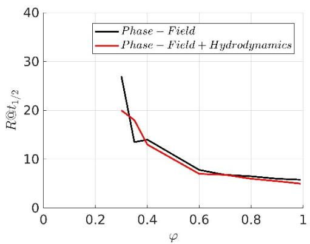  
Figure S 1: Crystallization half time $t _ { 1 / 2 }$ (left) and crystal radius at $t _ { 1 / 2 }$ (right) measured in simulations of binary solute-solvent blends at fixed solute volume fraction $\varphi$ , without convective flows (black curve) and with convective flows (red curve). There is no impact of convective flows in the crystal nucleation and growth process. Note that below $\varphi = 0 . 4$ , the number of crystals is very low and therefore the precision on the radius evaluation very poor.

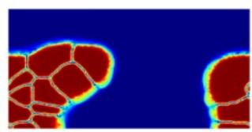

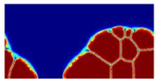

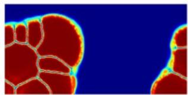

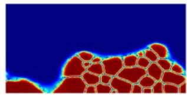

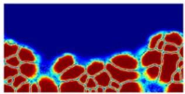

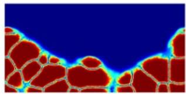

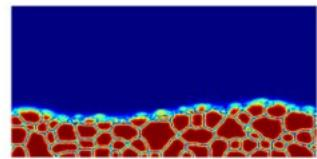

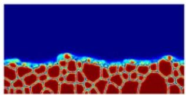

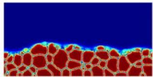  
Figure S 2: Film morphologies at the end of drying. The crystalline order parameter is shown. The different rows correspond to different evaporation rates. From top to bottom:

$v _ { e v a p } = 6 7$ , 201, 536 ?? ∙ ?L!. (Left) Viscosities as reported in the table below (Center) Viscosities divided by 10 (Right) Viscosities divided by 100.

# 1.5. Simulation parameters

<table><tr><td>Parameters</td><td>Full Name</td><td>Value</td><td>Unit</td></tr><tr><td>α</td><td>Evaporation-condensation coefficient</td><td>(1-9)·2.3·10-5</td><td>-</td></tr><tr><td>dx, dy</td><td>Grid Spacing</td><td>1</td><td>nm</td></tr><tr><td>T</td><td>Temperature</td><td>300</td><td>K</td></tr><tr><td>ρi</td><td>Density</td><td>1000</td><td>kg/m3</td></tr><tr><td>m1,m2,m3</td><td>Molar Mass</td><td>0.1, 0.1, 0.03</td><td>kg/mol</td></tr><tr><td>ν0</td><td>Molar Volume of the Flory Huggins Lattice Site</td><td>3·10-5</td><td>m3/mol</td></tr><tr><td>χ12,LL,χ13,LL,χ23,LL</td><td>Liquid – liquid interaction parameter</td><td>0.57, 1,0</td><td>-</td></tr><tr><td>χ12,SL,χ13,SL</td><td>Liquid – solid interaction parameter</td><td>0.15, 0.5</td><td>-</td></tr><tr><td>Tm</td><td>Melting Temperature</td><td>600</td><td>K</td></tr><tr><td>Lfus</td><td>Heat of Fusion</td><td>75789</td><td>J/kg</td></tr><tr><td>W</td><td>Energy barrier upon crystallization</td><td>142105</td><td>J/kg</td></tr><tr><td>P0</td><td>Reference Pressure</td><td>105</td><td>Pa</td></tr><tr><td>Psat,1, Psat,2, Psat,3</td><td>Vapor Pressure</td><td>102,1.5·103, 108</td><td>Pa</td></tr><tr><td>Psat,1, Psat,2, Psat,3</td><td>Vapor Pressure during annealing</td><td>102,1.5·102, 108</td><td>Pa</td></tr><tr><td>Pi∞</td><td>Partial Vapor Pressure in the Environment</td><td>0</td><td>Pa</td></tr><tr><td>E0</td><td>Solid-Vapor interaction energy</td><td>5·109</td><td>J/m3</td></tr><tr><td>β</td><td>Numerical Free Energy Coefficient</td><td>10-5</td><td>J/m3</td></tr><tr><td>κ1, κ2, κ3</td><td>Surface Tension Parameters for Volume Fraction Gradients</td><td>2·10-10, 2·10-10, 6·10-9</td><td>J/m</td></tr><tr><td>εc, εvap</td><td>Surface Tension Parameters for Order Parameter Gradients</td><td>1.5·10-5, 2·10-4</td><td>(J/m)0.5</td></tr><tr><td>εg</td><td>Surface Tension parameters for the grain boundaries</td><td>0.2</td><td>J/m2</td></tr><tr><td>Dφj→1s,i</td><td>Self-Diffusion Coefficients in pure materials (all)</td><td>10-9</td><td>m2/s</td></tr><tr><td>Mc,Mv</td><td>Allen Cahn mobility coefficients</td><td>4,106</td><td>s-1</td></tr><tr><td>η1,η2,η3</td><td>Material viscosities</td><td>5·106, 5·103, 5·10-2</td><td>Pa·s</td></tr><tr><td>D1vap, D2vap, D3vap</td><td>Diffusion Coefficients in the Vapor Phase</td><td>10-16, 10-10, 10-10</td><td>m2/s</td></tr><tr><td>tφ, tφ, tφv</td><td>Thresholds for crystal detection</td><td>0.4, 0.02, 5·10-2</td><td>-</td></tr><tr><td>dsl,csl, wsl</td><td>Amplitude, center and with of the penalty function for the diffusion coefficients upon liquid solid transition</td><td>10-9, 0.7, 10</td><td>-</td></tr><tr><td>dξ, cξ, wξ</td><td>Amplitude, center and with of the penalty function for the order parameter fluctuations</td><td>10-2, 0.85, 15</td><td>-</td></tr><tr><td>dη, cη, wη</td><td>Amplitude, center and with of the penalty function for the viscosities</td><td>10-7, 0.2, 20</td><td>-</td></tr><tr><td>dsv, csv, wsv</td><td>Amplitude, center and with of the penalty function for the Allen Cahn mobility and the solid- vapor interaction energy</td><td>10-9, 0.3, 15</td><td>-</td></tr></table>

# 2. SI to main text section ‘Simulation procedure and experimental approach’

The simulations are set up as follows: a 2D cross-section of the film is simulated on 256 x 256 lattice points. Initially, the fluid film is assumed to be fully amorphous and perfectly mixed, and a thin layer of air/vapor phase is placed at the top of the simulation box. The condensed phase is initialized with $20 \%$ volume fraction of solute and $80 \%$ of solvent (this corresponds roughly to 1.3 M MAPbI3). The initial volume fraction is chosen such that it is well below the crystallization threshold of $26 \%$ (see section 0). Periodic boundary conditions are applied in the horizontal direction, Neumann boundary conditions with no flow at the bottom (substrate), and the outflow condition for the evaporating solvent (see equation S19) at the top (vapor phase).

The interaction parameters $\chi _ { i j }$ are chosen such that the solute and solvent are completely miscible in the fluid state, but not in the crystalline phase so that the simulated crystals are nearly solvent-free (see section 2.1). Moreover, the resulting equilibrium concentration (saturation concentration $\varphi _ { s }$ ) of solute in the liquid phase is very low $( 3 . 7 \% )$ . Nucleation and growth are balanced so that the system is neither purely growth nor purely nucleationdominated. Diffusive constants are chosen so that neither the growth of the crystals nor the evaporation are limited by diffusion, and the amount of solute thus remains homogenous in the liquid phase. The full list of parameters can be found in section 1.5.

Two sets of simulations are performed. The first set solely differs in the evaporation rate of the solvent. The second set only differs in the crystallization rate. The evaporation rate is modified by adjusting the evaporation-condensation coefficient $\alpha$ (see equation S19). The crystallization rate is modified by adjusting the Allen-Cahn mobility M (see equation S17). Evaporation-condensation coefficient and Allen-Cahn mobility of the crystalline phase are chosen such that the change in the evaporation rate is sufficient to cover the whole range of possible morphology formation pathways: from crystallization being much faster than evaporation, to crystallization being much slower than evaporation. The range of evaporation rates investigated is nearly one decade and five simulations are performed for each evaporation rate. After a sufficiently long time, when all the untrapped solvent is evaporated, the driving force for evaporation is increased. This is done by increasing the vapor pressure by a factor of ten. This mimics the effect of the annealing step in the experiment. This is a very simplified picture of the annealing process. To describe a quantitatively realistic behavior during this processing step, the temperature-dependence of most of the thermodynamic parameters of the model would has to be taken into account. This is beyond the scope of the present work. Nevertheless, our simplified approach allows to qualitatively reproduce two major evolutions happening during annealing, namely the removal of the remaining solvent and grain coarsening.

There may be solvent remaining in the final stage of the drying because solvent may be trapped either below the crystals or in small channels in between. In such cases, the solvent surface tension energetically hinders further evaporation. Part of the remaining solvent might be removed upon an increase in the solvent vapor pressure, which mimics a thermal annealing process.

# 2.1. Phase diagram of the simulated solute solvent blend and crystal formation mechanisms

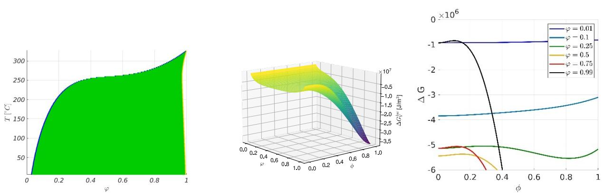  
Figure S 3: Left: phase diagram of the investigated system. Blue: liquidus (equilibrium volume fraction of solute in the liquid corresponding to the saturation concentration, $\varphi _ { s } =$ 0.0374 at ${ \cal T } = 2 8 ~ ^ { \circ } C )$ ), yellow: solidus (equilibrium volume fraction of solute in the solid), green: metastable two-phase region. The temperature in the drying simulations is set to 300K (approx. $2 8 ~ ^ { \circ } C )$ . Center: free energy landscape at 300K depending on crystalline order parameter and volume fraction. Note that there is no unstable region, thus crystallization is only possible through nucleation and growth. Right: Free energy plotted against $\phi$ at fixed chosen volume fractions, featuring an energy barrier for $\varphi = 0 . 2 5$ to $\varphi =$ 0.99. At low volume fractions, the free energy increases with $\phi$ , no crystal formation is possible.

A closer look at the free energy landscape helps understanding the crystal formation mechanisms. The figure below shows, beyond the isolines of the free energy surface, (a) the liquidus and solidus points in the 2D space, (b) the location of the maxima (energy barrier) and minima (crystalline phase) along the order parameter variable at fixed composition, (c) 'pseudo' spinodal and binodal curves describing the demixing properties {at fixed order parameter, and (d) pathways observed during crystal build-up in phase field simulations. There is obviously a 'pseudo' metastable and a 'pseudo' unstable region at high order parameter and intermediate volume fractions. This means that in principle, demixing by nucleation and growth or even spinodal decomposition can take place in a space domain reaching this {composition-crystallinity} region. Now, the system is initially fully amorphous $\phi = 0$ ), and the amorphous phase is stable whatever the composition. Only the fluctuations of the order parameter allow the energy barrier for crystallization to be overcome, on some limited domains in space. Then, these domains, which are actually the crystals nuclei, quickly evolve towards higher order parameter and volume fraction values (stable solidus point) while the amorphous phase evolves towards the stable

liquidus point. These are precisely the features of a nucleation process. Note that nucleation is only possible for sufficiently large solute volume fractions $( \varphi > 0 . 2 )$ . Thereby, for the highest solute concentrations, the crystallization pathways mostly avoid the ‘pseudo’ unstable and metastable regions. For lower concentrations however, the crystallization pathway may go through it, and one might therefore expect demixing to take place inside the nuclei. But in practice this does not happen. The reason is the following: the unstable and metastable regions of the free energy landscape are just a necessary condition, but demixing requires some space10 and time11 12 to take place. Indeed, the nuclei are too small and their composition/crystallinity evolves too quickly, which prevents demixing inside them. Instead, the composition in the nuclei progresses quickly towards the 'pseudo'-binodal composition (see the example of the nuclei in the $\varphi = 0 . 2 5$ mixture).

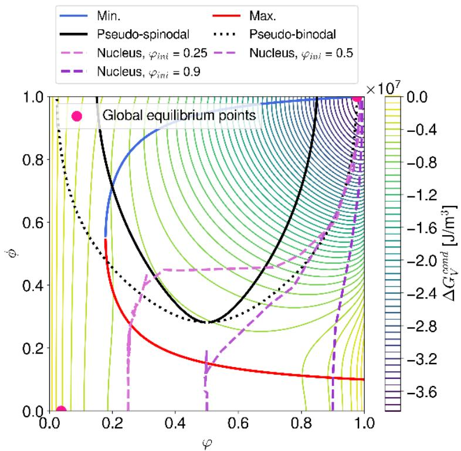  
Figure S 4: 2D contour plot of the free energy surface, featuring the liquidus and solidus points in the 2D space (pink points), the location of the energy maxima (red curve) and minima (blue curve) along $\phi$ at fixed $\varphi$ , the 'pseudo’ spinodal (black full line) and binodal (black dotted line). The typical trajectories observed during crystal build-up, starting from a volume fraction of solute $\varphi = 0 . 2 5$ , $\varphi = 0 . 5$ and $\varphi = 0 . 9$ , respectively, are shown by the dashed violet lines.

The series of snapshops below show the evolution of the volume fraction and parameter field during nucleation in a binary mixture with $2 5 \%$ , $50 \%$ and $90 \%$ of solute, corresponding to the three trajectories reported on the free energy surface above. Thereby, note that the local volume fraction variations are the consequences of local order parameter variations overcoming the energy barrier.

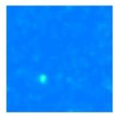

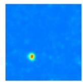

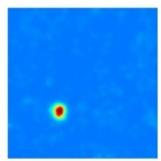

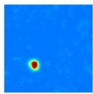

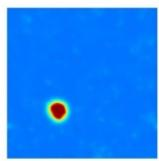

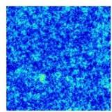

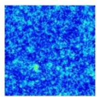

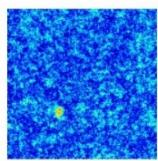

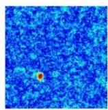

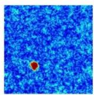

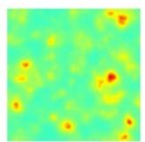  
Figure S 5: Volume fraction field (top row) and order parameter field (bottom row) at increasing times (from left to right) during crystallization in a binary blend, $\varphi = 0 . 2 5$ of solute.

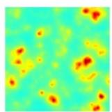

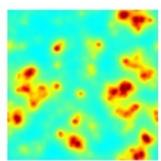

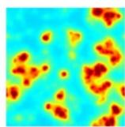

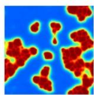

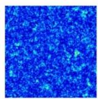

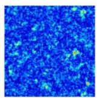

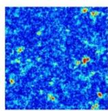

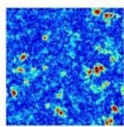

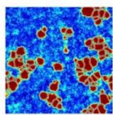

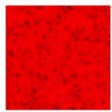  
Figure S 6: Volume fraction field (top row) and order parameter field (bottom row) at increasing times (from left to right) during crystallization in a binary blend, $\varphi = 0 . 5$ of solute.

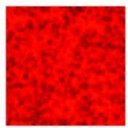

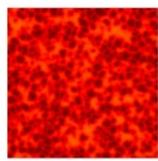

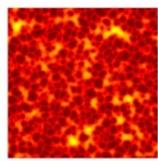

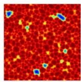

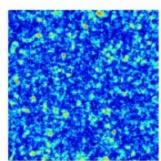

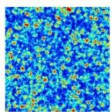

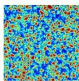

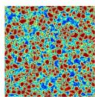

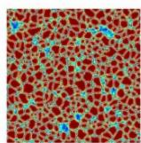  
Figure S 7: Volume fraction field (top row) and order parameter field (bottom row) at increasing times (from left to right) during crystallization in a binary blend, $\varphi = 0 . 9$ of solute.

As a conclusion, with the thermodynamic parameters used in this work, crystal form exclusively by one step nucleation and growth. The reader is referred to previous work for

a more general discussion on other possible nucleation pathways with different thermodynamic properties.13

# 2.2. Critical volume fraction (onset of nucleation)

In these simulations the overall composition is kept constant (the solvent may not evaporate). The simulation is run until the solute is fully crystallized. The time $t _ { 1 / 2 }$ until half of the solute is crystallized is extracted from the data. Two-dimensional simulations containing solute and solvent are performed.

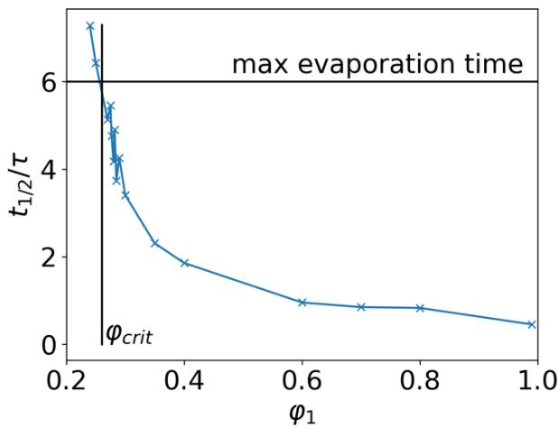  
Figure S 8: Crystallization half time $t _ { 1 / 2 }$ measured in a binary blend. The time increases for decreasing volume fractions. Below some (low) volume fraction there is not enough material, the driving force for crystallization is too low and the crystallization time diverges. The quantity of interest $\varphi _ { c r i t }$ is the critical volume fraction for which crystallization cannot occur within the evaporation time of the drying simulations. The time for evaporation is maximally $6 \tau$ . The intersection of the crystallization half-time with the maximal time of evaporation is $\varphi _ { c r i t }$ , which is roughly 0.26.

# 2.3. Time series of a single simulation with a low evaporation rate

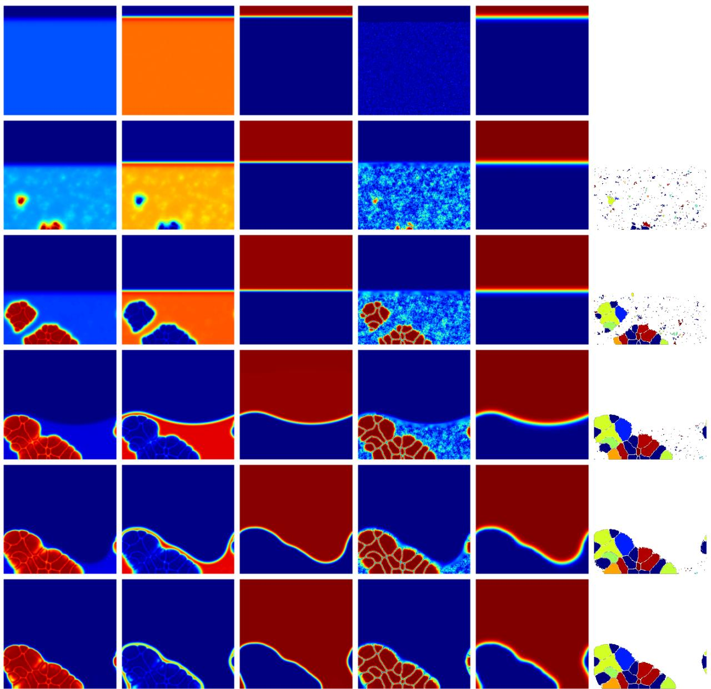  
Figure S 9: Time series for one single simulation with a low drying rate. The time increases with each row from top to bottom. From left to right: solute volume fraction $( \varphi _ { 1 } )$ , solvent volume fraction $( \varphi _ { 2 } )$ , air volume fraction $( \varphi _ { 3 } )$ , crystalline order parameter $( \phi _ { c } )$ , vapor order parameter $( \phi _ { v a p } )$ and the orientation parameter (?).

# 2.4. Experimental methods

# Materials:

Lead iodide (PbI2, $9 9 \%$ ), methylammonium iodide (MAI, $98 \%$ ), Benzyl Chloride (CB, $9 9 \%$ ) and Poly-(3-hexylthiophen-2,5-diyl) (P3HT) were purchased from Sigma. Anhydrous 2- Methoxyethanol (2ME, Aldrich, $9 9 . 8 \%$ ) and 1-methyl-2-pyrrolidinone (NMP, $9 9 . 8 \%$ ) were purchased from Aldrich. Tin (IV) oxide (SnO2, $1 5 \%$ in H2O colloidal dispersion) was purchased from Alfa Aesar). Carbon paste was purchased from Liaoning Huite Photoelectric Technology Co. Ltd. All the chemicals were used as received without further purification.

Gas-quenching-assisted blade deposition of perovskite films:

Equal molar amounts of MAI and PbI2 were dissolved in anhydrous 2ME and NMP, (2ME:NMP, $\mathsf { v } : \mathsf { v } = 3 7 : 3 )$ to prepare 1 M MAPbI3 stock solution and stirred at room temperature for 1 h. 20 µL of the precursor solution was doctor-bladed onto a $2 5 \ : \mathrm { m m } \times 2 5$ mm glass substrate at $3 \ : \mathsf { m m } \ : \mathsf { s } ^ { - 1 }$ and a gap height of $1 5 0 ~ { \mu \mathrm { m } }$ . After casting, the wet film was blown from the top with a continuous flow of dry air for 60 s, which is denoted as “gas quenching”. The air pressure can be controlled from 0 Bar to 5.0 Bar. Following that, the films were thermally annealed at $100 \%$ by a heat gun for 10 minutes. Blade coating of the perovskite precursor films was carried out on a commercial blade coater (ZAA2300.H from ZEHNTNER) using a ZUA 2000.100 blade (from ZEHNTNER) at room temperature in air.

# Solar cell fabrication:

The pre-patterned indium tin oxide (ITO) coated glass (Liaoning Huite Photoelectric Tech. Co., Ltd.) was sequentially cleaned by sonicating the substrates in acetone and isopropanol for 15 min each. Then, the substrates were treated in an UV–Ozone box for 20 min to remove organic residues and to enable better wetting. An aqueous $\mathsf { s n O } _ { 2 }$ nanoparticle solution was used to prepare the electron transport layer. The solution was diluted to 5.0 wt% $\mathsf { S n O } _ { 2 }$ and treated in the ultrasonic bath for 10 min before filtering with a $0 . 4 5 \mu \mathrm { m }$ PTFE filter. The solution was then doctor-bladed at $80 \%$ and $1 5 \mathsf { m m } \mathsf { s } ^ { - 1 }$ , and a gap height of $1 0 0 \mu \mathsf { m }$ . Subsequently, the film was annealed at $1 5 0 ~ ^ { \circ } \mathrm { C }$ for 30 min to form a compact layer. The perovskite absorber layer was subsequently deposited using the gas-quenching-assisted blade-coating method described above.

For the hole transport layer, $1 0 \mathrm { m g } \mathrm { m L } ^ { - 1 }$ P3HT was dissolved in anhydrous CB and stirred at $80 \%$ for at least 2 h. A gap height of $1 5 0 ~ { \mu \mathrm { m } }$ and a volume of $4 0 ~ \mu \ L$ was used for doctor-blading P3HT solutions. The coating temperatures and speeds for P3HT were 60 $^ \circ \mathsf { C }$ and $5 \mathsf { m m } \mathsf { s } ^ { - 1 }$ , respectively. After coating the P3HT layer, the film was annealed at 100 $^ \circ \mathsf { C }$ for 5 min. For the carbon electrode, the carbon paste was stencil-printed on the asprepared film and annealed at $120 ^ { \circ } \mathsf { C }$ for 15 min. For this, the electrode pattern was cut out of an adhesive tape with a laser. The tape was then placed on the substrate with the sticky side down. The cutouts were filled with carbon paste by blade coating. The tape was then removed carefully and the substrate was annealed on a hot plate at $100 ^ { \circ } \mathsf { C }$ for 15 min.

# Characterizations:

Solar cells were characterized by measuring their current–voltage (J–V)-characteristics with an AAA solar simulator, which provides AM1.5G illumination and source measurement system from LOT-Quantum Design, calibrated with a certified silicon solar

module. The voltage sweep range was $- 0 . 5$ to $1 . 5 \lor$ in steps of $2 0 \ \mathsf { m V } .$ Morphologies of the perovskite films were imaged with a confocal microscope (FEI Apreo LoVac).

Scanning electron microscopy (SEM): A FEI Helios Nanolab 660 was used to acquire SEM images and to prepare FIB cross-sections. The final polishing with the ion beam was performed at $5 \mathsf { k V }$ and 80 pA.

X-ray powder diffraction (XRD): X-ray diffraction analysis was performed by classical exsitu Bragg–Brentano geometry using a Panalytical X’pert powder diffractometer with filtered Cu-Kα radiation and an X’Celerator solid-state stripe detector.

Transmittance and reflectance spectra of the samples were carried out using a UV-VIS-NIR spectrometer (Lambda 950, from Perkin Elmer). For the haze measurement, the diffuse transmittance and total transmittance were detected without or with a reflection standard placed, respectively. The detector with R955 PMT works at the wavelength of 160 nm to 900 nm.

The roughness and thickness of the perovskite films were measured by confocal microscope μsurf custom from NanoFocus AG.

In situ white light reflectance spectrometer (WLRS, Thetametrisis): For high-quality reflective measurements, all the film was deposited on the silicon wafers which were cut into $1 \times 1$ cm substrates. The refractive index (n) and extinction coefficient (k) of the perovskite wet films were set as $1 . 5 \pm 0 . 5$ and $0 . 3 \pm 0 . 1$ , respectively.

In Situ PL: PL measurements were acquired on a home-built confocal setup using a 532 nm or 450 nm laser diode, a plano-convex lens above the substrate, a 550 nm long-pass filter, and a fiber-coupled spectrometer (AVANTES, ULS2048XL Sensline series) calibrated by the manufacturer. The distance between the plano-convex lens and the substrate was optimized such that the PL intensity of a dry film was maximized. The working distance was not adjusted with the change of the wet film thickness during the drying process.

In situ UV-vis: The in-situ absorption measurements were performed using a F20-UVX spectrometer (Filmetrics, Inc.) equipped with tungsten halogen and deuterium light sources (Filmetrics, Inc.). The signal is detected with the same fiber-coupled spectrometer with a spectral range of 300 to 1000 nm. Most of the measurements were performed with an integration time of 0.5 s (thin perovskite layer) per spectrum. The UV–vis absorption spectra are calculated from the transmission spectra, using the following equation: $\mathsf { A } \lambda = -$ $\mathsf { l o g } _ { 1 0 } ( \mathsf { T } )$ , where Aλ is the absorbance at a certain wavelength (λ) and T is the calibrated transmitted radiation.

# 3. SI to main text section ‘Impact of the drying rate on the morphology and model validation

# 3.1. Infrared reflectometry and XRD spectra

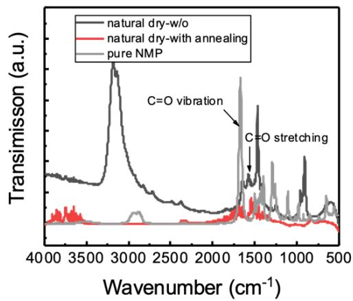

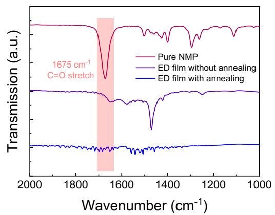  
Figure S 10: Infrared reflectometry spectra of the environmentally dried film, the film after annealing, and for pure NMP.

The intense peak corresponds to $\complement { = } \complement$ symmetric stretching at 1675 cm-1 for pure NMP and a weak peak at similar position for environmentally dry film, while an absence of this peak in the environmentally dry film after thermal annealing treatment. Therefore, we confirmed that the NMP could left in the film if no gas quenching treatment is performed, which is in good agreement with the XRD patterns.

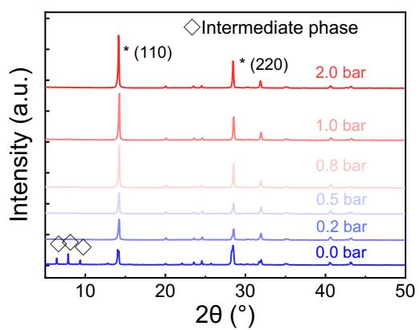

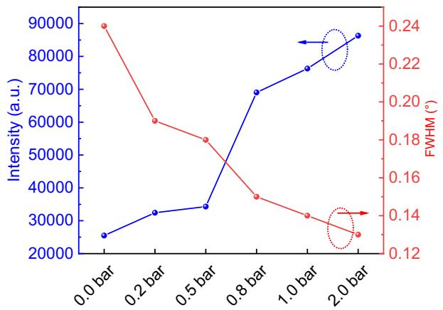  
Figure S 11: Left: XRD spectra for all the experimental drying conditions. Right: full-width at half maximum (FWHM) and intensity of the (110) peak of all the samples.

Regarding the XRD patterns of ED film, we found the peak located at $6 . 4 ^ { \circ }$ , $7 . 8 ^ { \circ }$ , and $9 . 3 ^ { \circ }$ , which indicates the lattice of the PbI2 crystal has been enlarged by large molecules. The large molecules could be the NMP because some reports mentioned the PbI2(NMP) XRD

peak located at $8 . 1 ^ { \circ }$ . The peak position is determined by the crystal lattice, and layered PbI2 have weak bonding, which allows the insertion of different guest molecules by van der Walls interactions.

As shown in Figure S11, a set of preferred orientations at $1 4 . 1 5 ^ { \circ }$ , 28.44°, $3 1 . 8 5 ^ { \circ }$ , $4 0 . 6 2 ^ { \circ }$ and $4 3 . 1 4 ^ { \circ }$ was observed, with these assigned to the (110), (220), (310), (224) and (330) planes of the MAPbI3 perovskite tetragonal structure, respectively. Minor peaks of the (200), (211), and (202) planes are present at 2θ values of $2 0 . 0 3 ^ { \circ }$ , $2 3 . 5 0 ^ { \circ }$ , and $2 4 . 5 5 ^ { \circ }$ , respectively, clearly indicating that all perovskite films are of high phase purity.

If necessary, we can plot the FWHM and intensity of XRD peak at $1 4 . 1 5 ^ { \circ }$ . The FWHM and intensity of the (110) peak are shown in Figure S11b, the crystallinity of the perovskite films was increased by increasing the evaporation rate.

# 3.2. Visualization of trapping mechanisms of solvent in the film after drying

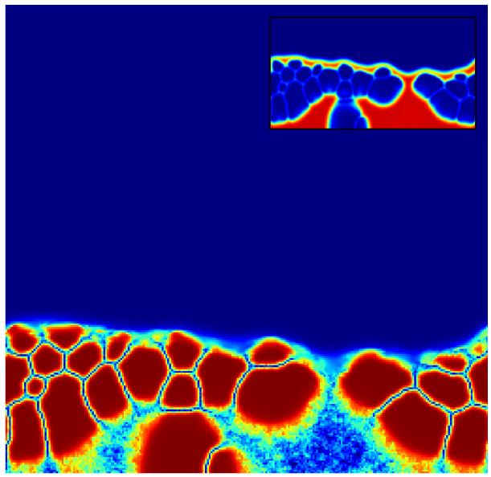  
Figure S 12: Exemplary dry state of a simulation with slow to medium evaporation rate. The crystalline order parameter and the solvent volume fraction are displayed (as inset). The solvent on the left side is completely trapped between the crystals and the substrate and can therefore hardly evaporate. The solvent trapped on the right side cannot evaporate due to surface tension effects: further evaporation would require a tremendous increase of the liquid meniscus curvature, which is associated with an unaffordable surface energy increase.

# 3.3. Evolution of the film height and crystallinity during annealing

  
Figure S 13: Left: Simulated Film Height including annealing. A slight drop in film height is visible at the start of annealing, which has two reasons. First, the evaporation rate is enhanced dramatically because the vapor pressure is increased abruptly. Therefore, previously trapped solvent now evaporates quickly. Second, the film-vapor interface is modified, which is a purely numerical effect. Unfortunately, the magnitude of these two effects could not be evaluated independently. Right: Crystallinity of the system, including annealing. The increase of crystallinity at the start of annealing is a numerical artefact also due to the modification of the diffuse film-vapor interface structure at the onset of annealing. This has a noticeable but limited impact on the calculation of the overall crystallinity inside the film.

# 3.4. Evaluation of crystal size, amount of uncovered substrate, and roughness in the simulation

The fraction of uncovered substrate is the fraction of vertical lines in the simulation, where the volume fraction of solute has no value larger than 0.8. The volume fraction of the solute is chosen instead of the crystalline order parameter for this coverage evaluation, because the crystalline order parameter field is noisy due to the applied fluctuations. The value of 0.8 is chosen because beyond $\phi _ { c } = 0 . 8$ , the solute is always in the crystallized state in the dry film.

For the roughness calculation, the highest point $h _ { i }$ in each vertical line of the simulation box, surpassing a solute volume fraction of 0.8 is used as an upper boundary of the film. The roughness $R _ { Q }$ is then calculated as

$$
R _ {Q} = \sqrt {\frac {\sum_ {i = 1} ^ {N} \left(h _ {i} - h _ {f i n a l}\right) ^ {2}}{N}} \tag {S26}
$$

where $N$ is the number of columns.

For the crystal sizes, the equivalent radius of each individual grain $r _ { i }$ (defined as the domains with homogenous/identical orientation value) is calculated. The average crystal sizes are calculated as:

$$
r = \frac {\sum_ {i = 1} ^ {N} v _ {i} r _ {i}}{V} \tag {S27}
$$

where V is the total volume of the crystals and $v _ { i }$ the fraction the volume of crystal i.

# 3.5. SEM images

  
Figure S 14: First and second row: SEM top views at different magnifications after annealing. Third row: SEM cross-section. From left to right: 0, 0.2, 0.5, 0.8, 1, 1.5, and 2 bar air pressure for gas quenching during fabrication.

# 3.6. Simulated film morphologies after drying and annealing

  
Figure S 15: Film morphologies at the end of drying. The crystalline order parameter is shown. The different rows correspond to different evaporation rates. From top to bottom: $v _ { e v a p } = 6 7$ , 134, 201, 268, 335, 402, 469, 536, 603 nm/s. The columns represent five different runs with exactly the same simulation parameters, including ?K%&'.

  
Figure S 16: Film morphology at the end of annealing (30s timespan). The crystalline order parameter is shown. The different rows correspond to different evaporation rates. From top to bottom: $v _ { e v a p } = 6 7$ , 134, 201, 268, 335, 402, 469, 536, 603 nm/s. The columns represent five different runs with exactly the same simulation parameters, including ?K%&'.

# 3.7. Comparison between the film morphology after drying and after annealing

  
Figure S 17: Comparison between morphology descriptors after drying and after 30s annealing. (Left) the crystal sizes increase during annealing due to grain coarsening. For low evaporation rates, the morphological features only a few, large and separated crystals and this effect is less pronounced. (Center) Film roughness: The roughness of the film stays the same or decreases slightly, if crystals at the solid-vapor interface disappear due to coarsening. (Right) Uncovered substrate: The uncovered substrate decreases during annealing due to coarsening.

# 3.8. Haze factor

  
Figure S 18: Haze factor: The haze factor is a measurement to evaluate the lightscattering ability of the thin film. The haze factor is calculated from the ratio of diffuse and total transmission. The natural dry film shows a very high haze at the long wavelength which could be attributed to the uncovered area, resulting in the high light scattering. For the films processed with a higher air flow rate, i.e., 1.0 bar, the haze factor is lower than $10 \%$ , indicating that the film has a smooth surface, such that the light is absorbed with low scattering.

# 3.9. PL grain size and UV-vis spectra

  
Figure S 19: Measured PL curves for environmental drying, 0.2 bar, and 2 bar (left to right). First row: Spectra, second row: heat map.

The grain sizes of the crystals can be calculated with 14,15

$$
E _ {g} = E _ {g, b u l k} + \frac {2 \pi^ {2} \hbar^ {2}}{m _ {e} d ^ {2}}, \tag {S28}
$$

where $E _ { g , b u l k }$ is the energy gap of the bulk material, $\hbar$ is the reduced Planck constant, $m _ { e }$ is the effective mass of the excitons, and $d$ the average size of the grains.

  
Figure S 20: Measured UV-vis for environmental drying, 0.2 bar, and 2 bar air pressure (left to right).

# 4. SI to main text section ‘Dependence of the device performance on film morphology’

# 4.1. Stabilized power output

  
Figure S 21: Left: Stabilized power output. Right: time-dependent photocurrent and PCE at the maximum power point of the champion cell.

# 4.2. JV-scan of the champion cell and device yield

  
Figure S 22: Left: Forward and Reverse scan of the champion cell. Right: Device yield of the measured solar cells depending on the perovskite films prepared by various evaporation rates (0, 0.2, 0.5, 0.8, 1.0, 1.5, and 2.0 bar, respectively).

# 4.3. Drift-diffusion simulations

  
Figure S 23: Drift diffusion simulations. First Row: experimental (crosses) and simulated (full line) JV curves. Fitted are the trap densities at the interfaces, the generation rate, the series, and the shunt resistance. The electron and hole mobilities, the trap density in the bulk, as well as the ion density, are kept constant, except for 0 bar and 0.2 bar vapor pressure. No reasonable fit could be achieved for these two pressures while keeping these three parameters constant. The obtained values are displayed in the second row. The shunt resistance decreases for lower air pressures and the trap density increases. The

other parameters remain approximately constant. Note also that the weak slope of the JV curve at high voltage and its S-shape cannot be explained by a mere variation of the series resistance.

<table><tr><td>Parameters</td><td>Full Name</td><td>Value</td><td>Unit</td></tr><tr><td>T</td><td>Temperature</td><td>295</td><td>K</td></tr><tr><td>L</td><td>Total thickness of the device</td><td>470·10-9</td><td>m</td></tr><tr><td>eps_r</td><td>Relative dielectric constant</td><td>24</td><td></td></tr><tr><td>CB</td><td>Conduction band edge</td><td>3.9</td><td>eV</td></tr><tr><td>VB</td><td>Valence band edge</td><td>5.49</td><td>eV</td></tr><tr><td>Nc</td><td>Effective density of states</td><td>5·1024</td><td>m-3</td></tr><tr><td>n_0</td><td>Ionised n-doping</td><td>0</td><td>m-3</td></tr><tr><td>p_0</td><td>Ionised p-doping</td><td>0</td><td>m-3</td></tr><tr><td>L_TCO</td><td>Tickness of the ITO layer</td><td>110·10-9</td><td>m</td></tr><tr><td>L_BE</td><td>Tickness of the back electrode</td><td>200·10-9</td><td>m</td></tr><tr><td>lambda_min</td><td>Minimum wavelength of the spectrum for the calculated generation profile</td><td>350·10-9</td><td>m</td></tr><tr><td>lambda_max</td><td>Maximum wavelength of the spectrum for the calculated generation profile</td><td>800·10-9</td><td>m</td></tr><tr><td>mun_0</td><td>Electron mobility at zero field</td><td>6·10-4(fitted for 0,0.2 bar)</td><td>m2/Vs</td></tr><tr><td>mup_0</td><td>Hole mobility at zero field</td><td>6·10-4(fitted for 0,0.2 bar)</td><td>m2/Vs</td></tr><tr><td>mob_n_dep</td><td>Electron mobility</td><td>0,constant</td><td></td></tr><tr><td>mob_p_dep</td><td>Hole mobility</td><td>0,constant</td><td></td></tr><tr><td>W_L</td><td>Work function of the left electrode</td><td>4.25</td><td>eV</td></tr><tr><td>W_R</td><td>Work function of the right electrode</td><td>5.1</td><td>eV</td></tr><tr><td>Sn_L</td><td>Surface recombination velocity of electrons at the left electrode</td><td>-1·10-7</td><td>m/s</td></tr><tr><td>Sp_L</td><td>Surface recombination velocity of holes at the left elecctord</td><td>-1·10-7</td><td>m/s</td></tr><tr><td>Sn_R</td><td>Surface recombination velocity of electrons at the right electrode</td><td>-1·10-7</td><td>m/s</td></tr><tr><td>Sp_R</td><td>Surface recombination velocity of holes at the right electrode</td><td>-1·10-7</td><td>m/s</td></tr><tr><td>Rshunt</td><td>Shunt resistance</td><td>5·103(fitted)</td><td>Ωm2</td></tr><tr><td>Rseries</td><td>Resistance place in series with the device</td><td>2·10-4(fitted)</td><td>Ωm2</td></tr><tr><td>L_LTL</td><td>Thickness of the left transport layer</td><td>20·10-9</td><td>m</td></tr><tr><td>L_RTL</td><td>Thickness of the right transport layer</td><td>50·10-9</td><td>m</td></tr><tr><td>Nc_LTL</td><td>Effective density of states of the left transport layer</td><td>2.7·1024</td><td>m-3</td></tr><tr><td>Nc_RTL</td><td>Effective density of states of the right transport layer</td><td>5·1026</td><td>m-3</td></tr><tr><td>doping_LTL</td><td>Density of ionized dopants of the left transport layer</td><td>0</td><td>m-3</td></tr><tr><td>doping_RTL</td><td>Density of ionized dopants of the right transport layer</td><td>0</td><td>m-3</td></tr><tr><td>mob_LTL</td><td>Mobility of electrons and holes in the left transport layer</td><td>5·105</td><td>m2/Vs</td></tr><tr><td>mob_RTL</td><td>Mobility of electrons and holes in the right transport layer</td><td>5·107</td><td>m2/Vs</td></tr><tr><td>nu_int_LTL</td><td>Interface transfer velocity between the main layer and the left transport layer</td><td>1·103</td><td>m/s</td></tr><tr><td>nu_int_RTL</td><td>Interface transfer velocity between the main layer and the right transport layer</td><td>1·103</td><td>m/s</td></tr><tr><td>eps_r_LTL</td><td>Relative dielectric constant of the left transport layer</td><td>10</td><td></td></tr><tr><td>eps_r_RTL</td><td>Relative dielectric constant of the right transport layer</td><td>3</td><td></td></tr><tr><td>CB_LTL</td><td>Conduction band edge of the left transport layer</td><td>4.2</td><td>eV</td></tr><tr><td>CB_RTL</td><td>Conduction band edge of the right transport layer</td><td>3</td><td>eV</td></tr><tr><td>VB_LTL</td><td>Valence band edge of the left transport layer</td><td>8.4</td><td>eV</td></tr><tr><td>VB_RTL</td><td>Valence band edge of the right transport layer</td><td>5.15</td><td>eV</td></tr><tr><td>TLsGen</td><td>Transport layer absorption</td><td>0, no</td><td></td></tr><tr><td>TLsTraps</td><td>Transport layer contain traps</td><td>0, no</td><td></td></tr><tr><td>InosInTls</td><td>Ions can move from the bulk into the transport layers</td><td>0, no</td><td></td></tr><tr><td>CNI</td><td>Concentration of negative ions</td><td>2·1022 (fitted for 0, 0.2 bar)</td><td>m-3</td></tr><tr><td>CPI</td><td>Concentration of positive ions</td><td>2·1022 (fitted for 0, 0.2 bar)</td><td>m-3</td></tr><tr><td>mob/ion_spec</td><td>Which ionic species can move</td><td>1, only positive</td><td></td></tr><tr><td>ion_red_rate</td><td>Rate at which the ion distribution is updated</td><td>1</td><td></td></tr><tr><td>Gehp</td><td>Average generation rate of the electron-hole pairs in the absorbing layer</td><td>2.83·1027 (fitted)</td><td>m-3s-1</td></tr><tr><td>Gfrac</td><td>Actual average generation rate as a fraction of Gehp</td><td>1</td><td></td></tr><tr><td>Gen_profile</td><td>File of the generation profile</td><td>None, uniform</td><td></td></tr><tr><td>Field_dep_G</td><td>Field-dependent splitting of the electron-hole pairs</td><td>0, no</td><td></td></tr><tr><td>kdirect</td><td>Rate of direct recombination</td><td>1.6·10-17</td><td>m3/s</td></tr><tr><td>UseLangevin</td><td>Constant rate of recombination of Langevin expression</td><td>0, direct recombination</td><td></td></tr><tr><td>Bulk_tr</td><td>Density of traps in the bulk</td><td>1.04·1020 (fitted)</td><td>m-3</td></tr><tr><td>St_L</td><td>Number of traps per area at the left interface between the left transport layer and the main absorber</td><td>2·1012 (fitted)</td><td>m-2</td></tr><tr><td>St_R</td><td>Number of traps per area at the left interface between the left transport layer and the main absorber</td><td>\( 1 \cdot 10^{10} (fitted) \)</td><td>\( m^{-2} \)</td></tr><tr><td>num_GBs</td><td>Number of grain boundaries</td><td>0</td><td></td></tr><tr><td>GB_tr</td><td>Number of traps per area at a grain boundary</td><td>\( 1 \cdot 10^{13} \)</td><td>\( m^{-2} \)</td></tr><tr><td>Cn</td><td>Capture coefficient for electrons (for all traps)</td><td>\( 1 \cdot 10^{-13} \)</td><td>\( m^3 \)</td></tr><tr><td>Cp</td><td>Capture coefficient for holes (for all traps)</td><td>\( 1 \cdot 10^{-13} \)</td><td>\( m^3 \)</td></tr><tr><td>ETrapSingle</td><td>Energy level of all traps</td><td>4.91</td><td>eV</td></tr><tr><td>Tr_type_L</td><td>Traps at the left interface</td><td>-1, acceptor</td><td></td></tr><tr><td>Tr_type_R</td><td>Traps at the right interface</td><td>1, donor</td><td></td></tr><tr><td>Tr_type_B</td><td>Traps at grain boundaries and in the bulk</td><td>-1, acceptor</td><td></td></tr><tr><td>Vdistribution</td><td>Distribution of voltages that will be simulated</td><td>1, uniform</td><td></td></tr><tr><td>PreCond</td><td>Use of pre-conditioner</td><td>0, no</td><td></td></tr><tr><td>Vscan</td><td>Direction of voltage scan</td><td>-1, down</td><td></td></tr><tr><td>Vmin</td><td>Minimum voltage that will be simulated</td><td>0.0</td><td>V</td></tr><tr><td>Vmax</td><td>Maximum voltage that will be simulated</td><td>1.4</td><td>V</td></tr><tr><td>Vstep</td><td>Voltage step</td><td>0.01</td><td>V</td></tr><tr><td>until_Voc</td><td>Simulation termination at Voc</td><td>0, no</td><td></td></tr></table>

# 4.4. Steady-State PL Spectra and Time-Resolved PL (TRPL)

  
Figure S 24: Left: Steady-state PL. Right: TRPL.

The steady-state photoluminescence (PL) and time-resolved photoluminescence (TRPL) decay measurements were conducted to study the charge recombination in the perovskite films. As shown in Figure S 24, the enhanced PL intensity and increased average carrier lifetime are observed as increasing the evaporation rate, which suggests the reduced nonradiative recombination center in the films processed by high air flow. These results can

be interpreted for the improved Voc due to low interface nonradiative recombination, which is highly consistent with the observations of the film morphology.

# 5. Literature

(1) Ronsin, O. J. J.; Harting, J. Formation of Crystalline Bulk Heterojunctions in Organic Solar Cells: Insights from Phase-Field Simulations. ACS Appl. Mater. Interfaces 2022, 14 (44), 49785−49800. https://doi.org/10.1021/acsami.2c14319.   
(2) Shargaieva, O.; Näsström, H.; Li, J.; Többens, D. M.; Unger, E. L. Temperature-Dependent Crystallization Mechanisms of Methylammonium Lead Iodide Perovskite From Different Solvents. Frontiers in Energy Research 2021, 9.   
(3) Ronsin, O. J. J.; Harting, J. Phase-Field Simulations of the Morphology Formation in Evaporating Crystalline Multicomponent Films. Advanced Theory and Simulations 2022, 2200286. https://doi.org/10.1002/adts.202200286.   
(4) Matkar, R. A.; Kyu, T. Role of Crystal−Amorphous Interaction in Phase Equilibria of Crystal−Amorphous Polymer Blends. J. Phys. Chem. B 2006, 110 (25), 12728– 12732. https://doi.org/10.1021/jp061159m.   
(5) Persad, A. H.; Ward, C. A. Expressions for the Evaporation and Condensation Coefficients in the Hertz-Knudsen Relation. Chemical Reviews 2016, 116 (14), 7727–7767. https://doi.org/10.1021/acs.chemrev.5b00511.   
(6) Knudsen, M. Die Maximale Verdampfungsgeschwindigkeit Des Quecksilbers. Annalen der Physik 1915, 352 (13), 697–708. https://doi.org/10.1002/andp.19153521306.   
(7) Hertz, H. Ueber Die Verdunstung Der Flüssigkeiten, Insbesondere Des Quecksilbers, Im Luftleeren Raume. Annalen der Physik 1882, 253 (10), 177–193. https://doi.org/10.1002/andp.18822531002.   
(8) Ronsin, O. J. J.; Jang, D.; Egelhaaf, H.-J.; Brabec, C. J.; Harting, J. Phase-Field Simulation of Liquid–Vapor Equilibrium and Evaporation of Fluid Mixtures. ACS Appl. Mater. Interfaces 2021, 13 (47), 55988–56003. https://doi.org/10.1021/acsami.1c12079.   
(9) Jaensson, N. O.; Hulsen, M. A.; Anderson, P. D. Stokes–Cahn–Hilliard Formulations and Simulations of Two-Phase Flows with Suspended Rigid Particles. Computers & Fluids 2015, 111, 1–17. https://doi.org/10.1016/j.compfluid.2014.12.023.   
(10) Nauman, E. B.; Balsara, N. P. Phase Equilibria and the Landau—Ginzburg Functional. Fluid Phase Equilibria 1989, 45 (2–3), 229–250. https://doi.org/10.1016/0378-3812(89)80260-2.   
(11) Cabral, J. T.; Higgins, J. S. Spinodal Nanostructures in Polymer Blends: On the Validity of the Cahn-Hilliard Length Scale Prediction. Progress in Polymer Science 2018, 81, 1–21. https://doi.org/10.1016/j.progpolymsci.2018.03.003.   
(12) König, B.; Ronsin, O. J. J.; Harting, J. Two-Dimensional Cahn–Hilliard Simulations for Coarsening Kinetics of Spinodal Decomposition in Binary Mixtures. Phys. Chem. Chem. Phys. 2021, 23 (43), 24823–24833. https://doi.org/10.1039/D1CP03229A.   
(13) Siber, M.; J. Ronsin, O. J.; Harting, J. Crystalline Morphology Formation in Phase-Field Simulations of Binary Mixtures. Journal of Materials Chemistry C 2023, 11 (45), 15979–15999. https://doi.org/10.1039/D3TC03047D.   
(14) Yu, H.; Wang, H.; Zhang, J.; Lu, J.; Yuan, Z.; Xu, W.; Hultman, L.; Bakulin, A. A.; Friend, R. H.; Wang, J.; Liu, X.-K.; Gao, F. Efficient and Tunable Electroluminescence from In Situ Synthesized Perovskite Quantum Dots. Small 2019, 15 (8), 1804947. https://doi.org/10.1002/smll.201804947.

(15) Ummadisingu, A.; Meloni, S.; Mattoni, A.; Tress, W.; Grätzel, M. Crystal-Size-Induced Band Gap Tuning in Perovskite Films. Angewandte Chemie International Edition 2021, 60 (39), 21368–21376. https://doi.org/10.1002/anie.202106394.